# Complete Route Map

Generated: 2025-11-03T17:25:04.505Z

## Diagram

```mermaid
flowchart TD
    subgraph Pages
        my_bookings["/my-bookings"]
        class my_bookings auth;
        ops["/ops"]
        class ops admin;
        blog["/blog"]
        class blog public;
        browse["/browse"]
        class browse public;
        checkout["/checkout"]
        class checkout public;
        create["/create"]
        class create public;
        root["/"]
        pricing["/pricing"]
        class pricing public;
        privacy_policy["/privacy-policy"]
        class privacy_policy public;
        reserve["/reserve"]
        class reserve public;
        signin["/signin"]
        class signin public;
        thank_you["/thank-you"]
        class thank_you public;
        tos["/tos"]
        class tos public;
        profile_manage["/profile/manage"]
        class profile_manage auth;
        ops_bookings["/ops/bookings"]
        class ops_bookings admin;
        ops_customer_details["/ops/customer-details"]
        class ops_customer_details admin;
        ops_rejections["/ops/rejections"]
        class ops_rejections admin;
        ops_restaurant_settings["/ops/restaurant-settings"]
        class ops_restaurant_settings admin;
        ops_tables["/ops/tables"]
        class ops_tables admin;
        ops_team["/ops/team"]
        class ops_team admin;
        ops_login["/ops/login"]
        class ops_login public;
        blog__articleId["/blog/:articleId"]
        class blog__articleId public;
        invite__token["/invite/:token"]
        class invite__token public;
        item__slug["/item/:slug"]
        class item__slug public;
        reserve__reservationId["/reserve/:reservationId"]
        class reserve__reservationId public;
        terms_togo["/terms/togo"]
        class terms_togo public;
        terms_venue["/terms/venue"]
        class terms_venue public;
        ops_bookings_new["/ops/bookings/new"]
        class ops_bookings_new admin;
        blog_author__authorId["/blog/author/:authorId"]
        class blog_author__authorId public;
        blog_category__categoryId["/blog/category/:categoryId"]
        class blog_category__categoryId public;
        reserve_r__slug["/reserve/r/:slug"]
        class reserve_r__slug public;
    end

    subgraph API
        api["/api"]
        subgraph Core
            api_auth_callback["/api/auth/callback"]
            class api_auth_callback public;
            api_availability["/api/availability"]
            class api_availability public;
            api_bookings__id_history["/api/bookings/:id/history"]
            class api_bookings__id_history public;
            api_bookings__id["/api/bookings/:id"]
            class api_bookings__id public;
            api_bookings_confirm["/api/bookings/confirm"]
            class api_bookings_confirm public;
            api_bookings["/api/bookings"]
            class api_bookings public;
            api_config_merge_rules["/api/config/merge-rules"]
            class api_config_merge_rules public;
            api_config_service_policy["/api/config/service-policy"]
            class api_config_service_policy public;
            api_events["/api/events"]
            class api_events public;
            api_lead["/api/lead"]
            class api_lead public;
            api_profile_image["/api/profile/image"]
            class api_profile_image public;
            api_profile["/api/profile"]
            class api_profile public;
            api_restaurants__slug_schedule["/api/restaurants/:slug/schedule"]
            class api_restaurants__slug_schedule public;
            api_restaurants["/api/restaurants"]
            class api_restaurants public;
            api_staff_auto_confirm["/api/staff/auto/confirm"]
            class api_staff_auto_confirm public;
            api_staff_auto_quote["/api/staff/auto/quote"]
            class api_staff_auto_quote public;
            api_staff_manual_confirm["/api/staff/manual/confirm"]
            class api_staff_manual_confirm public;
            api_staff_manual_context["/api/staff/manual/context"]
            class api_staff_manual_context public;
            api_staff_manual_hold["/api/staff/manual/hold"]
            class api_staff_manual_hold public;
            api_staff_manual_validate["/api/staff/manual/validate"]
            class api_staff_manual_validate public;
            api_team_invitations__token_accept["/api/team/invitations/:token/accept"]
            class api_team_invitations__token_accept public;
            api_team_invitations__token["/api/team/invitations/:token"]
            class api_team_invitations__token public;
        end
        subgraph v1
            api_v1_bookings["/api/v1/bookings"]
            class api_v1_bookings public;
            api_v1_events["/api/v1/events"]
            class api_v1_events public;
            api_v1_lead["/api/v1/lead"]
            class api_v1_lead public;
            api_v1_profile_image["/api/v1/profile/image"]
            class api_v1_profile_image public;
            api_v1_profile["/api/v1/profile"]
            class api_v1_profile public;
            api_v1_restaurants__slug_schedule["/api/v1/restaurants/:slug/schedule"]
            class api_v1_restaurants__slug_schedule public;
            api_v1_restaurants["/api/v1/restaurants"]
            class api_v1_restaurants public;
            api_v1_test_bookings["/api/v1/test/bookings"]
            class api_v1_test_bookings public;
            api_v1_test_leads["/api/v1/test/leads"]
            class api_v1_test_leads public;
            api_v1_test_playwright_session["/api/v1/test/playwright-session"]
            class api_v1_test_playwright_session public;
            api_v1_test_reservations__reservationId_confirmation["/api/v1/test/reservations/:reservationId/confirmation"]
            class api_v1_test_reservations__reservationId_confirmation public;
        end
        subgraph Test
            api_test_bookings["/api/test/bookings"]
            class api_test_bookings public;
            api_test_invitations["/api/test/invitations"]
            class api_test_invitations public;
            api_test_leads["/api/test/leads"]
            class api_test_leads public;
            api_test_playwright_session["/api/test/playwright-session"]
            class api_test_playwright_session public;
            api_test_reservations__reservationId_confirmation["/api/test/reservations/:reservationId/confirmation"]
            class api_test_reservations__reservationId_confirmation public;
            api_test_email["/api/test-email"]
            class api_test_email public;
        end
        subgraph Ops
            api_ops_allowed_capacities["/api/ops/allowed-capacities"]
            class api_ops_allowed_capacities public;
            api_ops_bookings__id_check_in["/api/ops/bookings/:id/check-in"]
            class api_ops_bookings__id_check_in public;
            api_ops_bookings__id_check_out["/api/ops/bookings/:id/check-out"]
            class api_ops_bookings__id_check_out public;
            api_ops_bookings__id_history["/api/ops/bookings/:id/history"]
            class api_ops_bookings__id_history public;
            api_ops_bookings__id_no_show["/api/ops/bookings/:id/no-show"]
            class api_ops_bookings__id_no_show public;
            api_ops_bookings__id["/api/ops/bookings/:id"]
            class api_ops_bookings__id public;
            api_ops_bookings__id_status["/api/ops/bookings/:id/status"]
            class api_ops_bookings__id_status public;
            api_ops_bookings__id_tables__tableId["/api/ops/bookings/:id/tables/:tableId"]
            class api_ops_bookings__id_tables__tableId public;
            api_ops_bookings__id_tables["/api/ops/bookings/:id/tables"]
            class api_ops_bookings__id_tables public;
            api_ops_bookings__id_undo_no_show["/api/ops/bookings/:id/undo-no-show"]
            class api_ops_bookings__id_undo_no_show public;
            api_ops_bookings_export["/api/ops/bookings/export"]
            class api_ops_bookings_export public;
            api_ops_bookings["/api/ops/bookings"]
            class api_ops_bookings public;
            api_ops_bookings_status_summary["/api/ops/bookings/status-summary"]
            class api_ops_bookings_status_summary public;
            api_ops_customers_export["/api/ops/customers/export"]
            class api_ops_customers_export public;
            api_ops_customers["/api/ops/customers"]
            class api_ops_customers public;
            api_ops_dashboard_changes["/api/ops/dashboard/changes"]
            class api_ops_dashboard_changes public;
            api_ops_dashboard_heatmap["/api/ops/dashboard/heatmap"]
            class api_ops_dashboard_heatmap public;
            api_ops_dashboard_rejections["/api/ops/dashboard/rejections"]
            class api_ops_dashboard_rejections public;
            api_ops_dashboard_summary["/api/ops/dashboard/summary"]
            class api_ops_dashboard_summary public;
            api_ops_dashboard_vips["/api/ops/dashboard/vips"]
            class api_ops_dashboard_vips public;
            api_ops_occasions["/api/ops/occasions"]
            class api_ops_occasions public;
            api_ops_restaurants__id["/api/ops/restaurants/:id"]
            class api_ops_restaurants__id public;
            api_ops_restaurants["/api/ops/restaurants"]
            class api_ops_restaurants public;
            api_ops_settings_strategic_config["/api/ops/settings/strategic-config"]
            class api_ops_settings_strategic_config public;
            api_ops_strategies_simulate["/api/ops/strategies/simulate"]
            class api_ops_strategies_simulate public;
            api_ops_tables__id["/api/ops/tables/:id"]
            class api_ops_tables__id public;
            api_ops_tables["/api/ops/tables"]
            class api_ops_tables public;
            api_ops_zones__id["/api/ops/zones/:id"]
            class api_ops_zones__id public;
            api_ops_zones["/api/ops/zones"]
            class api_ops_zones public;
        end
        subgraph Owner
            api_owner_restaurants__id_details["/api/owner/restaurants/:id/details"]
            class api_owner_restaurants__id_details public;
            api_owner_restaurants__id_hours["/api/owner/restaurants/:id/hours"]
            class api_owner_restaurants__id_hours public;
            api_owner_restaurants__id_service_periods["/api/owner/restaurants/:id/service-periods"]
            class api_owner_restaurants__id_service_periods public;
            api_owner_team_invitations__inviteId["/api/owner/team/invitations/:inviteId"]
            class api_owner_team_invitations__inviteId public;
            api_owner_team_invitations["/api/owner/team/invitations"]
            class api_owner_team_invitations public;
            api_owner_team_memberships["/api/owner/team/memberships"]
            class api_owner_team_memberships public;
        end
    end
    root --> ops
    root --> tos
    root --> blog
    root --> browse
    root --> create
    root --> signin
    root --> pricing
    root --> reserve
    root --> checkout
    ops --> ops_team
    root --> thank_you
    ops --> ops_login
    ops --> ops_tables
    root --> my_bookings
    ops --> ops_bookings
    root --> privacy_policy
    ops --> ops_rejections
    blog --> blog__articleId
    ops_bookings --> ops_bookings_new
    ops --> ops_customer_details
    reserve --> reserve__reservationId
    ops --> ops_restaurant_settings
    api --> api_lead
    api --> api_events
    api --> api_profile
    api --> api_bookings
    api --> api_test_email
    api --> api_restaurants
    api --> api_availability
    api_bookings --> api_bookings__id
    api_ops_zones --> api_ops_zones__id
    api_profile --> api_profile_image
    api_ops_tables --> api_ops_tables__id
    api_bookings --> api_bookings_confirm
    api_ops_bookings --> api_ops_bookings__id
    api_v1_profile --> api_v1_profile_image
    api_ops_bookings --> api_ops_bookings_export
    api_ops_restaurants --> api_ops_restaurants__id
    api_bookings__id --> api_bookings__id_history
    api_ops_customers --> api_ops_customers_export
    api_ops_bookings__id --> api_ops_bookings__id_status
    api_ops_bookings__id --> api_ops_bookings__id_tables
    api_ops_bookings__id --> api_ops_bookings__id_history
    api_ops_bookings__id --> api_ops_bookings__id_no_show
    api_ops_bookings__id --> api_ops_bookings__id_check_in
    api_ops_bookings__id --> api_ops_bookings__id_check_out
    api_ops_bookings --> api_ops_bookings_status_summary
    api_ops_bookings__id --> api_ops_bookings__id_undo_no_show
    api_team_invitations__token --> api_team_invitations__token_accept
    api_ops_bookings__id_tables --> api_ops_bookings__id_tables__tableId
    api_owner_team_invitations --> api_owner_team_invitations__inviteId
    classDef public stroke:#16a34a,stroke-width:2px;
    classDef auth stroke:#2563eb,stroke-width:2px;
    classDef admin stroke:#dc2626,stroke-width:2px;
    classDef owner stroke:#7c3aed,stroke-width:2px;
    classDef mixed stroke:#f59e0b,stroke-width:2px;
```

---

## Route Analysis

### Method Distribution

- DELETE: 11
- GET: 46
- PATCH: 5
- POST: 32
- PUT: 7

### Guard Distribution

- public: 95
- auth: 2
- admin: 8
- owner: 0
- mixed: 0

### Category Breakdown

- pages: {"total":31,"dynamic":7}
- api: {"total":74,"dynamic":24}
- api_core: 22
- api_v1: 11
- api_test: 6
- api_ops: 29
- api_owner: 6
