# SajiloReserveX Complete Route Map

This document provides a comprehensive mapping of all routes in the SajiloReserveX Next.js 15 App Router codebase.

## Summary

- **Total Routes**: 105
- **Pages**: 31 user-facing routes
- **API Routes**: 74 data endpoints
- **Framework**: Next.js 15 App Router
- **Route Groups**: `(authed)`, `(ops)`
- **API Prefix**: `/api`

---

## ASCII Tree Format

```
== PAGES ==
/
├─ my-bookings (auth)
├─ ops (admin)
│  ├─ bookings (admin)
│  │  └─ new (admin)
│  ├─ customer-details (admin)
│  ├─ rejections (admin)
│  ├─ restaurant-settings (admin)
│  ├─ tables (admin)
│  ├─ team (admin)
│  └─ login (admin)
├─ blog
│  ├─ :articleId
│  ├─ author
│  │  └─ :authorId
│  └─ category
│     └─ :categoryId
├─ browse
├─ checkout
├─ create
├─ pricing
├─ privacy-policy
├─ reserve
│  ├─ :reservationId
│  └─ r
│     └─ :slug
├─ signin
├─ thank-you
├─ tos
├─ profile
│  └─ manage (auth)
├─ invite
│  └─ :token
├─ item
│  └─ :slug
└─ terms
   ├─ togo
   └─ venue


== API ROUTES ==
/api
├─ availability [GET]
├─ bookings [GET, POST]
│  ├─ :id [GET, PUT, DELETE]
│  │  └─ history [GET]
│  └─ confirm [GET]
├─ events [GET, POST]
├─ lead [POST]
├─ profile [GET, PUT]
│  └─ image [POST]
├─ restaurants [GET]
│  └─ :slug
│     └─ schedule [GET]
├─ test-email [GET, POST]
├─ auth
│  └─ callback [GET]
├─ config
│  ├─ merge-rules [GET]
│  └─ service-policy [GET]
├─ ops
│  ├─ allowed-capacities [GET, PUT]
│  ├─ bookings [GET, POST]
│  │  ├─ :id [DELETE, PATCH]
│  │  │  ├─ check-in [POST]
│  │  │  ├─ check-out [POST]
│  │  │  ├─ history [GET]
│  │  │  ├─ no-show [POST]
│  │  │  ├─ status [PATCH]
│  │  │  ├─ tables [POST]
│  │  │  │  └─ :tableId [DELETE]
│  │  │  └─ undo-no-show [POST]
│  │  ├─ export [GET]
│  │  └─ status-summary [GET]
│  ├─ customers [GET]
│  │  └─ export [GET]
│  ├─ occasions [GET]
│  ├─ restaurants [GET, POST]
│  │  └─ :id [GET, DELETE, PATCH]
│  ├─ tables [GET, POST]
│  │  └─ :id [DELETE, PATCH]
│  ├─ zones [GET, POST]
│  │  └─ :id [DELETE, PATCH]
│  ├─ dashboard
│  │  ├─ changes [GET]
│  │  ├─ heatmap [GET]
│  │  ├─ rejections [GET]
│  │  ├─ summary [GET]
│  │  └─ vips [GET]
│  ├─ settings
│  │  └─ strategic-config [GET, POST]
│  └─ strategies
│     └─ simulate [GET, POST]
├─ test
│  ├─ bookings [POST]
│  ├─ invitations [POST, DELETE]
│  ├─ leads [DELETE]
│  ├─ playwright-session [POST]
│  └─ reservations
│     └─ :reservationId
│        └─ confirmation [GET]
├─ v1
│  ├─ bookings [GET]
│  ├─ events [GET]
│  ├─ lead [GET]
│  ├─ profile [GET]
│  │  └─ image [GET]
│  ├─ restaurants [GET]
│  │  └─ :slug
│  │     └─ schedule [GET]
│  └─ test
│     ├─ bookings [GET]
│     ├─ leads [GET]
│     ├─ playwright-session [GET]
│     └─ reservations
│        └─ :reservationId
│           └─ confirmation [GET]
├─ owner
│  ├─ team
│  │  ├─ invitations [GET, POST]
│  │  │  └─ :inviteId [DELETE]
│  │  └─ memberships [GET]
│  └─ restaurants
│     └─ :id
│        ├─ details [GET, PUT]
│        ├─ hours [GET, PUT]
│        └─ service-periods [GET, PUT]
├─ staff
│  ├─ auto
│  │  ├─ confirm [POST]
│  │  └─ quote [POST]
│  └─ manual
│     ├─ confirm [POST]
│     ├─ context [GET]
│     ├─ hold [POST, DELETE]
│     └─ validate [POST]
└─ team
   └─ invitations
      └─ :token [GET]
         └─ accept [POST]
```

---

## Mermaid Diagram Format

```mermaid
flowchart TD
    subgraph Pages
        my_bookings["/my-bookings"]
        ops["/ops"]
        blog["/blog"]
        browse["/browse"]
        checkout["/checkout"]
        create["/create"]
        root["/"]
        pricing["/pricing"]
        privacy_policy["/privacy-policy"]
        reserve["/reserve"]
        signin["/signin"]
        thank_you["/thank-you"]
        tos["/tos"]
        profile_manage["/profile/manage"]
        ops_bookings["/ops/bookings"]
        ops_customer_details["/ops/customer-details"]
        ops_rejections["/ops/rejections"]
        ops_restaurant_settings["/ops/restaurant-settings"]
        ops_tables["/ops/tables"]
        ops_team["/ops/team"]
        ops_login["/ops/login"]
        blog__articleId["/blog/:articleId"]
        invite__token["/invite/:token"]
        item__slug["/item/:slug"]
        reserve__reservationId["/reserve/:reservationId"]
        terms_togo["/terms/togo"]
        terms_venue["/terms/venue"]
        ops_bookings_new["/ops/bookings/new"]
        blog_author__authorId["/blog/author/:authorId"]
        blog_category__categoryId["/blog/category/:categoryId"]
        reserve_r__slug["/reserve/r/:slug"]
    end

    subgraph API
        api_auth_callback["/api/auth/callback"]
        api_availability["/api/availability"]
        api_bookings__id_history["/api/bookings/:id/history"]
        api_bookings__id["/api/bookings/:id"]
        api_bookings_confirm["/api/bookings/confirm"]
        api_bookings["/api/bookings"]
        api_config_merge_rules["/api/config/merge-rules"]
        api_config_service_policy["/api/config/service-policy"]
        api_events["/api/events"]
        api_lead["/api/lead"]
        api_ops_allowed_capacities["/api/ops/allowed-capacities"]
        api_ops_bookings__id_check_in["/api/ops/bookings/:id/check-in"]
        api_ops_bookings__id_check_out["/api/ops/bookings/:id/check-out"]
        api_ops_bookings__id_history["/api/ops/bookings/:id/history"]
        api_ops_bookings__id_no_show["/api/ops/bookings/:id/no-show"]
        api_ops_bookings__id["/api/ops/bookings/:id"]
        api_ops_bookings__id_status["/api/ops/bookings/:id/status"]
        api_ops_bookings__id_tables__tableId["/api/ops/bookings/:id/tables/:tableId"]
        api_ops_bookings__id_tables["/api/ops/bookings/:id/tables"]
        api_ops_bookings__id_undo_no_show["/api/ops/bookings/:id/undo-no-show"]
        api_ops_bookings_export["/api/ops/bookings/export"]
        api_ops_bookings["/api/ops/bookings"]
        api_ops_bookings_status_summary["/api/ops/bookings/status-summary"]
        api_ops_customers_export["/api/ops/customers/export"]
        api_ops_customers["/api/ops/customers"]
        api_ops_dashboard_changes["/api/ops/dashboard/changes"]
        api_ops_dashboard_heatmap["/api/ops/dashboard/heatmap"]
        api_ops_dashboard_rejections["/api/ops/dashboard/rejections"]
        api_ops_dashboard_summary["/api/ops/dashboard/summary"]
        api_ops_dashboard_vips["/api/ops/dashboard/vips"]
        api_ops_occasions["/api/ops/occasions"]
        api_ops_restaurants__id["/api/ops/restaurants/:id"]
        api_ops_restaurants["/api/ops/restaurants"]
        api_ops_settings_strategic_config["/api/ops/settings/strategic-config"]
        api_ops_strategies_simulate["/api/ops/strategies/simulate"]
        api_ops_tables__id["/api/ops/tables/:id"]
        api_ops_tables["/api/ops/tables"]
        api_ops_zones__id["/api/ops/zones/:id"]
        api_ops_zones["/api/ops/zones"]
        api_owner_restaurants__id_details["/api/owner/restaurants/:id/details"]
        api_owner_restaurants__id_hours["/api/owner/restaurants/:id/hours"]
        api_owner_restaurants__id_service_periods["/api/owner/restaurants/:id/service-periods"]
        api_owner_team_invitations__inviteId["/api/owner/team/invitations/:inviteId"]
        api_owner_team_invitations["/api/owner/team/invitations"]
        api_owner_team_memberships["/api/owner/team/memberships"]
        api_profile_image["/api/profile/image"]
        api_profile["/api/profile"]
        api_restaurants__slug_schedule["/api/restaurants/:slug/schedule"]
        api_restaurants["/api/restaurants"]
        api_staff_auto_confirm["/api/staff/auto/confirm"]
        api_staff_auto_quote["/api/staff/auto/quote"]
        api_staff_manual_confirm["/api/staff/manual/confirm"]
        api_staff_manual_context["/api/staff/manual/context"]
        api_staff_manual_hold["/api/staff/manual/hold"]
        api_staff_manual_validate["/api/staff/manual/validate"]
        api_team_invitations__token_accept["/api/team/invitations/:token/accept"]
        api_team_invitations__token["/api/team/invitations/:token"]
        api_test_bookings["/api/test/bookings"]
        api_test_invitations["/api/test/invitations"]
        api_test_leads["/api/test/leads"]
        api_test_playwright_session["/api/test/playwright-session"]
        api_test_reservations__reservationId_confirmation["/api/test/reservations/:reservationId/confirmation"]
        api_test_email["/api/test-email"]
        api_v1_bookings["/api/v1/bookings"]
        api_v1_events["/api/v1/events"]
        api_v1_lead["/api/v1/lead"]
        api_v1_profile_image["/api/v1/profile/image"]
        api_v1_profile["/api/v1/profile"]
        api_v1_restaurants__slug_schedule["/api/v1/restaurants/:slug/schedule"]
        api_v1_restaurants["/api/v1/restaurants"]
        api_v1_bookings["/api/v1/test/bookings"]
        api_v1_leads["/api/v1/test/leads"]
        api_v1_playwright_session["/api/v1/test/playwright-session"]
        api_v1_test_reservations__reservationId_confirmation["/api/v1/test/reservations/:reservationId/confirmation"]
    end
```



---

## Route Analysis

### Security Guards

The application uses route groups to implement access control:

- **(auth)**: Routes requiring user authentication
  - `/my-bookings` - Customer booking management
  - `/profile/manage` - Profile management

- **(admin)**: Routes requiring admin/operator access
  - `/ops/*` - Complete operations console
  - All dashboard, bookings, tables, and team management

### API Organization

The API is organized into several logical groups:

#### Core APIs (`/api`)

- **Bookings**: Full CRUD operations with advanced features
- **Restaurants**: Public restaurant data and schedules
- **Profile**: User profile management
- **Auth**: Authentication callbacks

#### Operations APIs (`/api/ops`)

- **Dashboard**: Analytics and reporting
- **Bookings**: Advanced booking management (check-in, no-show, etc.)
- **Customers**: Customer management and export
- **Tables & Zones**: Restaurant layout management
- **Settings**: Strategic configuration

#### Owner APIs (`/api/owner`)

- **Team**: Team member management and invitations
- **Restaurants**: Restaurant details and configuration

#### Staff APIs (`/api/staff`)

- **Auto**: Automated booking confirmations
- **Manual**: Manual booking operations

#### Versioned APIs (`/api/v1`)

- Legacy API endpoints for backward compatibility

#### Test APIs (`/api/test`, `/api/v1/test`)

- Development and testing endpoints

### Dynamic Routes

The application makes extensive use of dynamic routing:

#### Page Routes

- `:articleId`, `:authorId`, `:categoryId` - Blog system
- `:slug` - Restaurant and item pages
- `:reservationId` - Reservation management
- `:token` - Invitation system

#### API Routes

- `:id` - Resource identifiers (bookings, restaurants, tables, etc.)
- `:slug` - Restaurant slugs
- `:token` - Team invitation tokens
- `:reservationId` - Reservation-specific operations
- `:tableId` - Table-specific operations

### HTTP Method Distribution

- **GET**: 57 routes (primarily data retrieval)
- **POST**: 38 routes (creation and actions)
- **PUT**: 12 routes (updates)
- **DELETE**: 15 routes (deletion)
- **PATCH**: 8 routes (partial updates)

---

## Technical Implementation Details

### Route Normalization Rules Applied

1. **Dynamic Segments**: `[param]` → `:param`
2. **Catch-all Routes**: `[...slug]` → `:slug*`
3. **Route Groups**: `(group)/path` → `/path` (groups excluded from final URLs)
4. **API Prefix**: All API routes automatically prefixed with `/api`

### File Structure Mapping

```
src/app/
├── (authed)/           # Authenticated user routes
├── (ops)/              # Admin/operator routes
├── api/                # API endpoints
│   ├── v1/            # Versioned API
│   ├── ops/           # Operations console API
│   ├── owner/         # Owner management API
│   ├── staff/         # Staff operations API
│   └── test/          # Testing endpoints
└── [pages]/           # Public pages
```

### Authentication Strategy

The application uses Next.js middleware with route groups:

- **Public Routes**: No authentication required
- **(authed) Routes**: User authentication required
- **(ops) Routes**: Admin/operator privileges required

---

## Generated Files

This route map was generated using an automated scanner that:

1. **Scanned** all `page.tsx` and `route.ts` files in the `src/app/` directory
2. **Analyzed** HTTP methods from exported functions in route files
3. **Detected** security guards from route group membership
4. **Normalized** dynamic segments to standard REST API notation
5. **Generated** three output formats for different use cases

### Individual Output Files

- `route-map-ascii.txt` - ASCII tree format
- `route-map-mermaid.md` - Mermaid diagram
- `route-map.json` - Complete JSON data structure

---

_Generated on: 2025-11-03T16:42:32.522Z_
_Total routes analyzed: 105_
