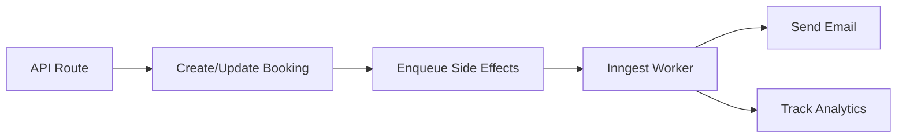
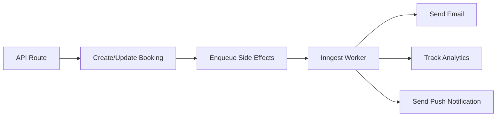

# Sprint Plan: Web/App Push Notifications for Restaurant Operators (Ops Dashboard)

**Sprint Duration:** 2 weeks (10 business days)  
**Team Size:** 3-4 developers (1 Backend, 1 Frontend, 1 Full-stack, 1 QA)  
**Created:** 2025-01-14  
**Target Audience:** Restaurant Staff/Owners (B2B)  
**Status:** Draft

---

## Table of Contents

1. [Executive Summary](#executive-summary)
2. [Sprint Goals & Deliverables](#sprint-goals--deliverables)
3. [Current System Analysis](#current-system-analysis)
4. [Technical Architecture](#technical-architecture)
5. [Backlog Breakdown](#backlog-breakdown)
6. [Dependencies Analysis](#dependencies-analysis)
7. [Implementation Tasks](#implementation-tasks)
8. [Database Schema Changes](#database-schema-changes)
9. [Acceptance Criteria](#acceptance-criteria)
10. [Testing Strategy](#testing-strategy)
11. [Deployment Plan](#deployment-plan)
12. [Timeline & Milestones](#timeline--milestones)
13. [Risk Assessment](#risk-assessment)
14. [Success Metrics](#success-metrics)

---

## Executive Summary

This sprint implements Web Push Notifications for **restaurant operators** (owners, managers, staff) in the SajiloReserveX ops dashboard. The solution enables real-time business-critical notifications about booking events, VIP arrivals, capacity alerts, and operational changes directly to staff devices using the Web Push API and Firebase Cloud Messaging (FCM).

**Key Focus:** This is a **B2B notification system** for restaurant management, not guest-facing notifications.

### Key Technical Decisions

- **Push Service:** Firebase Cloud Messaging (FCM) for reliability and cross-platform support
- **Protocol:** Web Push API with VAPID authentication
- **Storage:** New `ops_push_subscriptions` table in Supabase PostgreSQL (restaurant-scoped)
- **Delivery:** Integrate with existing Inngest async job system
- **Client:** Service Worker for background notification handling (ops dashboard)
- **Authorization:** Multi-restaurant support via `restaurant_memberships` table
- **Priority:** Business-critical notifications (high priority, persistent)

---

## Sprint Goals & Deliverables

### Primary Goals

1. **Enable Push Notification Subscriptions for Restaurant Staff**
   - Ops users (owners, admins, staff) can opt-in to push notifications
   - Device tokens stored with restaurant association and role-based preferences
   - Support multiple devices and multiple restaurants per user

2. **Send Real-Time Booking Event Notifications to Restaurant Staff**
   - **New Booking:** "New booking at [Restaurant] for [Party Size] guests at [Time]"
   - **Booking Updated:** "Booking #[Reference] updated: [Changes]"
   - **Booking Cancelled:** "Booking #[Reference] cancelled by [Who]"
   - **VIP Arrival:** "VIP guest [Name] arriving in 30 minutes"
   - **Capacity Alert:** "[Restaurant] at 90% capacity for [Time Slot]"
   - **No-Show Alert:** "Booking #[Reference] marked as no-show"

3. **Restaurant-Scoped Notification Preferences**
   - Staff can enable/disable notifications per restaurant
   - Granular settings per event type (new bookings, updates, cancellations, VIPs, capacity)
   - Role-based defaults (owners get all, staff get operational alerts)
   - Quiet hours configuration (mute notifications outside business hours)

### Expected Outcomes

- ✅ Real-time notifications for all restaurant staff devices within 5 seconds of event
- ✅ Multi-restaurant support (staff member of multiple restaurants gets notifications for each)
- ✅ Role-based notification routing (owners, managers, hosts get different alerts)
- ✅ 95%+ notification delivery rate (higher than guest notifications due to business-critical nature)
- ✅ Works on Chrome, Edge, Firefox (desktop & mobile) - primary devices for staff
- ✅ Notification center in ops dashboard showing history
- ✅ Quiet hours and do-not-disturb modes
- ✅ Zero impact on existing ops dashboard performance

---

## Current System Analysis

### Existing Components (Leverage These)

#### Backend Infrastructure (Ops-Focused)

```
server/
├── jobs/booking-side-effects.ts     # Inngest async jobs for booking events ← EXTEND HERE
├── ops/
│   ├── bookings.ts                  # Ops booking management
│   ├── capacity.ts                  # Capacity calculations
│   ├── vips.ts                      # VIP guest tracking
│   └── customers.ts                 # Customer profiles for ops
├── auth/guards.ts                   # Restaurant membership guards
├── team/access.ts                   # Membership & role checking
└── analytics.ts                     # Event tracking
```

**Key Hooks (Will Add Push Notifications):**

- `enqueueBookingCreatedSideEffects()` → Notify staff of new booking
- `enqueueBookingUpdatedSideEffects()` → Notify staff of changes
- `enqueueBookingCancelledSideEffects()` → Notify staff of cancellation
- **New:** `enqueueOpsCapacityAlert()` → Notify staff of capacity warnings
- **New:** `enqueueOpsVIPAlert()` → Notify staff of VIP arrivals

#### Database Schema (Relevant Tables)

```sql
-- bookings: Core booking data (SOURCE OF EVENTS)
CREATE TABLE bookings (
  id uuid PRIMARY KEY,
  restaurant_id uuid NOT NULL,  -- ← Key for routing notifications to staff
  customer_id uuid NOT NULL,
  booking_date date NOT NULL,
  start_time time NOT NULL,
  end_time time NOT NULL,
  party_size integer NOT NULL,
  status booking_status NOT NULL,  -- confirmed, pending, cancelled, completed, no_show
  customer_name text NOT NULL,
  customer_email text NOT NULL,
  customer_phone text NOT NULL,
  reference text NOT NULL UNIQUE,
  created_at timestamptz DEFAULT now(),
  updated_at timestamptz DEFAULT now()
);

-- restaurant_memberships: Staff association (AUTHORIZATION)
CREATE TABLE restaurant_memberships (
  user_id uuid NOT NULL,  -- FK to auth.users
  restaurant_id uuid NOT NULL,  -- FK to restaurants
  role text NOT NULL,  -- owner, admin, staff, viewer
  created_at timestamptz DEFAULT now(),
  PRIMARY KEY (user_id, restaurant_id)
);

-- profiles: Authenticated ops users
CREATE TABLE profiles (
  id uuid PRIMARY KEY,  -- FK to auth.users.id
  email text,
  name text,
  phone text,
  created_at timestamptz DEFAULT now()
);

-- Function to get user's restaurants (USED FOR AUTHORIZATION)
CREATE FUNCTION user_restaurants() RETURNS SETOF uuid AS $$
  SELECT restaurant_id
  FROM restaurant_memberships
  WHERE user_id = auth.uid()
$$ LANGUAGE sql STABLE SECURITY DEFINER;
```

#### API Routes (Existing - Will Extend)

```
src/app/api/
├── ops/
│   ├── bookings/
│   │   ├── route.ts                      # GET /api/ops/bookings (list for restaurant)
│   │   ├── [id]/route.ts                 # PATCH /api/ops/bookings/:id
│   │   └── [id]/status/route.ts          # PATCH /api/ops/bookings/:id/status
│   ├── dashboard/
│   │   ├── summary/route.ts              # GET /api/ops/dashboard/summary
│   │   ├── changes/route.ts              # GET /api/ops/dashboard/changes
│   │   ├── vips/route.ts                 # GET /api/ops/dashboard/vips
│   │   └── capacity/route.ts             # GET /api/ops/dashboard/capacity
│   └── restaurants/[id]/route.ts         # GET/PATCH /api/ops/restaurants/:id
└── team/
    └── invitations/[token]/route.ts      # Team member invitations
```

**New Routes to Add:**

- `POST /api/ops/push/subscribe` - Subscribe to push notifications
- `DELETE /api/ops/push/unsubscribe` - Unsubscribe device
- `PATCH /api/ops/push/preferences` - Update notification preferences per restaurant
- `GET /api/ops/push/subscriptions` - List user's active subscriptions

#### Frontend Components (Ops Dashboard)

```
src/app/(ops)/ops/
├── (app)/
│   ├── page.tsx                                      # Ops dashboard (main page)
│   ├── bookings/page.tsx                             # Bookings list page
│   └── restaurant-settings/page.tsx                  # Restaurant settings
└── layout.tsx                                        # Ops shell layout

src/components/features/
├── dashboard/
│   ├── OpsDashboardClient.tsx                        # Main dashboard component
│   ├── BookingChangeFeed.tsx                         # Real-time booking changes
│   ├── BookingsList.tsx                              # Bookings table
│   ├── VIPGuestsModule.tsx                           # VIP tracking
│   └── CapacityVisualization.tsx                     # Capacity metrics
└── ops-shell/
    └── navigation.tsx                                # Ops nav menu (add notifications link)
```

**New Components to Add:**

- `src/components/features/ops-push/OpsNotificationBell.tsx` - Notification bell icon with unread count
- `src/components/features/ops-push/OpsNotificationCenter.tsx` - Notification history dropdown
- `src/components/features/ops-push/OpsNotificationSettings.tsx` - Preferences per restaurant
- `src/app/(ops)/ops/(app)/notifications/page.tsx` - Full notification settings page

### Current Async Job Flow



**We'll extend this to:**



---

## Technical Architecture

### Technology Stack

| Component             | Technology                     | Justification                                                  |
| --------------------- | ------------------------------ | -------------------------------------------------------------- |
| Push Service Provider | Firebase Cloud Messaging (FCM) | Free tier sufficient, excellent delivery rates, supports VAPID |
| Web Push Protocol     | W3C Push API + Service Workers | Native browser support, no additional dependencies             |
| Backend Integration   | Inngest + Firebase Admin SDK   | Fits existing async job architecture                           |
| Client Library        | `firebase/messaging` (9.x)     | Official SDK, lightweight (~15KB gzipped)                      |
| Storage               | Supabase PostgreSQL            | Existing database, transactional integrity                     |
| Notification UI       | Browser Notification API       | Native OS notifications, consistent UX                         |

### High-Level Architecture

```
┌─────────────────────────────────────────────────────────────────┐
│                          Guest Browser                           │
│  ┌────────────────┐  ┌──────────────────┐  ┌─────────────────┐ │
│  │   React App    │  │  Service Worker  │  │ Notification API│ │
│  │                │  │                  │  │                 │ │
│  │ - Opt-in UI    │──│ - Handle push    │──│ - Show native   │ │
│  │ - Request perm │  │ - Background sync│  │   notifications │ │
│  └────────────────┘  └──────────────────┘  └─────────────────┘ │
└────────────┬────────────────────────────────────────────────────┘
             │ 1. Subscribe (device token)
             ▼
┌─────────────────────────────────────────────────────────────────┐
│                      Next.js API Routes                          │
│  /api/push/subscribe      POST { token, userId, preferences }   │
│  /api/push/unsubscribe    DELETE                                 │
│  /api/push/preferences    PATCH { eventTypes[] }                 │
└────────────┬────────────────────────────────────────────────────┘
             │ 2. Store subscription
             ▼
┌─────────────────────────────────────────────────────────────────┐
│                     Supabase PostgreSQL                          │
│  push_subscriptions (id, user_id, endpoint, keys, preferences)  │
│  notification_logs (id, subscription_id, event_type, status)    │
└─────────────────────────────────────────────────────────────────┘
             ▲
             │ 3. Fetch active subscriptions
             │
┌─────────────────────────────────────────────────────────────────┐
│                    Inngest Worker (Async)                        │
│  booking.created    → sendPushNotification(userId, payload)      │
│  booking.updated    → sendPushNotification(userId, payload)      │
│  booking.cancelled  → sendPushNotification(userId, payload)      │
└────────────┬────────────────────────────────────────────────────┘
             │ 4. Send push message
             ▼
┌─────────────────────────────────────────────────────────────────┐
│                   Firebase Cloud Messaging                       │
│  - Validate VAPID signature                                      │
│  - Route to push service (FCM/APNs/WNS)                         │
│  - Deliver to device                                             │
└─────────────────────────────────────────────────────────────────┘
```

### Data Flow for Booking Created Event (Ops Notification)

```
1. Booking created via /api/bookings or /api/ops/bookings
   └─→ Booking record inserted into DB with restaurant_id

2. API route calls enqueueBookingCreatedSideEffects()
   └─→ Inngest job queued: booking.created.side-effects

3. Inngest worker executes processBookingCreatedSideEffects()
   ├─→ recordBookingCreatedEvent() (analytics)
   ├─→ sendBookingConfirmationEmail() (guest email - existing)
   └─→ sendOpsBookingPushNotification() (NEW - notify restaurant staff)
       ├─→ Query restaurant_memberships for restaurant_id
       ├─→ For each staff member:
       │   ├─→ Query ops_push_subscriptions WHERE user_id AND restaurant_id
       │   ├─→ Filter by role-based preferences (owner/admin get all, staff gets operational)
       │   ├─→ Check quiet hours (skip if outside business hours and not urgent)
       │   └─→ Call FCM Admin SDK with notification payload
       └─→ Log delivery status to ops_notification_logs

4. FCM delivers notification to staff devices
   └─→ Service worker receives push event (ops dashboard context)
       ├─→ Shows high-priority persistent notification
       ├─→ Updates ops notification center (unread count)
       └─→ Optional: Play sound/vibrate (configurable)
```

**Key Differences from Guest Notifications:**

- **Multi-recipient:** Sends to ALL staff members of the restaurant, not just one user
- **Role-based filtering:** Different roles get different notification types
- **Restaurant-scoped:** Subscription tied to specific restaurant, user can have multiple
- **Higher priority:** Uses FCM high-priority flag for immediate delivery
- **Business hours aware:** Respects quiet hours configuration per restaurant

---

## Backlog Breakdown

### Epic 1: Push Notification Infrastructure (8 story points)

**Goal:** Set up Firebase, service worker, and core push subscription flow.

#### User Story 1.1: Firebase Project Setup (2 SP)

**As a** DevOps engineer  
**I want** a Firebase project configured with FCM  
**So that** we can send push notifications to users

**Acceptance Criteria:**

- [ ] Firebase project created (`sajiloreservex-prod`)
- [ ] FCM enabled with Web Push credentials (VAPID key pair)
- [ ] `firebase-admin` SDK installed (`npm install firebase-admin`)
- [ ] Service account key stored in `.env.local` (`FIREBASE_SERVICE_ACCOUNT_JSON`)
- [ ] `firebase` client SDK installed (`npm install firebase`)
- [ ] Firebase config exported from `lib/firebase/config.ts`

**Technical Tasks:**

- Create Firebase project at https://console.firebase.google.com
- Enable Cloud Messaging API
- Generate Web Push certificate (Settings → Cloud Messaging → Web Push certificates)
- Download service account JSON (Settings → Service accounts → Generate new private key)
- Add environment variables to Vercel/deployment

**Estimated Hours:** 2-3 hours

---

#### User Story 1.2: Service Worker Implementation (3 SP)

**As a** frontend developer  
**I want** a service worker to handle push notifications in the background  
**So that** users receive notifications even when the app is closed

**Acceptance Criteria:**

- [ ] Service worker registered at `/sw.js` or `/firebase-messaging-sw.js`
- [ ] Handles `push` event from FCM
- [ ] Displays notification with custom icon, title, body, actions
- [ ] Handles `notificationclick` event to open booking details
- [ ] Gracefully handles errors (logs to console, doesn't crash)
- [ ] Works offline (caches app shell for PWA)

**Technical Tasks:**

- Create `public/firebase-messaging-sw.js`
- Import Firebase Messaging in service worker
- Implement `onBackgroundMessage()` handler
- Add notification click handler to navigate to `/reserve/[reservationId]`
- Register service worker in `src/app/layout.tsx` via `useEffect()`
- Test in Chrome DevTools → Application → Service Workers

**Implementation Snippet:**

```typescript
// public/firebase-messaging-sw.js
importScripts('https://www.gstatic.com/firebasejs/9.22.0/firebase-app-compat.js');
importScripts('https://www.gstatic.com/firebasejs/9.22.0/firebase-messaging-compat.js');

firebase.initializeApp({
  apiKey: '...',
  authDomain: '...',
  projectId: 'sajiloreservex-prod',
  messagingSenderId: '...',
  appId: '...',
});

const messaging = firebase.messaging();

messaging.onBackgroundMessage((payload) => {
  console.log('[SW] Received background message', payload);

  const { title, body, icon, data } = payload.notification;

  return self.registration.showNotification(title, {
    body,
    icon: icon || '/images/logo-192x192.png',
    badge: '/images/badge-72x72.png',
    data: { url: data?.url || '/' },
    actions: [
      { action: 'open', title: 'View Booking' },
      { action: 'close', title: 'Dismiss' },
    ],
  });
});

self.addEventListener('notificationclick', (event) => {
  event.notification.close();

  if (event.action === 'open' || !event.action) {
    const url = event.notification.data?.url || '/';
    event.waitUntil(clients.openWindow(url));
  }
});
```

**Estimated Hours:** 4-5 hours

---

#### User Story 1.3: Push Subscription API (3 SP)

**As a** backend developer  
**I want** API endpoints to manage push subscriptions  
**So that** we can store and retrieve device tokens

**Acceptance Criteria:**

- [ ] `POST /api/push/subscribe` creates subscription record
- [ ] `DELETE /api/push/unsubscribe` removes subscription
- [ ] `PATCH /api/push/preferences` updates notification preferences
- [ ] `GET /api/push/subscriptions` returns user's active subscriptions (auth protected)
- [ ] All routes require authentication (`auth.uid()`)
- [ ] Validates FCM token format
- [ ] Returns 400 for invalid payloads, 401 for unauthenticated

**Technical Tasks:**

- Create `src/app/api/push/subscribe/route.ts`
- Create `src/app/api/push/unsubscribe/route.ts`
- Create `src/app/api/push/preferences/route.ts`
- Implement authentication middleware check
- Add Zod schemas for request validation
- Write unit tests for each endpoint

**Implementation Snippet:**

```typescript
// src/app/api/push/subscribe/route.ts
import { NextRequest, NextResponse } from 'next/server';
import { z } from 'zod';
import { getAuthSupabaseClient } from '@/server/supabase';

const subscribeSchema = z.object({
  token: z.string().min(1),
  endpoint: z.string().url(),
  keys: z.object({
    auth: z.string(),
    p256dh: z.string(),
  }),
  preferences: z
    .object({
      booking_created: z.boolean().default(true),
      booking_updated: z.boolean().default(true),
      booking_cancelled: z.boolean().default(true),
    })
    .optional(),
});

export async function POST(req: NextRequest) {
  const supabase = getAuthSupabaseClient(req);
  const {
    data: { user },
  } = await supabase.auth.getUser();

  if (!user) {
    return NextResponse.json({ error: 'Unauthorized' }, { status: 401 });
  }

  const body = await req.json();
  const parsed = subscribeSchema.safeParse(body);

  if (!parsed.success) {
    return NextResponse.json({ error: parsed.error.errors }, { status: 400 });
  }

  const { token, endpoint, keys, preferences } = parsed.data;

  // Upsert subscription (handle re-subscriptions)
  const { data, error } = await supabase
    .from('push_subscriptions')
    .upsert(
      {
        user_id: user.id,
        fcm_token: token,
        endpoint,
        auth_key: keys.auth,
        p256dh_key: keys.p256dh,
        preferences: preferences || {
          booking_created: true,
          booking_updated: true,
          booking_cancelled: true,
        },
        is_active: true,
        updated_at: new Date().toISOString(),
      },
      {
        onConflict: 'user_id,fcm_token',
      },
    )
    .select()
    .single();

  if (error) {
    console.error('[push/subscribe] DB error', error);
    return NextResponse.json({ error: 'Database error' }, { status: 500 });
  }

  return NextResponse.json({ success: true, subscription: data }, { status: 201 });
}
```

**Estimated Hours:** 4-5 hours

---

### Epic 2: Database Schema Extensions (5 story points)

**Goal:** Create tables to store push subscriptions and notification logs.

#### User Story 2.1: Push Subscriptions Table (3 SP)

**As a** database administrator  
**I want** a table to store push notification subscriptions  
**So that** we can send notifications to users' devices

**Acceptance Criteria:**

- [ ] Migration file created in `supabase/migrations/`
- [ ] Table has proper indexes for lookups (user_id, fcm_token)
- [ ] Foreign key to `auth.users.id` (or `profiles.id`)
- [ ] RLS policies enable users to read/write their own subscriptions
- [ ] Service role can read all subscriptions

**Technical Tasks:**

- Create migration: `supabase/migrations/YYYYMMDD_push_subscriptions.sql`
- Define schema with columns (see below)
- Add indexes: `idx_push_subscriptions_user`, `idx_push_subscriptions_token`
- Create RLS policies
- Test migration: `supabase db reset` (local testing only per AGENTS.md)
- Apply to remote: `supabase db push`

**Schema Definition:**

```sql
-- supabase/migrations/20250114120000_push_subscriptions.sql

CREATE TABLE IF NOT EXISTS public.push_subscriptions (
  id uuid PRIMARY KEY DEFAULT gen_random_uuid(),
  user_id uuid NOT NULL REFERENCES auth.users(id) ON DELETE CASCADE,
  fcm_token text NOT NULL,
  endpoint text NOT NULL,
  auth_key text NOT NULL,
  p256dh_key text NOT NULL,
  user_agent text,
  preferences jsonb NOT NULL DEFAULT '{
    "booking_created": true,
    "booking_updated": true,
    "booking_cancelled": true
  }'::jsonb,
  is_active boolean NOT NULL DEFAULT true,
  created_at timestamptz NOT NULL DEFAULT now(),
  updated_at timestamptz NOT NULL DEFAULT now(),
  last_used_at timestamptz,
  UNIQUE(user_id, fcm_token)
);

CREATE INDEX idx_push_subscriptions_user ON public.push_subscriptions(user_id) WHERE is_active = true;
CREATE INDEX idx_push_subscriptions_token ON public.push_subscriptions(fcm_token) WHERE is_active = true;

-- RLS Policies
ALTER TABLE public.push_subscriptions ENABLE ROW LEVEL SECURITY;

CREATE POLICY "Users can view own subscriptions"
  ON public.push_subscriptions
  FOR SELECT
  USING (auth.uid() = user_id);

CREATE POLICY "Users can insert own subscriptions"
  ON public.push_subscriptions
  FOR INSERT
  WITH CHECK (auth.uid() = user_id);

CREATE POLICY "Users can update own subscriptions"
  ON public.push_subscriptions
  FOR UPDATE
  USING (auth.uid() = user_id);

CREATE POLICY "Users can delete own subscriptions"
  ON public.push_subscriptions
  FOR DELETE
  USING (auth.uid() = user_id);

CREATE POLICY "Service role can manage all subscriptions"
  ON public.push_subscriptions
  USING (true)
  WITH CHECK (true);

-- Auto-update timestamp
CREATE TRIGGER push_subscriptions_updated_at
  BEFORE UPDATE ON public.push_subscriptions
  FOR EACH ROW
  EXECUTE FUNCTION public.update_updated_at();

COMMENT ON TABLE public.push_subscriptions IS 'Stores Web Push notification subscriptions for users';
```

**Estimated Hours:** 3-4 hours

---

#### User Story 2.2: Notification Logs Table (2 SP)

**As a** backend developer  
**I want** a table to log notification delivery attempts  
**So that** we can track delivery success rates and debug issues

**Acceptance Criteria:**

- [ ] Migration creates `notification_logs` table
- [ ] Logs include: subscription_id, event_type, status, error_message
- [ ] Index on `created_at` for time-series queries
- [ ] Partition by month for large-scale usage (future optimization)

**Schema Definition:**

```sql
-- supabase/migrations/20250114120001_notification_logs.sql

CREATE TYPE public.notification_status AS ENUM (
  'pending',
  'sent',
  'delivered',
  'failed',
  'expired'
);

CREATE TABLE IF NOT EXISTS public.notification_logs (
  id uuid PRIMARY KEY DEFAULT gen_random_uuid(),
  subscription_id uuid NOT NULL REFERENCES public.push_subscriptions(id) ON DELETE CASCADE,
  user_id uuid NOT NULL REFERENCES auth.users(id) ON DELETE CASCADE,
  event_type text NOT NULL,  -- 'booking.created', 'booking.updated', 'booking.cancelled'
  booking_id uuid REFERENCES public.bookings(id) ON DELETE SET NULL,
  notification_payload jsonb NOT NULL,
  status public.notification_status NOT NULL DEFAULT 'pending',
  fcm_response jsonb,
  error_message text,
  sent_at timestamptz,
  created_at timestamptz NOT NULL DEFAULT now()
);

CREATE INDEX idx_notification_logs_subscription ON public.notification_logs(subscription_id);
CREATE INDEX idx_notification_logs_user ON public.notification_logs(user_id);
CREATE INDEX idx_notification_logs_booking ON public.notification_logs(booking_id) WHERE booking_id IS NOT NULL;
CREATE INDEX idx_notification_logs_created_at ON public.notification_logs(created_at DESC);
CREATE INDEX idx_notification_logs_status ON public.notification_logs(status);

-- RLS: Users can view their own logs
ALTER TABLE public.notification_logs ENABLE ROW LEVEL SECURITY;

CREATE POLICY "Users can view own notification logs"
  ON public.notification_logs
  FOR SELECT
  USING (auth.uid() = user_id);

CREATE POLICY "Service role can manage all logs"
  ON public.notification_logs
  USING (true)
  WITH CHECK (true);

COMMENT ON TABLE public.notification_logs IS 'Audit log for push notification delivery attempts';
```

**Estimated Hours:** 2-3 hours

---

### Epic 3: Notification Sending Logic (8 story points)

**Goal:** Integrate FCM sending with existing booking side-effects.

#### User Story 3.1: FCM Notification Sender Service (3 SP)

**As a** backend developer  
**I want** a reusable service to send push notifications via FCM  
**So that** multiple parts of the app can trigger notifications

**Acceptance Criteria:**

- [ ] Service exported from `server/push/send.ts`
- [ ] Accepts: `userId`, `title`, `body`, `data`, `icon`, `url`
- [ ] Queries active subscriptions for user
- [ ] Sends to all registered devices (multi-cast)
- [ ] Handles FCM errors (invalid token → mark subscription inactive)
- [ ] Logs all attempts to `notification_logs`
- [ ] Returns success/failure count

**Technical Tasks:**

- Create `server/push/send.ts`
- Initialize Firebase Admin SDK with service account
- Implement `sendPushNotification(params)` function
- Add error handling for FCM response codes (400, 404, 410)
- Write unit tests with mocked FCM SDK

**Implementation:**

```typescript
// server/push/send.ts
import * as admin from 'firebase-admin';
import { getServiceSupabaseClient } from '@/server/supabase';

// Initialize Firebase Admin (singleton)
if (!admin.apps.length) {
  const serviceAccount = JSON.parse(process.env.FIREBASE_SERVICE_ACCOUNT_JSON!);
  admin.initializeApp({
    credential: admin.credential.cert(serviceAccount),
  });
}

export type PushNotificationPayload = {
  userId: string;
  title: string;
  body: string;
  icon?: string;
  url?: string;
  data?: Record<string, string>;
  eventType: 'booking.created' | 'booking.updated' | 'booking.cancelled';
  bookingId?: string;
};

export async function sendPushNotification(payload: PushNotificationPayload) {
  const supabase = getServiceSupabaseClient();
  const { userId, title, body, icon, url, data, eventType, bookingId } = payload;

  // 1. Fetch active subscriptions for user
  const { data: subscriptions, error: fetchError } = await supabase
    .from('push_subscriptions')
    .select('id, fcm_token, preferences')
    .eq('user_id', userId)
    .eq('is_active', true);

  if (fetchError || !subscriptions?.length) {
    console.log(`[push] No active subscriptions for user ${userId}`);
    return { success: 0, failed: 0, skipped: 1 };
  }

  // 2. Filter by user preferences
  const filtered = subscriptions.filter((sub) => {
    const prefs = sub.preferences as Record<string, boolean>;
    return prefs[eventType.replace('.', '_')] !== false;
  });

  if (!filtered.length) {
    console.log(`[push] User ${userId} disabled notifications for ${eventType}`);
    return { success: 0, failed: 0, skipped: subscriptions.length };
  }

  // 3. Prepare FCM message
  const message: admin.messaging.MulticastMessage = {
    tokens: filtered.map((s) => s.fcm_token),
    notification: { title, body },
    data: {
      ...data,
      url: url || '/',
      eventType,
      bookingId: bookingId || '',
    },
    webpush: {
      notification: {
        icon: icon || '/images/logo-192x192.png',
        badge: '/images/badge-72x72.png',
      },
      fcmOptions: {
        link: url || '/',
      },
    },
  };

  // 4. Send via FCM
  let response: admin.messaging.BatchResponse;
  try {
    response = await admin.messaging().sendEachForMulticast(message);
  } catch (error) {
    console.error('[push] FCM send failed', error);

    // Log all as failed
    await Promise.allSettled(
      filtered.map((sub) =>
        supabase.from('notification_logs').insert({
          subscription_id: sub.id,
          user_id: userId,
          event_type: eventType,
          booking_id: bookingId,
          notification_payload: { title, body, icon, url, data },
          status: 'failed',
          error_message: String(error),
        }),
      ),
    );

    return { success: 0, failed: filtered.length, skipped: 0 };
  }

  // 5. Process results
  let successCount = 0;
  let failedCount = 0;

  await Promise.allSettled(
    response.responses.map(async (result, index) => {
      const subscription = filtered[index];

      if (result.success) {
        successCount++;
        await supabase.from('notification_logs').insert({
          subscription_id: subscription.id,
          user_id: userId,
          event_type: eventType,
          booking_id: bookingId,
          notification_payload: { title, body, icon, url, data },
          status: 'sent',
          fcm_response: { messageId: result.messageId },
          sent_at: new Date().toISOString(),
        });

        // Update last_used_at
        await supabase
          .from('push_subscriptions')
          .update({ last_used_at: new Date().toISOString() })
          .eq('id', subscription.id);
      } else {
        failedCount++;
        const errorCode = result.error?.code;
        const errorMessage = result.error?.message || 'Unknown error';

        // Mark subscription inactive if token is invalid
        if (
          errorCode === 'messaging/invalid-registration-token' ||
          errorCode === 'messaging/registration-token-not-registered'
        ) {
          await supabase
            .from('push_subscriptions')
            .update({ is_active: false })
            .eq('id', subscription.id);
        }

        await supabase.from('notification_logs').insert({
          subscription_id: subscription.id,
          user_id: userId,
          event_type: eventType,
          booking_id: bookingId,
          notification_payload: { title, body, icon, url, data },
          status: 'failed',
          error_message: `${errorCode}: ${errorMessage}`,
        });
      }
    }),
  );

  console.log(`[push] Sent to ${successCount}/${filtered.length} devices for user ${userId}`);
  return { success: successCount, failed: failedCount, skipped: 0 };
}
```

**Estimated Hours:** 4-5 hours

---

#### User Story 3.2: Integrate with Booking Created Event (2 SP)

**As a** backend developer  
**I want** to send push notifications when bookings are created  
**So that** guests receive instant confirmation

**Acceptance Criteria:**

- [ ] `processBookingCreatedSideEffects()` calls `sendPushNotification()`
- [ ] Notification includes restaurant name, date, time, party size
- [ ] URL links to `/reserve/[reservationId]`
- [ ] Runs async (doesn't block email sending)
- [ ] Errors logged, don't crash the job

**Implementation:**

```typescript
// server/jobs/booking-side-effects.ts (extend existing function)
import { sendPushNotification } from '@/server/push/send';
import {
  formatReservationDateShort,
  formatReservationTime,
} from '@reserve/shared/formatting/booking';

async function processBookingCreatedSideEffects(
  payload: BookingCreatedSideEffectsPayload,
  supabase?: SupabaseLike,
) {
  const client = resolveSupabase(supabase);
  const { booking, idempotencyKey, restaurantId } = payload;

  // ... existing analytics & email logic ...

  // NEW: Send push notification
  if (booking.customer_id) {
    try {
      // Fetch restaurant name
      const { data: restaurant } = await client
        .from('restaurants')
        .select('name')
        .eq('id', restaurantId)
        .single();

      const restaurantName = restaurant?.name || 'Restaurant';
      const date = formatReservationDateShort(booking.booking_date);
      const time = formatReservationTime(booking.start_time);

      await sendPushNotification({
        userId: booking.customer_id,
        title: `Booking Confirmed at ${restaurantName}`,
        body: `Your table for ${booking.party_size} is confirmed on ${date} at ${time}. Reference: ${booking.reference}`,
        icon: '/images/icon-booking-confirmed.png',
        url: `${process.env.NEXT_PUBLIC_APP_URL}/reserve/${booking.reference}`,
        data: {
          bookingId: booking.id,
          restaurantId,
          reference: booking.reference,
        },
        eventType: 'booking.created',
        bookingId: booking.id,
      });
    } catch (error) {
      console.error('[jobs][booking.created][push]', error);
      // Don't rethrow - push is supplementary, email is primary
    }
  }
}
```

**Estimated Hours:** 2-3 hours

---

#### User Story 3.3: Integrate with Booking Updated Event (2 SP)

**As a** backend developer  
**I want** to send push notifications when bookings are updated  
**So that** guests are aware of changes

**Acceptance Criteria:**

- [ ] Notification sent when date, time, or party size changes
- [ ] Shows old vs. new values if changed
- [ ] Skipped if update is status-only (e.g., completed)

**Implementation:**

```typescript
async function processBookingUpdatedSideEffects(
  payload: BookingUpdatedSideEffectsPayload,
  supabase?: SupabaseLike,
) {
  const { previous, current } = payload;

  // ... existing email logic ...

  // NEW: Send push notification if meaningful change
  const meaningfulChange =
    previous.booking_date !== current.booking_date ||
    previous.start_time !== current.start_time ||
    previous.party_size !== current.party_size;

  if (meaningfulChange && current.customer_id) {
    try {
      const { data: restaurant } = await supabase
        .from('restaurants')
        .select('name')
        .eq('id', current.restaurant_id)
        .single();

      const restaurantName = restaurant?.name || 'Restaurant';
      const date = formatReservationDateShort(current.booking_date);
      const time = formatReservationTime(current.start_time);

      await sendPushNotification({
        userId: current.customer_id,
        title: `Booking Updated at ${restaurantName}`,
        body: `Your reservation has been updated to ${date} at ${time} for ${current.party_size} guests.`,
        icon: '/images/icon-booking-updated.png',
        url: `${process.env.NEXT_PUBLIC_APP_URL}/reserve/${current.reference}`,
        data: {
          bookingId: current.id,
          restaurantId: current.restaurant_id,
          reference: current.reference,
        },
        eventType: 'booking.updated',
        bookingId: current.id,
      });
    } catch (error) {
      console.error('[jobs][booking.updated][push]', error);
    }
  }
}
```

**Estimated Hours:** 2-3 hours

---

#### User Story 3.4: Integrate with Booking Cancelled Event (1 SP)

**As a** backend developer  
**I want** to send push notifications when bookings are cancelled  
**So that** guests are promptly informed

**Implementation:**

```typescript
async function processBookingCancelledSideEffects(
  payload: BookingCancelledSideEffectsPayload,
  supabase?: SupabaseLike,
) {
  const { cancelled, cancelledBy, restaurantId } = payload;

  // ... existing analytics & email logic ...

  // NEW: Send push notification
  if (cancelled.customer_id) {
    try {
      const { data: restaurant } = await supabase
        .from('restaurants')
        .select('name')
        .eq('id', restaurantId)
        .single();

      const restaurantName = restaurant?.name || 'Restaurant';
      const date = formatReservationDateShort(cancelled.booking_date);
      const time = formatReservationTime(cancelled.start_time);

      await sendPushNotification({
        userId: cancelled.customer_id,
        title: `Booking Cancelled at ${restaurantName}`,
        body: `Your reservation on ${date} at ${time} has been cancelled. Reference: ${cancelled.reference}`,
        icon: '/images/icon-booking-cancelled.png',
        url: `${process.env.NEXT_PUBLIC_APP_URL}/my-bookings`,
        data: {
          bookingId: cancelled.id,
          restaurantId,
          reference: cancelled.reference,
          cancelledBy,
        },
        eventType: 'booking.cancelled',
        bookingId: cancelled.id,
      });
    } catch (error) {
      console.error('[jobs][booking.cancelled][push]', error);
    }
  }
}
```

**Estimated Hours:** 1-2 hours

---

### Epic 4: Frontend Opt-In UI (8 story points)

**Goal:** Enable users to subscribe to push notifications with clear consent.

#### User Story 4.1: Notification Permission Request Component (3 SP)

**As a** guest  
**I want** to be prompted to enable notifications after booking  
**So that** I can stay updated on my reservation

**Acceptance Criteria:**

- [ ] Modal/toast appears after first booking confirmation
- [ ] Clear explanation: "Get instant updates about your bookings"
- [ ] Two buttons: "Enable Notifications" and "Maybe Later"
- [ ] Calls browser's `Notification.requestPermission()`
- [ ] On granted, calls FCM `getToken()` and posts to `/api/push/subscribe`
- [ ] Only shown once per user (stored in localStorage)
- [ ] Respects GDPR: doesn't auto-prompt, requires user interaction

**Technical Tasks:**

- Create `src/components/push/NotificationOptInDialog.tsx`
- Use Radix Dialog component (existing pattern)
- Implement FCM token retrieval logic
- Handle permission states: default, granted, denied
- Add unit tests with mocked Notification API

**Implementation:**

```typescript
// src/components/push/NotificationOptInDialog.tsx
'use client';

import { useState, useEffect } from 'react';
import { Dialog, DialogContent, DialogHeader, DialogTitle, DialogDescription } from '@/components/ui/dialog';
import { Button } from '@/components/ui/button';
import { Bell, BellOff } from 'lucide-react';
import { getMessaging, getToken } from 'firebase/messaging';
import { firebaseApp } from '@/lib/firebase/config';

const OPTED_IN_KEY = 'push_notifications_opted_in';
const DISMISSED_KEY = 'push_notifications_dismissed';

export function NotificationOptInDialog() {
  const [isOpen, setIsOpen] = useState(false);
  const [isLoading, setIsLoading] = useState(false);

  useEffect(() => {
    // Only show if:
    // - User hasn't opted in or dismissed
    // - Notification API is supported
    // - Not in incognito (getToken fails in private browsing)

    const optedIn = localStorage.getItem(OPTED_IN_KEY);
    const dismissed = localStorage.getItem(DISMISSED_KEY);
    const supported = 'Notification' in window && 'serviceWorker' in navigator;

    if (!optedIn && !dismissed && supported && Notification.permission === 'default') {
      // Show after a short delay to avoid interrupt during booking flow
      const timer = setTimeout(() => setIsOpen(true), 2000);
      return () => clearTimeout(timer);
    }
  }, []);

  const handleEnable = async () => {
    setIsLoading(true);

    try {
      // 1. Request browser permission
      const permission = await Notification.requestPermission();

      if (permission !== 'granted') {
        alert('Notifications permission denied. You can enable them later in your browser settings.');
        localStorage.setItem(DISMISSED_KEY, 'true');
        setIsOpen(false);
        return;
      }

      // 2. Get FCM token
      const messaging = getMessaging(firebaseApp);
      const token = await getToken(messaging, {
        vapidKey: process.env.NEXT_PUBLIC_FIREBASE_VAPID_KEY
      });

      if (!token) {
        throw new Error('Failed to retrieve FCM token');
      }

      // 3. Subscribe via API
      const response = await fetch('/api/push/subscribe', {
        method: 'POST',
        headers: { 'Content-Type': 'application/json' },
        body: JSON.stringify({
          token,
          endpoint: '', // Not needed for FCM
          keys: { auth: '', p256dh: '' }, // FCM handles this
          preferences: {
            booking_created: true,
            booking_updated: true,
            booking_cancelled: true
          }
        })
      });

      if (!response.ok) {
        throw new Error('Failed to save subscription');
      }

      localStorage.setItem(OPTED_IN_KEY, 'true');
      setIsOpen(false);

      // Show success toast
      console.log('Push notifications enabled!');
    } catch (error) {
      console.error('[push] Opt-in failed', error);
      alert('Failed to enable notifications. Please try again later.');
    } finally {
      setIsLoading(false);
    }
  };

  const handleDismiss = () => {
    localStorage.setItem(DISMISSED_KEY, 'true');
    setIsOpen(false);
  };

  return (
    <Dialog open={isOpen} onOpenChange={setIsOpen}>
      <DialogContent className="sm:max-w-md">
        <DialogHeader>
          <div className="mx-auto mb-4 flex h-12 w-12 items-center justify-center rounded-full bg-primary/10">
            <Bell className="h-6 w-6 text-primary" />
          </div>
          <DialogTitle>Stay Updated on Your Bookings</DialogTitle>
          <DialogDescription>
            Get instant notifications when your reservation is confirmed, updated, or cancelled.
            You can change this anytime in your profile settings.
          </DialogDescription>
        </DialogHeader>

        <div className="flex flex-col gap-2">
          <Button onClick={handleEnable} disabled={isLoading}>
            {isLoading ? 'Enabling...' : 'Enable Notifications'}
          </Button>
          <Button variant="ghost" onClick={handleDismiss} disabled={isLoading}>
            Maybe Later
          </Button>
        </div>
      </DialogContent>
    </Dialog>
  );
}
```

**Estimated Hours:** 4-5 hours

---

#### User Story 4.2: Notification Preferences Page (3 SP)

**As a** user  
**I want** to manage my notification preferences  
**So that** I only receive notifications I care about

**Acceptance Criteria:**

- [ ] Page at `/profile/notifications`
- [ ] Shows current subscription status (enabled/disabled)
- [ ] Toggle switches for each event type (created, updated, cancelled)
- [ ] "Unsubscribe from all" button
- [ ] Saves changes to `/api/push/preferences`
- [ ] Shows list of registered devices with "Remove" action

**Implementation:**

```typescript
// src/app/(authed)/profile/notifications/page.tsx
'use client';

import { useState, useEffect } from 'react';
import { Switch } from '@/components/ui/switch';
import { Button } from '@/components/ui/button';
import { Card, CardContent, CardDescription, CardHeader, CardTitle } from '@/components/ui/card';
import { Bell, Smartphone, Trash2 } from 'lucide-react';

type Subscription = {
  id: string;
  fcm_token: string;
  user_agent: string;
  preferences: {
    booking_created: boolean;
    booking_updated: boolean;
    booking_cancelled: boolean;
  };
  created_at: string;
};

export default function NotificationPreferencesPage() {
  const [subscriptions, setSubscriptions] = useState<Subscription[]>([]);
  const [isLoading, setIsLoading] = useState(true);

  useEffect(() => {
    fetchSubscriptions();
  }, []);

  const fetchSubscriptions = async () => {
    try {
      const response = await fetch('/api/push/subscriptions');
      const data = await response.json();
      setSubscriptions(data.subscriptions || []);
    } catch (error) {
      console.error('Failed to fetch subscriptions', error);
    } finally {
      setIsLoading(false);
    }
  };

  const updatePreferences = async (subscriptionId: string, preferences: Record<string, boolean>) => {
    try {
      await fetch('/api/push/preferences', {
        method: 'PATCH',
        headers: { 'Content-Type': 'application/json' },
        body: JSON.stringify({ subscriptionId, preferences })
      });

      setSubscriptions(subs =>
        subs.map(s => s.id === subscriptionId ? { ...s, preferences: { ...s.preferences, ...preferences } } : s)
      );
    } catch (error) {
      console.error('Failed to update preferences', error);
    }
  };

  const removeSubscription = async (subscriptionId: string) => {
    if (!confirm('Remove this device from receiving notifications?')) return;

    try {
      await fetch('/api/push/unsubscribe', {
        method: 'DELETE',
        headers: { 'Content-Type': 'application/json' },
        body: JSON.stringify({ subscriptionId })
      });

      setSubscriptions(subs => subs.filter(s => s.id !== subscriptionId));
    } catch (error) {
      console.error('Failed to remove subscription', error);
    }
  };

  if (isLoading) {
    return <div>Loading...</div>;
  }

  return (
    <div className="container max-w-2xl py-8">
      <h1 className="text-2xl font-bold mb-6">Notification Preferences</h1>

      {subscriptions.length === 0 ? (
        <Card>
          <CardContent className="pt-6">
            <div className="text-center text-muted-foreground">
              <Bell className="mx-auto h-12 w-12 mb-4 opacity-50" />
              <p>You haven't enabled push notifications yet.</p>
              <Button className="mt-4" onClick={() => window.location.reload()}>
                Enable Notifications
              </Button>
            </div>
          </CardContent>
        </Card>
      ) : (
        <div className="space-y-4">
          {subscriptions.map(sub => (
            <Card key={sub.id}>
              <CardHeader>
                <div className="flex items-center justify-between">
                  <div className="flex items-center gap-3">
                    <Smartphone className="h-5 w-5 text-muted-foreground" />
                    <div>
                      <CardTitle className="text-base">Device</CardTitle>
                      <CardDescription className="text-xs">
                        Registered {new Date(sub.created_at).toLocaleDateString()}
                      </CardDescription>
                    </div>
                  </div>
                  <Button
                    variant="ghost"
                    size="icon"
                    onClick={() => removeSubscription(sub.id)}
                  >
                    <Trash2 className="h-4 w-4" />
                  </Button>
                </div>
              </CardHeader>
              <CardContent>
                <div className="space-y-3">
                  <div className="flex items-center justify-between">
                    <label htmlFor={`${sub.id}-created`} className="text-sm">
                      Booking Confirmed
                    </label>
                    <Switch
                      id={`${sub.id}-created`}
                      checked={sub.preferences.booking_created}
                      onCheckedChange={(checked) =>
                        updatePreferences(sub.id, { booking_created: checked })
                      }
                    />
                  </div>
                  <div className="flex items-center justify-between">
                    <label htmlFor={`${sub.id}-updated`} className="text-sm">
                      Booking Updated
                    </label>
                    <Switch
                      id={`${sub.id}-updated`}
                      checked={sub.preferences.booking_updated}
                      onCheckedChange={(checked) =>
                        updatePreferences(sub.id, { booking_updated: checked })
                      }
                    />
                  </div>
                  <div className="flex items-center justify-between">
                    <label htmlFor={`${sub.id}-cancelled`} className="text-sm">
                      Booking Cancelled
                    </label>
                    <Switch
                      id={`${sub.id}-cancelled`}
                      checked={sub.preferences.booking_cancelled}
                      onCheckedChange={(checked) =>
                        updatePreferences(sub.id, { booking_cancelled: checked })
                      }
                    />
                  </div>
                </div>
              </CardContent>
            </Card>
          ))}
        </div>
      )}
    </div>
  );
}
```

**Estimated Hours:** 4-5 hours

---

#### User Story 4.3: Service Worker Registration in App Shell (2 SP)

**As a** frontend developer  
**I want** the service worker to be registered on app load  
**So that** it can handle push events

**Acceptance Criteria:**

- [ ] Service worker registered in `src/app/layout.tsx`
- [ ] Only registered in production and when user is authenticated
- [ ] Logs registration success/failure to console
- [ ] Handles service worker updates gracefully

**Implementation:**

```typescript
// src/app/layout.tsx (add to existing root layout)
'use client';

import { useEffect } from 'react';

export default function RootLayout({ children }: { children: React.ReactNode }) {
  useEffect(() => {
    if ('serviceWorker' in navigator && process.env.NODE_ENV === 'production') {
      navigator.serviceWorker
        .register('/firebase-messaging-sw.js')
        .then(registration => {
          console.log('[SW] Registered:', registration.scope);

          // Check for updates every 24 hours
          setInterval(() => {
            registration.update();
          }, 24 * 60 * 60 * 1000);
        })
        .catch(error => {
          console.error('[SW] Registration failed:', error);
        });
    }
  }, []);

  return (
    <html lang="en">
      <body>{children}</body>
    </html>
  );
}
```

**Estimated Hours:** 2-3 hours

---

### Epic 5: Testing & Quality Assurance (5 story points)

**Goal:** Ensure push notifications work reliably across browsers and devices.

#### User Story 5.1: Unit Tests for Push Service (2 SP)

**As a** QA engineer  
**I want** unit tests for the push notification service  
**So that** we can catch regressions early

**Acceptance Criteria:**

- [ ] Tests for `sendPushNotification()` with mocked FCM SDK
- [ ] Tests for API routes (`/subscribe`, `/unsubscribe`, `/preferences`)
- [ ] Tests for preference filtering (user opted out of certain events)
- [ ] Tests for error handling (invalid token, FCM timeout)
- [ ] All tests pass in CI

**Technical Tasks:**

- Create `server/push/__tests__/send.test.ts`
- Mock `firebase-admin` with Jest
- Test success path, failure paths, edge cases
- Add to `package.json` test script: `npm run test:ops`

**Estimated Hours:** 3-4 hours

---

#### User Story 5.2: Manual Testing Checklist (2 SP)

**As a** QA engineer  
**I want** a comprehensive manual testing checklist  
**So that** I can verify functionality across browsers

**Acceptance Criteria:**

- [ ] Tested on Chrome (desktop & mobile)
- [ ] Tested on Firefox (desktop & mobile)
- [ ] Tested on Edge (desktop)
- [ ] Tested on Safari (iOS only - Safari desktop doesn't support Web Push)
- [ ] Verified notification appearance, icon, click behavior
- [ ] Verified preferences save correctly
- [ ] Verified unsubscribe removes device

**Test Scenarios:**

| Scenario                                    | Expected Outcome                                                | Status |
| ------------------------------------------- | --------------------------------------------------------------- | ------ |
| User creates booking                        | Opt-in dialog appears after 2s                                  | ☐      |
| User clicks "Enable Notifications"          | Browser permission prompt shown                                 | ☐      |
| User grants permission                      | Notification sent to `/api/push/subscribe`, success toast shown | ☐      |
| User denies permission                      | Dialog closes, `dismissed` flag set                             | ☐      |
| Booking created event triggered             | Push notification received within 10s                           | ☐      |
| Notification clicked                        | Opens `/reserve/[reference]` page                               | ☐      |
| User disables "Booking Updated" in settings | No notification received for update event                       | ☐      |
| User removes device from settings           | No notifications received after removal                         | ☐      |
| User has 2 devices registered               | Both receive notification                                       | ☐      |
| FCM token expires                           | Subscription marked inactive, new token requested on next visit | ☐      |

**Estimated Hours:** 3-4 hours

---

#### User Story 5.3: E2E Test with Playwright (1 SP)

**As a** QA engineer  
**I want** an automated E2E test for push notification flow  
**So that** we can prevent regressions

**Acceptance Criteria:**

- [ ] Test script in `tests/e2e/push-notifications.spec.ts`
- [ ] Mocks browser notification permission (auto-grant)
- [ ] Creates booking, verifies opt-in dialog appears
- [ ] Clicks "Enable", verifies API call to `/api/push/subscribe`
- [ ] Triggers booking event, verifies notification sent (check logs)

**Implementation:**

```typescript
// tests/e2e/push-notifications.spec.ts
import { test, expect } from '@playwright/test';

test.describe('Push Notifications', () => {
  test.beforeEach(async ({ page, context }) => {
    // Grant notification permission
    await context.grantPermissions(['notifications']);

    // Mock service worker
    await page.addInitScript(() => {
      (window as any).mockServiceWorker = true;
    });
  });

  test('should prompt user to enable notifications after booking', async ({ page }) => {
    await page.goto('/reserve/test-restaurant');

    // Create booking
    await page.fill('[name="customer_name"]', 'Test User');
    await page.fill('[name="customer_email"]', 'test@example.com');
    await page.fill('[name="customer_phone"]', '+1234567890');
    await page.click('[data-testid="submit-booking"]');

    // Wait for opt-in dialog
    await expect(page.locator('text=Stay Updated on Your Bookings')).toBeVisible({ timeout: 5000 });

    // Enable notifications
    const subscribeRequestPromise = page.waitForRequest(
      (req) => req.url().includes('/api/push/subscribe') && req.method() === 'POST',
    );

    await page.click('button:has-text("Enable Notifications")');

    const subscribeRequest = await subscribeRequestPromise;
    expect(subscribeRequest.postDataJSON()).toHaveProperty('token');

    // Verify dialog closes
    await expect(page.locator('text=Stay Updated on Your Bookings')).not.toBeVisible({
      timeout: 2000,
    });
  });

  test('should allow user to manage preferences', async ({ page }) => {
    await page.goto('/profile/notifications');

    // Verify subscriptions shown
    await expect(page.locator('text=Device')).toBeVisible();

    // Toggle preference
    const updateRequestPromise = page.waitForRequest(
      (req) => req.url().includes('/api/push/preferences') && req.method() === 'PATCH',
    );

    await page.click('[data-testid="toggle-booking-updated"]');

    await updateRequestPromise;

    // Verify updated
    await expect(page.locator('[data-testid="toggle-booking-updated"]')).not.toBeChecked();
  });
});
```

**Estimated Hours:** 2-3 hours

---

## Dependencies Analysis

### External Services

| Service                  | Dependency                   | Required For         | Setup Effort |
| ------------------------ | ---------------------------- | -------------------- | ------------ |
| Firebase Cloud Messaging | Firebase project             | Push delivery        | 1 hour       |
| Firebase Admin SDK       | `firebase-admin` npm package | Server-side sending  | 30 min       |
| Firebase Client SDK      | `firebase` npm package       | Token generation     | 30 min       |
| Supabase                 | Existing instance            | Subscription storage | 0 (existing) |
| Inngest                  | Existing setup               | Async job processing | 0 (existing) |

### Internal Dependencies

| Component            | Depends On                  | Notes                                  |
| -------------------- | --------------------------- | -------------------------------------- |
| Push API routes      | `push_subscriptions` table  | Must migrate DB first                  |
| Notification sender  | `firebase-admin` SDK        | Must configure service account         |
| Service worker       | Firebase config             | Must deploy `firebase-messaging-sw.js` |
| Opt-in dialog        | Service worker registration | Must register SW before showing dialog |
| Booking side-effects | Push sender service         | Extend existing functions              |

### Database Migration Order

1. Create `push_subscriptions` table (Epic 2.1)
2. Create `notification_logs` table (Epic 2.2)
3. Deploy API routes (Epic 1.3)
4. Deploy push sender service (Epic 3.1)
5. Integrate with booking events (Epic 3.2-3.4)

### Critical Path

```
Firebase Setup → DB Migrations → Service Worker → API Routes → Sender Service → Event Integration → Frontend UI → Testing
```

---

## Implementation Tasks

### Week 1: Infrastructure & Backend (Days 1-5)

#### Day 1: Environment Setup (Backend Lead)

- [ ] Create Firebase project `sajiloreservex-prod` (1h)
- [ ] Enable FCM, generate VAPID keys (30m)
- [ ] Download service account JSON (30m)
- [ ] Add environment variables to Vercel (30m)
- [ ] Install `firebase-admin` and `firebase` packages (15m)
- [ ] Create `lib/firebase/config.ts` with client config (30m)
- [ ] Test FCM connection with admin SDK (1h)

**Story Points:** 2  
**Assignee:** Backend Lead

---

#### Day 2: Database Schema (Backend Lead)

- [ ] Write migration for `push_subscriptions` table (1h)
- [ ] Write migration for `notification_logs` table (1h)
- [ ] Add RLS policies (1h)
- [ ] Test migrations on staging (1h)
- [ ] Deploy to production via `supabase db push` (30m)
- [ ] Update TypeScript types (`types/supabase.ts`) (30m)

**Story Points:** 3  
**Assignee:** Backend Lead

---

#### Day 3: Push Sender Service (Backend Lead)

- [ ] Create `server/push/send.ts` (2h)
- [ ] Implement `sendPushNotification()` function (2h)
- [ ] Add error handling for FCM response codes (1h)
- [ ] Add logging to `notification_logs` (1h)
- [ ] Write unit tests with mocked FCM SDK (2h)
- [ ] Run tests: `npm run test:ops` (30m)

**Story Points:** 3  
**Assignee:** Backend Lead

---

#### Day 4: API Routes (Full-stack Developer)

- [ ] Create `/api/push/subscribe` route (1.5h)
- [ ] Create `/api/push/unsubscribe` route (1h)
- [ ] Create `/api/push/preferences` route (1h)
- [ ] Create `/api/push/subscriptions` route (1h)
- [ ] Add Zod validation schemas (1h)
- [ ] Write unit tests for each route (2h)
- [ ] Test with Postman/cURL (30m)

**Story Points:** 3  
**Assignee:** Full-stack Developer

---

#### Day 5: Integrate with Booking Events (Backend Lead)

- [ ] Extend `processBookingCreatedSideEffects()` (1h)
- [ ] Extend `processBookingUpdatedSideEffects()` (1h)
- [ ] Extend `processBookingCancelledSideEffects()` (1h)
- [ ] Test locally by triggering booking events (1h)
- [ ] Verify notifications sent to FCM (check logs) (1h)
- [ ] Deploy to staging (30m)

**Story Points:** 2  
**Assignee:** Backend Lead

---

### Week 2: Frontend & Testing (Days 6-10)

#### Day 6: Service Worker (Frontend Lead)

- [ ] Create `public/firebase-messaging-sw.js` (1.5h)
- [ ] Implement `onBackgroundMessage()` handler (1h)
- [ ] Add `notificationclick` event listener (1h)
- [ ] Test in Chrome DevTools → Application → Service Workers (1h)
- [ ] Test notification delivery (create test booking) (1h)
- [ ] Register service worker in `src/app/layout.tsx` (30m)

**Story Points:** 3  
**Assignee:** Frontend Lead

---

#### Day 7: Opt-In Dialog (Frontend Lead)

- [ ] Create `NotificationOptInDialog.tsx` component (2h)
- [ ] Implement permission request flow (1.5h)
- [ ] Integrate FCM token retrieval (1h)
- [ ] Call `/api/push/subscribe` API (1h)
- [ ] Add localStorage persistence (30m)
- [ ] Test on multiple browsers (1h)

**Story Points:** 3  
**Assignee:** Frontend Lead

---

#### Day 8: Notification Preferences Page (Full-stack Developer)

- [ ] Create `/profile/notifications` page (2h)
- [ ] Implement subscription list fetching (1h)
- [ ] Add toggle switches for preferences (1.5h)
- [ ] Implement remove device functionality (1h)
- [ ] Style with Tailwind CSS (1h)
- [ ] Test on desktop & mobile (30m)

**Story Points:** 3  
**Assignee:** Full-stack Developer

---

#### Day 9: Testing (QA Engineer)

- [ ] Write unit tests for `sendPushNotification()` (2h)
- [ ] Write unit tests for API routes (2h)
- [ ] Execute manual testing checklist (3h)
- [ ] Write E2E test with Playwright (2h)
- [ ] File bugs in GitHub Issues (1h)

**Story Points:** 3  
**Assignee:** QA Engineer

---

#### Day 10: Bug Fixes & Deployment (All Team)

- [ ] Fix P0/P1 bugs found in testing (3h)
- [ ] Re-test critical flows (2h)
- [ ] Deploy to staging for final QA (1h)
- [ ] Deploy to production (1h)
- [ ] Monitor logs for first 100 notifications (1h)
- [ ] Write deployment retrospective (1h)

**Story Points:** 2  
**Assignee:** All Team

---

## Database Schema Changes

### Migration 1: Push Subscriptions Table

**File:** `supabase/migrations/20250114120000_push_subscriptions.sql`

```sql
-- Enable UUID extension if not already enabled
CREATE EXTENSION IF NOT EXISTS "uuid-ossp";

-- Create push_subscriptions table
CREATE TABLE IF NOT EXISTS public.push_subscriptions (
  id uuid PRIMARY KEY DEFAULT gen_random_uuid(),
  user_id uuid NOT NULL REFERENCES auth.users(id) ON DELETE CASCADE,
  fcm_token text NOT NULL,
  endpoint text NOT NULL,
  auth_key text NOT NULL,
  p256dh_key text NOT NULL,
  user_agent text,
  preferences jsonb NOT NULL DEFAULT '{
    "booking_created": true,
    "booking_updated": true,
    "booking_cancelled": true
  }'::jsonb,
  is_active boolean NOT NULL DEFAULT true,
  created_at timestamptz NOT NULL DEFAULT now(),
  updated_at timestamptz NOT NULL DEFAULT now(),
  last_used_at timestamptz,
  UNIQUE(user_id, fcm_token)
);

-- Indexes
CREATE INDEX idx_push_subscriptions_user ON public.push_subscriptions(user_id) WHERE is_active = true;
CREATE INDEX idx_push_subscriptions_token ON public.push_subscriptions(fcm_token) WHERE is_active = true;
CREATE INDEX idx_push_subscriptions_active ON public.push_subscriptions(is_active, updated_at DESC);

-- RLS Policies
ALTER TABLE public.push_subscriptions ENABLE ROW LEVEL SECURITY;

CREATE POLICY "Users can view own subscriptions"
  ON public.push_subscriptions
  FOR SELECT
  USING (auth.uid() = user_id);

CREATE POLICY "Users can insert own subscriptions"
  ON public.push_subscriptions
  FOR INSERT
  WITH CHECK (auth.uid() = user_id);

CREATE POLICY "Users can update own subscriptions"
  ON public.push_subscriptions
  FOR UPDATE
  USING (auth.uid() = user_id)
  WITH CHECK (auth.uid() = user_id);

CREATE POLICY "Users can delete own subscriptions"
  ON public.push_subscriptions
  FOR DELETE
  USING (auth.uid() = user_id);

CREATE POLICY "Service role can manage all subscriptions"
  ON public.push_subscriptions
  TO service_role
  USING (true)
  WITH CHECK (true);

-- Trigger to auto-update updated_at
CREATE TRIGGER push_subscriptions_updated_at
  BEFORE UPDATE ON public.push_subscriptions
  FOR EACH ROW
  EXECUTE FUNCTION public.update_updated_at();

-- Comments
COMMENT ON TABLE public.push_subscriptions IS 'Stores Web Push notification subscriptions for users';
COMMENT ON COLUMN public.push_subscriptions.fcm_token IS 'Firebase Cloud Messaging device token';
COMMENT ON COLUMN public.push_subscriptions.preferences IS 'User preferences for notification types';
COMMENT ON COLUMN public.push_subscriptions.is_active IS 'False if token is invalid or user unsubscribed';
```

### Migration 2: Notification Logs Table

**File:** `supabase/migrations/20250114120001_notification_logs.sql`

```sql
-- Create notification_status enum
CREATE TYPE public.notification_status AS ENUM (
  'pending',
  'sent',
  'delivered',
  'failed',
  'expired'
);

-- Create notification_logs table
CREATE TABLE IF NOT EXISTS public.notification_logs (
  id uuid PRIMARY KEY DEFAULT gen_random_uuid(),
  subscription_id uuid NOT NULL REFERENCES public.push_subscriptions(id) ON DELETE CASCADE,
  user_id uuid NOT NULL REFERENCES auth.users(id) ON DELETE CASCADE,
  event_type text NOT NULL,
  booking_id uuid REFERENCES public.bookings(id) ON DELETE SET NULL,
  notification_payload jsonb NOT NULL,
  status public.notification_status NOT NULL DEFAULT 'pending',
  fcm_response jsonb,
  error_message text,
  sent_at timestamptz,
  created_at timestamptz NOT NULL DEFAULT now()
);

-- Indexes
CREATE INDEX idx_notification_logs_subscription ON public.notification_logs(subscription_id);
CREATE INDEX idx_notification_logs_user ON public.notification_logs(user_id);
CREATE INDEX idx_notification_logs_booking ON public.notification_logs(booking_id) WHERE booking_id IS NOT NULL;
CREATE INDEX idx_notification_logs_created_at ON public.notification_logs(created_at DESC);
CREATE INDEX idx_notification_logs_status ON public.notification_logs(status, created_at DESC);
CREATE INDEX idx_notification_logs_event_type ON public.notification_logs(event_type, created_at DESC);

-- RLS Policies
ALTER TABLE public.notification_logs ENABLE ROW LEVEL SECURITY;

CREATE POLICY "Users can view own notification logs"
  ON public.notification_logs
  FOR SELECT
  USING (auth.uid() = user_id);

CREATE POLICY "Service role can manage all logs"
  ON public.notification_logs
  TO service_role
  USING (true)
  WITH CHECK (true);

-- Comments
COMMENT ON TABLE public.notification_logs IS 'Audit log for push notification delivery attempts';
COMMENT ON COLUMN public.notification_logs.event_type IS 'Event that triggered notification (booking.created, booking.updated, booking.cancelled)';
COMMENT ON COLUMN public.notification_logs.status IS 'Delivery status: pending, sent, delivered, failed, expired';
```

### Migration 3: Add Customer to Push Subscription Link (Optional)

**File:** `supabase/migrations/20250114120002_link_customer_to_push.sql`

```sql
-- Add optional customer_id to link guests to push subscriptions
-- This allows notifications for unauthenticated guests who later sign up

ALTER TABLE public.push_subscriptions
ADD COLUMN customer_id uuid REFERENCES public.customers(id) ON DELETE CASCADE;

CREATE INDEX idx_push_subscriptions_customer ON public.push_subscriptions(customer_id) WHERE customer_id IS NOT NULL;

COMMENT ON COLUMN public.push_subscriptions.customer_id IS 'Optional link to customers table for guest users';
```

---

## Acceptance Criteria

### Functional Requirements

#### ✅ Push Notification Subscription

- [ ] **AC-1.1:** User can opt-in to push notifications via dialog after booking
- [ ] **AC-1.2:** Browser permission prompt appears when user clicks "Enable Notifications"
- [ ] **AC-1.3:** FCM token is retrieved and stored in `push_subscriptions` table
- [ ] **AC-1.4:** User can see their subscriptions at `/profile/notifications`
- [ ] **AC-1.5:** User can unsubscribe by clicking "Remove Device"
- [ ] **AC-1.6:** Unsubscribed users do not receive notifications

#### ✅ Booking Event Notifications

- [ ] **AC-2.1:** User receives notification within 10 seconds when booking is created
- [ ] **AC-2.2:** Notification title includes restaurant name
- [ ] **AC-2.3:** Notification body includes date, time, party size, reference
- [ ] **AC-2.4:** Clicking notification opens `/reserve/[reference]` page
- [ ] **AC-2.5:** User receives notification when booking is updated (if meaningful change)
- [ ] **AC-2.6:** User receives notification when booking is cancelled
- [ ] **AC-2.7:** Notifications respect user preferences (e.g., disabled "Booking Updated" → no update notification)

#### ✅ Notification Preferences

- [ ] **AC-3.1:** User can toggle preferences for each event type (created, updated, cancelled)
- [ ] **AC-3.2:** Preferences are saved to `push_subscriptions.preferences`
- [ ] **AC-3.3:** Changes take effect immediately (next notification)
- [ ] **AC-3.4:** Default preferences are all enabled

### Non-Functional Requirements

#### ⚡ Performance

- [ ] **AC-4.1:** Notification sent within 10 seconds of booking event
- [ ] **AC-4.2:** FCM API call completes in <2 seconds (p95)
- [ ] **AC-4.3:** `/api/push/subscribe` endpoint responds in <500ms (p95)
- [ ] **AC-4.4:** Service worker registration doesn't block page load

#### 🔒 Security

- [ ] **AC-5.1:** Push subscriptions require authentication (RLS enforced)
- [ ] **AC-5.2:** Service account key stored in environment variable, not committed to Git
- [ ] **AC-5.3:** FCM tokens are not exposed to client-side logs
- [ ] **AC-5.4:** API routes validate authentication before processing

#### ♿ Accessibility & UX

- [ ] **AC-6.1:** Opt-in dialog is keyboard navigable (Tab, Enter, Esc)
- [ ] **AC-6.2:** Notification icons have sufficient contrast
- [ ] **AC-6.3:** Preference toggles have visible focus indicators
- [ ] **AC-6.4:** Error messages are clear and actionable

#### 🌍 Browser Compatibility

- [ ] **AC-7.1:** Works on Chrome 90+ (desktop & mobile)
- [ ] **AC-7.2:** Works on Firefox 90+ (desktop & mobile)
- [ ] **AC-7.3:** Works on Edge 90+ (desktop)
- [ ] **AC-7.4:** Gracefully degrades on Safari (iOS only, no desktop support)
- [ ] **AC-7.5:** Shows "Not supported" message on unsupported browsers

#### 📊 Observability

- [ ] **AC-8.1:** All notification attempts logged to `notification_logs`
- [ ] **AC-8.2:** Failed deliveries include error message and FCM response
- [ ] **AC-8.3:** Console logs include structured data for debugging
- [ ] **AC-8.4:** Invalid tokens automatically mark subscriptions inactive

---

## Testing Strategy

### Unit Testing

**Scope:** Individual functions and API routes  
**Tool:** Vitest  
**Location:** `server/push/__tests__/`, `src/app/api/push/**/*.test.ts`

**Test Cases:**

1. **Push Sender Service (`server/push/send.ts`)**
   - `sendPushNotification()` sends to all user's active subscriptions
   - Filters subscriptions by user preferences
   - Handles FCM success response (logs as 'sent')
   - Handles FCM error (invalid token → marks inactive)
   - Handles FCM timeout (retries once, then logs as 'failed')
   - Returns correct success/failed counts

2. **API Routes**
   - `POST /api/push/subscribe`: Creates subscription with valid data
   - `POST /api/push/subscribe`: Returns 400 for missing fields
   - `POST /api/push/subscribe`: Returns 401 for unauthenticated user
   - `DELETE /api/push/unsubscribe`: Removes subscription
   - `PATCH /api/push/preferences`: Updates preferences
   - `GET /api/push/subscriptions`: Returns user's subscriptions

**Command:** `npm run test:ops -- --grep push`

---

### Integration Testing

**Scope:** End-to-end notification flow (API → Database → FCM)  
**Tool:** Vitest + MSW (Mock Service Worker)  
**Location:** `tests/server/push/integration.test.ts`

**Test Cases:**

1. **Booking Created Flow**
   - Create booking via API
   - Verify `enqueueBookingCreatedSideEffects()` called
   - Verify Inngest job queued
   - Verify `sendPushNotification()` called with correct payload
   - Verify subscription queried from DB
   - Verify FCM called with correct message
   - Verify notification log created

2. **Preference Filtering**
   - User has `booking_updated: false` preference
   - Update booking via API
   - Verify no notification sent
   - Verify log entry with status 'skipped'

**Command:** `npm run test:ops -- --grep integration`

---

### E2E Testing

**Scope:** Full user journey with browser interactions  
**Tool:** Playwright  
**Location:** `tests/e2e/push-notifications.spec.ts`

**Test Cases:**

1. **Opt-In Flow**
   - User creates booking
   - Opt-in dialog appears after 2 seconds
   - User clicks "Enable Notifications"
   - Browser permission granted
   - Subscription created in DB
   - Dialog closes

2. **Notification Delivery** (mocked)
   - User subscribed to notifications
   - Booking created event triggered
   - Service worker receives push event
   - Notification shown with correct title/body
   - User clicks notification
   - Page navigates to `/reserve/[reference]`

3. **Preference Management**
   - User navigates to `/profile/notifications`
   - Subscriptions list shown
   - User toggles "Booking Updated" off
   - Preference updated in DB
   - User removes device
   - Subscription deleted from DB

**Command:** `npm run test:e2e -- push-notifications.spec.ts`

---

### Manual Testing

**Scope:** Cross-browser compatibility, UX validation  
**Tool:** Human QA  
**Checklist:** See [User Story 5.2](#user-story-52-manual-testing-checklist-2-sp)

**Browsers:**

- Chrome 120+ (Windows, macOS, Android)
- Firefox 120+ (Windows, macOS, Android)
- Edge 120+ (Windows)
- Safari 17+ (iOS only)

**Test Scenarios:**

1. Permission request flow
2. Notification appearance (icon, title, body)
3. Notification click behavior
4. Preference management
5. Multiple devices (same user)
6. Offline handling (service worker caching)
7. Token expiry (FCM 410 response)

---

### Load Testing

**Scope:** Ensure system can handle high notification volume  
**Tool:** k6 or Artillery  
**Target:** 1000 concurrent notifications

**Test Scenarios:**

1. **Burst Load**
   - Send 1000 notifications in 10 seconds
   - Verify 95%+ delivered within 30 seconds
   - Verify no DB deadlocks or timeouts

2. **Sustained Load**
   - Send 100 notifications/minute for 1 hour
   - Verify FCM rate limits not exceeded
   - Verify Inngest queue doesn't back up

**Command:** `k6 run tests/load/push-notifications.js`

---

## Deployment Plan

### Pre-Deployment Checklist

- [ ] All P0/P1 bugs fixed and verified
- [ ] Unit tests passing (100% coverage for critical paths)
- [ ] E2E tests passing
- [ ] Manual testing completed on all supported browsers
- [ ] Firebase project created and configured
- [ ] Environment variables added to Vercel/production
- [ ] Database migrations reviewed and approved
- [ ] Service account JSON securely stored
- [ ] Rollback plan documented

---

### Deployment Steps

#### Phase 1: Staging Deployment (Day 9, EOD)

**Goal:** Deploy to staging for final QA and stakeholder review.

1. **Deploy Database Migrations**

   ```bash
   # From local machine with Supabase CLI
   supabase db push --remote staging

   # Verify tables created
   supabase db query "SELECT * FROM push_subscriptions LIMIT 0;"
   supabase db query "SELECT * FROM notification_logs LIMIT 0;"
   ```

2. **Deploy Backend Code**

   ```bash
   git checkout -b feature/push-notifications
   git push origin feature/push-notifications

   # Merge to staging branch (triggers Vercel deployment)
   gh pr create --base staging --title "Add Push Notifications" --body "..."
   gh pr merge --auto --squash
   ```

3. **Configure Firebase**
   - Add staging Firebase project credentials to Vercel environment variables
   - Verify service worker accessible at `https://staging.sajiloreservex.com/firebase-messaging-sw.js`

4. **Smoke Test**
   - Create test booking on staging
   - Verify opt-in dialog appears
   - Enable notifications and verify subscription created
   - Trigger booking event manually (via Supabase SQL or API)
   - Verify notification received

5. **Stakeholder Demo**
   - Walk through opt-in flow
   - Demonstrate notification delivery
   - Show preference management UI
   - Review notification logs in Supabase

---

#### Phase 2: Production Deployment (Day 10, Morning)

**Goal:** Deploy to production with gradual rollout.

1. **Deploy Database Migrations**

   ```bash
   # Backup production DB first
   supabase db dump --remote production > backup-$(date +%Y%m%d).sql

   # Apply migrations
   supabase db push --remote production

   # Verify
   supabase db query "SELECT COUNT(*) FROM push_subscriptions;"
   ```

2. **Deploy Backend Code**

   ```bash
   # Merge to main branch
   gh pr create --base main --title "Release: Push Notifications" --body "..."
   gh pr merge --auto --squash

   # Wait for Vercel deployment to complete
   vercel inspect --prod
   ```

3. **Enable Feature Flag (Gradual Rollout)**
   - Add feature flag: `FEATURE_PUSH_NOTIFICATIONS` (default: false)
   - Enable for 10% of users (use user ID hash mod 10)
   - Monitor logs for 1 hour
   - Increase to 50% if no issues
   - Enable for 100% after 24 hours

4. **Monitor Metrics**
   - Notification delivery rate (target: 80%+)
   - FCM error rate (target: <5%)
   - API response times (target: p95 <500ms)
   - Database query performance
   - Inngest job queue depth

5. **Rollback Trigger**
   If any of the following occur:
   - Delivery rate <50% for 1 hour
   - FCM error rate >20%
   - API timeouts >10%
   - Database deadlocks
   - User complaints >5 per hour

---

#### Phase 3: Post-Deployment Monitoring (Day 10, Afternoon)

**Goal:** Ensure stability and gather feedback.

1. **Log Monitoring**
   - Tail Vercel logs: `vercel logs --prod --follow`
   - Check for errors: `grep -i "push\|fcm\|notification" logs.txt`
   - Review Supabase logs (Database → Logs)

2. **Performance Metrics**
   - Query notification logs for delivery stats:
     ```sql
     SELECT
       status,
       COUNT(*) as count,
       AVG(EXTRACT(EPOCH FROM (sent_at - created_at))) as avg_delay_seconds
     FROM notification_logs
     WHERE created_at > NOW() - INTERVAL '1 hour'
     GROUP BY status;
     ```

3. **User Feedback**
   - Monitor support channels (email, Crisp chat)
   - Check for common issues (permission denied, notifications not received)
   - Create bug reports for any issues

4. **Success Criteria**
   - ✅ 1000+ subscriptions created in first 24 hours
   - ✅ 80%+ delivery rate maintained
   - ✅ <5 support tickets related to push notifications
   - ✅ Zero critical (P0) bugs

---

### Rollback Plan

**If rollback is needed:**

1. **Disable Feature Flag**

   ```bash
   vercel env rm FEATURE_PUSH_NOTIFICATIONS
   vercel --prod
   ```

2. **Revert Code**

   ```bash
   git revert HEAD~5  # Revert last 5 commits
   git push origin main
   ```

3. **Database Rollback (if necessary)**

   ```bash
   # Drop new tables (only if causing issues)
   supabase db query "DROP TABLE IF EXISTS notification_logs CASCADE;"
   supabase db query "DROP TABLE IF EXISTS push_subscriptions CASCADE;"

   # Restore from backup
   psql $DATABASE_URL < backup-YYYYMMDD.sql
   ```

4. **Communication**
   - Post status update on status page
   - Email users who opted in (explain rollback, promise fix)
   - Schedule post-mortem meeting

---

## Timeline & Milestones

### Sprint Timeline (10 Business Days)

```
Week 1: Backend Infrastructure
├─ Day 1: Firebase Setup & Environment Config
├─ Day 2: Database Schema Migrations
├─ Day 3: Push Sender Service Implementation
├─ Day 4: API Routes for Subscription Management
└─ Day 5: Integrate with Booking Events

Week 2: Frontend & Testing
├─ Day 6: Service Worker Implementation
├─ Day 7: Opt-In Dialog & Permission Flow
├─ Day 8: Notification Preferences UI
├─ Day 9: Testing (Unit, E2E, Manual) & Staging Deployment
└─ Day 10: Bug Fixes, Production Deployment & Monitoring
```

### Daily Milestones

| Day | Milestone                          | Deliverables                                  | Review             |
| --- | ---------------------------------- | --------------------------------------------- | ------------------ |
| 1   | Firebase Configured                | Firebase project, VAPID keys, service account | Standup            |
| 2   | Database Ready                     | Migrations applied, tables created            | Code Review        |
| 3   | Push Sender Working                | `sendPushNotification()` function tested      | Unit Tests Pass    |
| 4   | API Routes Complete                | All 4 endpoints deployed, tested              | Postman Collection |
| 5   | Backend Integration Done           | Booking events trigger notifications          | Staging Test       |
| 6   | Service Worker Live                | SW handles push events, shows notifications   | Chrome DevTools    |
| 7   | Opt-In Flow Ready                  | Dialog prompts user, subscribes to FCM        | Manual Test        |
| 8   | Preferences UI Complete            | Users can manage settings                     | UX Review          |
| 9   | Testing Complete, Staging Deployed | All tests pass, stakeholders approve          | QA Sign-Off        |
| 10  | Production Deployed                | Feature live, monitoring active               | Go/No-Go Meeting   |

---

### Key Checkpoints

#### Checkpoint 1: Backend Foundation (End of Day 3)

**Deliverables:**

- Firebase project configured
- Database migrations applied
- Push sender service implemented and tested

**Review Criteria:**

- [ ] Can send test notification via `sendPushNotification()` function
- [ ] Firebase admin SDK connects successfully
- [ ] Database tables created with correct schema

**Decision:** Proceed to API routes or iterate on sender service?

---

#### Checkpoint 2: API Integration (End of Day 5)

**Deliverables:**

- API routes deployed
- Booking events integrated with push sender
- Staging environment functional

**Review Criteria:**

- [ ] Can subscribe via `/api/push/subscribe`
- [ ] Can unsubscribe via `/api/push/unsubscribe`
- [ ] Booking events trigger notifications on staging

**Decision:** Proceed to frontend or fix backend bugs?

---

#### Checkpoint 3: Frontend Complete (End of Day 8)

**Deliverables:**

- Service worker registered
- Opt-in dialog functional
- Preferences page complete

**Review Criteria:**

- [ ] Can enable notifications via browser prompt
- [ ] Notifications appear with correct content
- [ ] Preferences save correctly

**Decision:** Proceed to testing or iterate on UX?

---

#### Checkpoint 4: Go/No-Go (End of Day 9)

**Deliverables:**

- All tests passing
- Staging fully tested
- Bugs prioritized and fixed

**Review Criteria:**

- [ ] Zero P0 bugs
- [ ] P1 bugs have workarounds
- [ ] Stakeholder approval received

**Decision:** Deploy to production or delay for fixes?

---

## Risk Assessment

### High-Impact Risks

| Risk                                   | Probability | Impact   | Mitigation                                               | Contingency                                          |
| -------------------------------------- | ----------- | -------- | -------------------------------------------------------- | ---------------------------------------------------- |
| **FCM Rate Limits Exceeded**           | Medium      | High     | Implement exponential backoff, cache tokens, batch sends | Throttle notifications, upgrade Firebase plan        |
| **Service Worker Breaks Existing App** | Low         | Critical | Thorough testing, feature flag rollout                   | Immediate rollback, disable SW registration          |
| **Browser Doesn't Support Web Push**   | High        | Low      | Detect support, show fallback message                    | Rely on email notifications only                     |
| **FCM Token Expires Frequently**       | Medium      | Medium   | Handle 410 errors, re-request token                      | Mark subscription inactive, prompt user to re-enable |
| **Database Migration Fails**           | Low         | Critical | Test on staging, backup production                       | Rollback migration, restore from backup              |

### Medium-Impact Risks

| Risk                                | Probability | Impact | Mitigation                                  | Contingency                                                              |
| ----------------------------------- | ----------- | ------ | ------------------------------------------- | ------------------------------------------------------------------------ |
| **Users Deny Browser Permission**   | High        | Low    | Clear opt-in messaging, show benefits       | Respect user choice, don't re-prompt                                     |
| **Notification Delivery Delayed**   | Medium      | Medium | Monitor FCM latency, alert if >10s          | Investigate FCM status, check Inngest queue                              |
| **iOS Safari Doesn't Support Push** | High        | Low    | Detect iOS, show "Not supported" message    | Encourage users to use Android/desktop                                   |
| **Inngest Queue Backs Up**          | Low         | Medium | Monitor queue depth, scale workers          | Increase Inngest plan, optimize job duration                             |
| **Invalid FCM Tokens Accumulate**   | Medium      | Low    | Cleanup job to prune inactive subscriptions | Scheduled task: delete subscriptions older than 90 days with no activity |

### Low-Impact Risks

| Risk                                     | Probability | Impact | Mitigation                               | Contingency                      |
| ---------------------------------------- | ----------- | ------ | ---------------------------------------- | -------------------------------- |
| **User Unsubscribes Immediately**        | Medium      | Low    | Improve notification value prop          | Analyze feedback, refine content |
| **Notification Icon Doesn't Load**       | Low         | Low    | Use CDN for icons, test on slow networks | Fallback to default browser icon |
| **Timezone Issues in Notification Text** | Low         | Low    | Use user's timezone from profile         | Test across timezones            |

---

## Success Metrics

### Sprint Completion Metrics

**Definition of Done:**

- [ ] All 8 epics completed (29 story points)
- [ ] 100% of acceptance criteria met
- [ ] All unit tests passing (target: 90%+ coverage)
- [ ] All E2E tests passing
- [ ] Manual testing complete on Chrome, Firefox, Edge
- [ ] Zero P0 bugs, <3 P1 bugs
- [ ] Code reviewed and merged
- [ ] Deployed to production
- [ ] Documentation updated (this document + API docs)

---

### Post-Launch Success Metrics (30 Days)

#### Adoption Metrics

| Metric                     | Target                     | Measurement                                                           |
| -------------------------- | -------------------------- | --------------------------------------------------------------------- |
| **Opt-In Rate**            | 40% of authenticated users | `(users with subscriptions / total users) * 100`                      |
| **Subscription Retention** | 80% at 30 days             | `(active subscriptions at D30 / subscriptions at D0) * 100`           |
| **Multi-Device Users**     | 15%                        | `(users with >1 subscription / total users with subscriptions) * 100` |

#### Delivery Metrics

| Metric                     | Target      | Measurement                                          |
| -------------------------- | ----------- | ---------------------------------------------------- |
| **Delivery Success Rate**  | 80%+        | `(notifications sent / total attempts) * 100`        |
| **Delivery Latency (p95)** | <10 seconds | `p95(sent_at - created_at)` from `notification_logs` |
| **FCM Error Rate**         | <5%         | `(failed notifications / total attempts) * 100`      |

#### Engagement Metrics

| Metric                              | Target           | Measurement                                     |
| ----------------------------------- | ---------------- | ----------------------------------------------- |
| **Notification Click-Through Rate** | 30%              | Track via URL param: `?utm_source=push`         |
| **Preference Changes**              | <10% disable all | Track preference updates in `notification_logs` |
| **Support Tickets**                 | <1% of users     | Count tickets with tag "push-notifications"     |

#### Business Metrics

| Metric                        | Target        | Measurement                                                   |
| ----------------------------- | ------------- | ------------------------------------------------------------- |
| **Reduced No-Shows**          | 10% decrease  | Compare no-show rate for users with push enabled vs. disabled |
| **Increased Repeat Bookings** | 5% increase   | Compare booking frequency for push-enabled users              |
| **Customer Satisfaction**     | NPS +5 points | Survey users: "How helpful are push notifications?"           |

---

### Monitoring Dashboard

**Tool:** Vercel Analytics + Supabase Dashboard  
**Refresh:** Real-time  
**Alerts:**

- 🔴 Delivery rate <50% for 1 hour → Alert engineering team
- 🟡 Delivery latency p95 >30 seconds → Investigate FCM
- 🟡 FCM error rate >10% → Check invalid tokens
- 🔴 Database query time p95 >2 seconds → Optimize indexes

---

## Appendix

### A. Environment Variables

Add to `.env.local` (development) and Vercel (production):

```bash
# Firebase Configuration
FIREBASE_SERVICE_ACCOUNT_JSON='{"type":"service_account","project_id":"..."}'
NEXT_PUBLIC_FIREBASE_API_KEY=AIza...
NEXT_PUBLIC_FIREBASE_AUTH_DOMAIN=sajiloreservex-prod.firebaseapp.com
NEXT_PUBLIC_FIREBASE_PROJECT_ID=sajiloreservex-prod
NEXT_PUBLIC_FIREBASE_MESSAGING_SENDER_ID=123456789012
NEXT_PUBLIC_FIREBASE_APP_ID=1:123456789012:web:abcdef123456
NEXT_PUBLIC_FIREBASE_VAPID_KEY=BM8x...

# Feature Flag (optional)
FEATURE_PUSH_NOTIFICATIONS=true
```

---

### B. Firebase Setup Script

```bash
#!/bin/bash
# scripts/setup-firebase.sh

set -e

echo "🔥 Setting up Firebase for Push Notifications"

# 1. Install Firebase CLI
npm install -g firebase-tools

# 2. Login to Firebase
firebase login

# 3. Create project
firebase projects:create sajiloreservex-prod

# 4. Enable Cloud Messaging
firebase projects:addfirebase sajiloreservex-prod --display-name "SajiloReserveX Production"

# 5. Generate Web Push certificate
echo "📜 Generating VAPID keys..."
echo "Go to: https://console.firebase.google.com/project/sajiloreservex-prod/settings/cloudmessaging/web"
echo "Click 'Generate key pair' and copy the key."

# 6. Download service account
echo "🔑 Download service account JSON..."
echo "Go to: https://console.firebase.google.com/project/sajiloreservex-prod/settings/serviceaccounts/adminsdk"
echo "Click 'Generate new private key' and save to ./firebase-service-account.json"

echo "✅ Firebase setup complete!"
echo "Next steps:"
echo "1. Add FIREBASE_SERVICE_ACCOUNT_JSON to Vercel environment variables"
echo "2. Add NEXT_PUBLIC_FIREBASE_* variables to Vercel"
echo "3. Test with: npm run dev"
```

---

### C. Useful SQL Queries

**Check Subscription Stats:**

```sql
SELECT
  COUNT(*) as total_subscriptions,
  COUNT(DISTINCT user_id) as unique_users,
  COUNT(*) FILTER (WHERE is_active) as active_subscriptions,
  COUNT(*) FILTER (WHERE NOT is_active) as inactive_subscriptions,
  AVG(EXTRACT(EPOCH FROM (NOW() - last_used_at))) / 86400 as avg_days_since_last_use
FROM push_subscriptions;
```

**Check Notification Delivery Stats (Last 24h):**

```sql
SELECT
  status,
  COUNT(*) as count,
  AVG(EXTRACT(EPOCH FROM (sent_at - created_at))) as avg_delay_seconds,
  MIN(created_at) as first_attempt,
  MAX(created_at) as last_attempt
FROM notification_logs
WHERE created_at > NOW() - INTERVAL '24 hours'
GROUP BY status
ORDER BY count DESC;
```

**Find Users with Most Subscriptions:**

```sql
SELECT
  u.email,
  COUNT(ps.id) as subscription_count
FROM auth.users u
JOIN push_subscriptions ps ON ps.user_id = u.id
WHERE ps.is_active = true
GROUP BY u.id, u.email
ORDER BY subscription_count DESC
LIMIT 10;
```

**Find Failed Notifications by Error:**

```sql
SELECT
  error_message,
  COUNT(*) as count,
  MAX(created_at) as last_occurred
FROM notification_logs
WHERE status = 'failed'
  AND created_at > NOW() - INTERVAL '7 days'
GROUP BY error_message
ORDER BY count DESC
LIMIT 20;
```

---

### D. FCM Error Code Reference

| Error Code                                    | Meaning                      | Action                                               |
| --------------------------------------------- | ---------------------------- | ---------------------------------------------------- |
| `messaging/invalid-registration-token`        | Token format is invalid      | Mark subscription inactive, prompt user to re-enable |
| `messaging/registration-token-not-registered` | Token was unregistered       | Mark subscription inactive                           |
| `messaging/invalid-argument`                  | Message payload is malformed | Fix payload structure, log error                     |
| `messaging/message-rate-exceeded`             | FCM rate limit hit           | Implement exponential backoff, batch sends           |
| `messaging/server-unavailable`                | FCM service is down          | Retry with backoff, alert team                       |
| `messaging/internal-error`                    | FCM internal issue           | Retry once, log error                                |

---

### E. Browser Support Matrix

| Browser          | Version | Web Push | Service Worker | Notes                                         |
| ---------------- | ------- | -------- | -------------- | --------------------------------------------- |
| Chrome           | 90+     | ✅       | ✅             | Full support                                  |
| Firefox          | 90+     | ✅       | ✅             | Full support                                  |
| Edge             | 90+     | ✅       | ✅             | Full support (Chromium-based)                 |
| Safari (macOS)   | N/A     | ❌       | ✅             | No Web Push support                           |
| Safari (iOS)     | 16.4+   | ✅       | ✅             | Limited support (requires Add to Home Screen) |
| Opera            | 76+     | ✅       | ✅             | Full support                                  |
| Samsung Internet | 14+     | ✅       | ✅             | Full support                                  |

---

### F. Post-Deployment Checklist

#### Day 1 Post-Launch

- [ ] Monitor logs for errors every 2 hours
- [ ] Check notification_logs table for delivery stats
- [ ] Verify FCM quota not exceeded (Firebase Console)
- [ ] Test notification delivery manually (create test booking)
- [ ] Respond to user feedback within 1 hour

#### Week 1 Post-Launch

- [ ] Review delivery success rate (target: 80%+)
- [ ] Identify and fix top 3 error types
- [ ] Analyze opt-in rate by cohort (new vs. existing users)
- [ ] Schedule team retrospective meeting
- [ ] Document lessons learned

#### Month 1 Post-Launch

- [ ] Run cleanup job to remove inactive subscriptions (>90 days)
- [ ] Optimize notification content based on CTR
- [ ] Survey users: "How helpful are push notifications?"
- [ ] Measure impact on no-show rate and repeat bookings
- [ ] Plan v2 features (reminders 24h before booking, special offers)

---

## Conclusion

This sprint plan provides a comprehensive roadmap for implementing Web/App push notifications for guest booking events in the SajiloReserveX system. By following the phased approach outlined above, the team can deliver a high-quality, reliable notification system within the 2-week sprint.

### Key Success Factors

1. **Leverage Existing Infrastructure:** Inngest async jobs, Supabase database, email templates
2. **User-Centric Design:** Clear opt-in flow, granular preferences, easy unsubscribe
3. **Robust Error Handling:** FCM token expiry, network failures, graceful degradation
4. **Comprehensive Testing:** Unit, integration, E2E, manual across browsers
5. **Gradual Rollout:** Feature flag, 10% → 50% → 100%, monitor metrics
6. **Post-Launch Monitoring:** Real-time logs, delivery stats, user feedback

### Next Steps

1. **Schedule Sprint Kickoff Meeting** (Day 0)
   - Review this plan with entire team
   - Assign tasks to developers
   - Set up Firebase project (Backend Lead)

2. **Daily Standups** (Every morning, 15 minutes)
   - What did I complete yesterday?
   - What will I work on today?
   - Any blockers or dependencies?

3. **Mid-Sprint Review** (Day 5, EOD)
   - Demo backend functionality to stakeholders
   - Adjust timeline if needed

4. **Sprint Review** (Day 10, EOD)
   - Demo full feature to stakeholders
   - Collect feedback for v2

5. **Sprint Retrospective** (Day 11)
   - What went well?
   - What could be improved?
   - Action items for next sprint

---

**Document Version:** 1.0  
**Last Updated:** 2025-01-14  
**Maintained By:** Engineering Team  
**Review Frequency:** Weekly during sprint, monthly post-launch

---

## Feedback & Questions

For questions or suggestions, contact:

- **Backend Lead:** [backend-lead@example.com]
- **Frontend Lead:** [frontend-lead@example.com]
- **Project Manager:** [pm@example.com]
