# SajiloReserveX - System Architecture Documentation

**Version:** 1.0  
**Date:** 2025-01-15  
**Status:** Production

---

## Table of Contents

1. [High-Level Architecture](#high-level-architecture)
2. [Technology Stack](#technology-stack)
3. [Application Layers](#application-layers)
4. [Data Flow Architecture](#data-flow-architecture)
5. [Security Architecture](#security-architecture)
6. [Deployment Architecture](#deployment-architecture)
7. [Integration Architecture](#integration-architecture)
8. [Scalability & Performance](#scalability--performance)

---

## High-Level Architecture

### System Overview

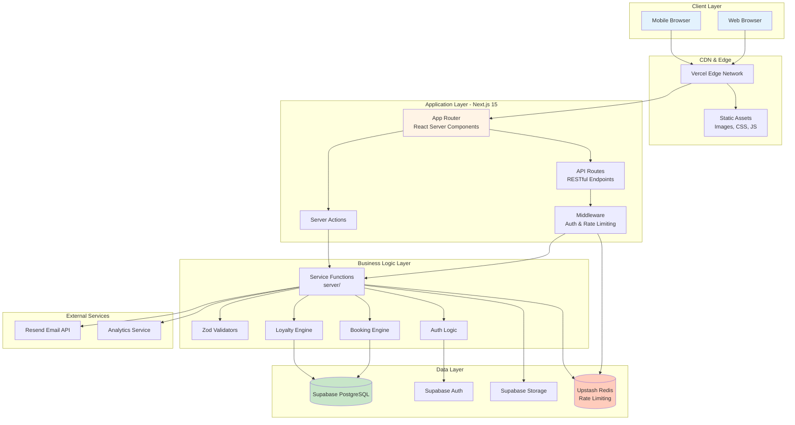

### Architecture Principles

1. **Server-First Rendering**
   - React Server Components (RSC) for optimal performance
   - Reduced client-side JavaScript
   - Faster Time to First Byte (TTFB)

2. **Progressive Enhancement**
   - Core functionality works without JavaScript
   - Enhanced experience with client-side interactions
   - Graceful degradation

3. **Type Safety End-to-End**
   - TypeScript throughout
   - Zod for runtime validation
   - Database types auto-generated from Supabase

4. **Security by Default**
   - Row-Level Security (RLS) in database
   - HTTP-only cookies
   - Rate limiting on all public endpoints
   - Input validation at every boundary

---

## Technology Stack

### Frontend Architecture

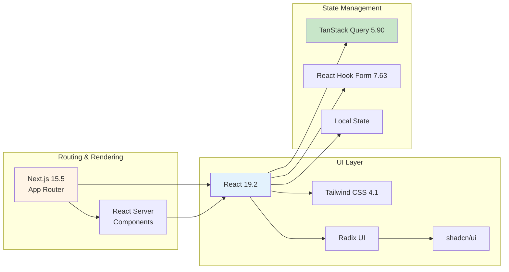

**Frontend Technologies:**

| Technology      | Version | Purpose                       |
| --------------- | ------- | ----------------------------- |
| Next.js         | 15.5.4  | React framework, SSR, routing |
| React           | 19.2.0  | UI library                    |
| TypeScript      | 5.9.2   | Type safety                   |
| Tailwind CSS    | 4.1.13  | Utility-first styling         |
| Radix UI        | Latest  | Accessible primitives         |
| shadcn/ui       | 3.4.0   | Component library             |
| TanStack Query  | 5.90.2  | Server state management       |
| React Hook Form | 7.63.0  | Form handling                 |
| Zod             | 4.1.11  | Schema validation             |

---

### Backend Architecture

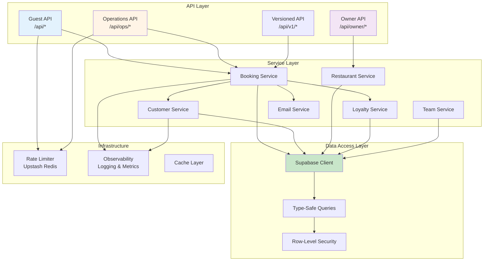

**Backend Technologies:**

| Technology    | Version  | Purpose                    |
| ------------- | -------- | -------------------------- |
| Node.js       | 20.11.0+ | Runtime environment        |
| Supabase      | Latest   | PostgreSQL database + Auth |
| Upstash Redis | 1.35.4   | Rate limiting & caching    |
| Resend        | 6.1.0    | Transactional emails       |
| Nodemailer    | 7.0.6    | Email fallback             |
| Zod           | 4.1.11   | API validation             |

---

## Application Layers

### Layer 1: Presentation Layer

**Responsibility:** User interface and user experience

```mermaid
graph TD
    subgraph "Pages"
        HomePage[Home Page<br/>src/app/page.tsx]
        ReservePage[Reserve Page<br/>src/app/reserve/r/[slug]/page.tsx]
        MyBookings[My Bookings<br/>src/app/my-bookings/page.tsx]
        OpsDashboard[Ops Dashboard<br/>src/app/ops/page.tsx]
    end

    subgraph "Components"
        Features[Feature Components<br/>src/components/features/]
        UI[UI Primitives<br/>src/components/ui/]
        Marketing[Marketing Components<br/>src/components/marketing/]
    end

    subgraph "Hooks"
        QueryHooks[React Query Hooks<br/>src/hooks/]
        FormHooks[Form Hooks]
    end

    HomePage --> Marketing
    ReservePage --> Features
    MyBookings --> Features
    OpsDashboard --> Features

    Features --> UI
    Features --> QueryHooks
    Features --> FormHooks

    style HomePage fill:#e3f2fd
    style Features fill:#fff4e6
```

**Key Patterns:**

- Server Components for initial render
- Client Components for interactivity
- Composition over inheritance
- Atomic design principles

---

### Layer 2: API Layer

**Responsibility:** HTTP request handling and routing

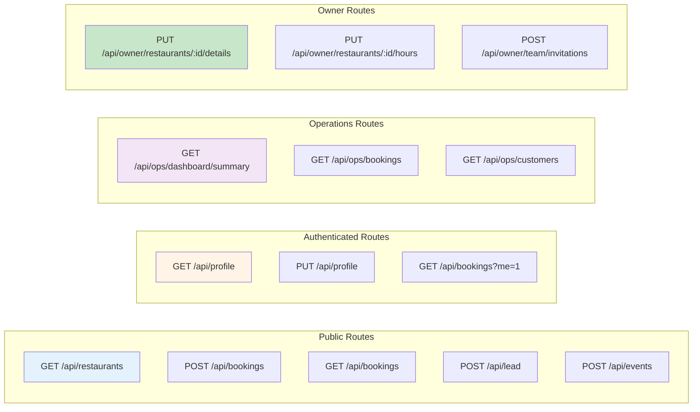

**API Design Principles:**

- RESTful conventions
- Consistent error responses
- Versioned endpoints (/api/v1/\*)
- Rate limiting on all routes
- Idempotency support

---

### Layer 3: Business Logic Layer

**Responsibility:** Core application logic and rules

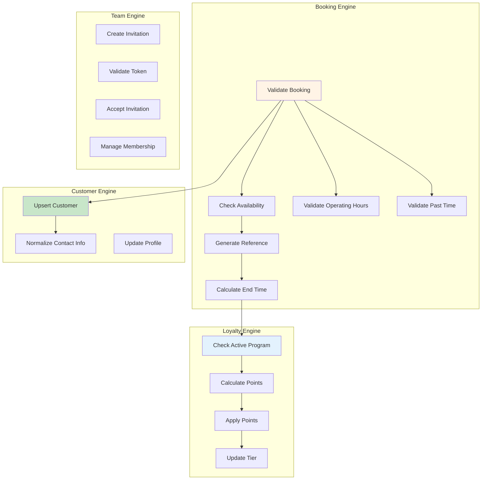

**Business Rules:**

- Operating hours enforcement
- Past time blocking with grace period
- Loyalty point accrual formulas
- Idempotency key handling
- Reference uniqueness

---

### Layer 4: Data Access Layer

**Responsibility:** Database interactions and caching

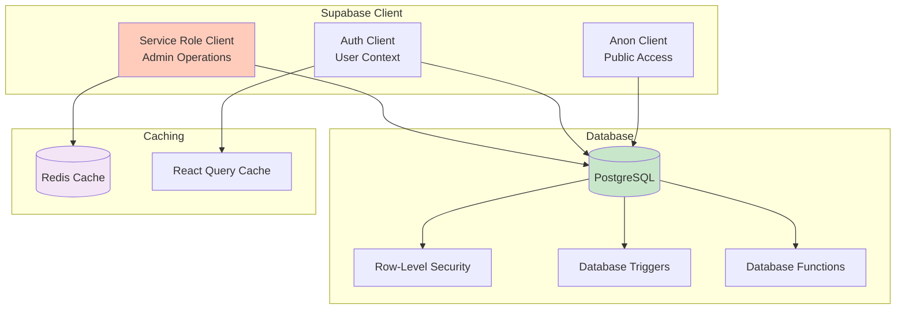

---

## Data Flow Architecture

### Booking Creation Flow

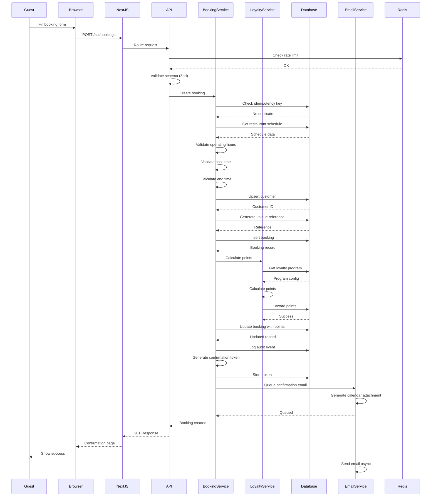

### Authentication Flow

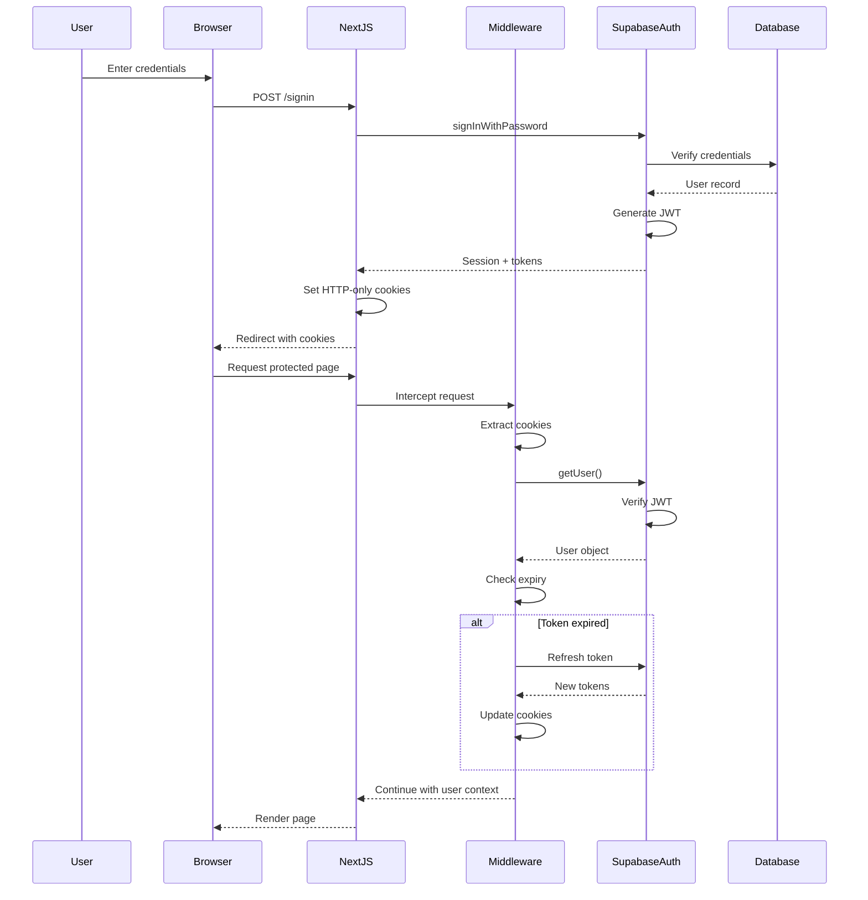

---

## Security Architecture

### Authentication & Authorization

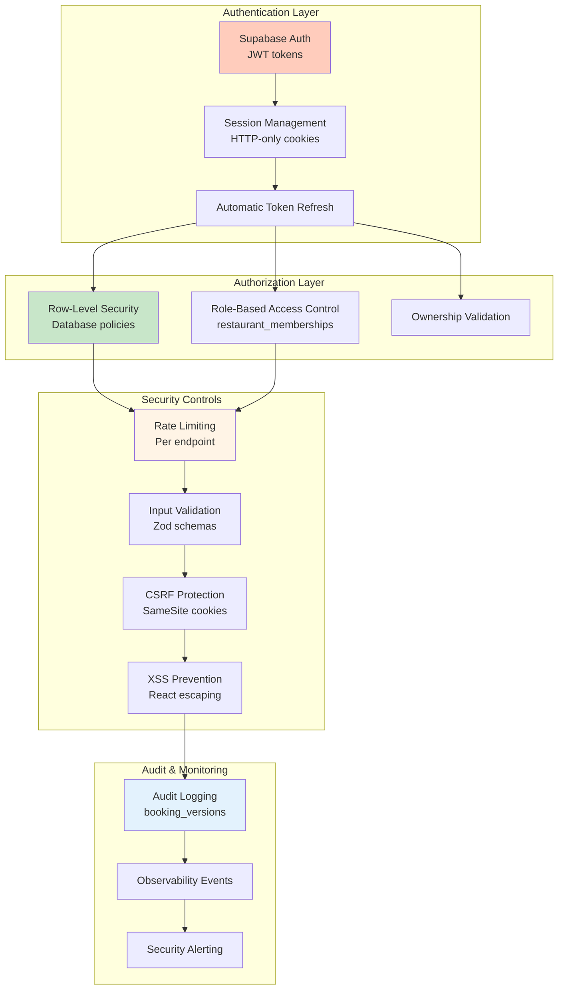

### Rate Limiting Architecture

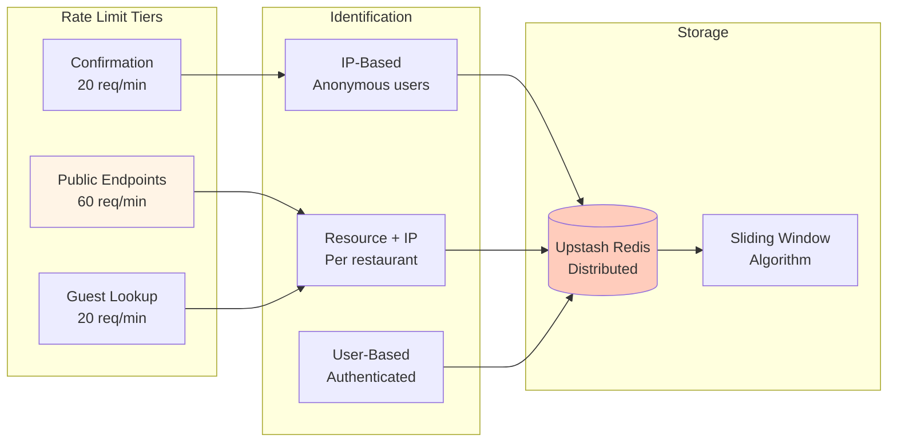

---

## Deployment Architecture

### Production Environment

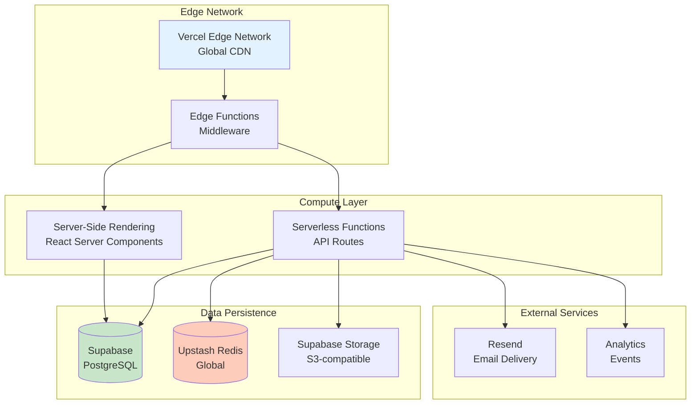

### Deployment Pipeline

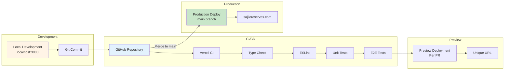

---

## Integration Architecture

### External Service Integration

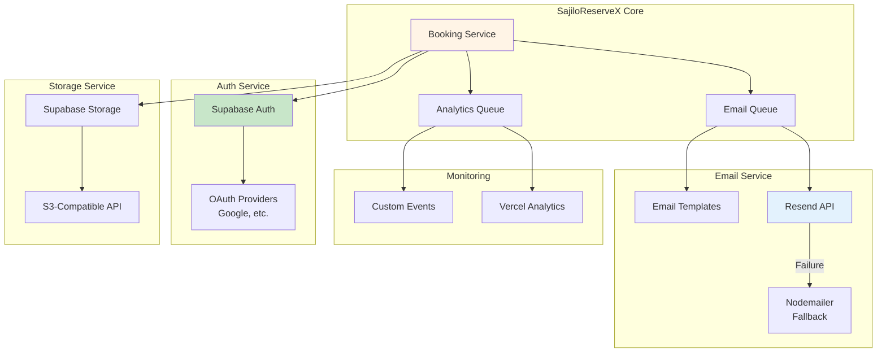

---

## Scalability & Performance

### Horizontal Scaling

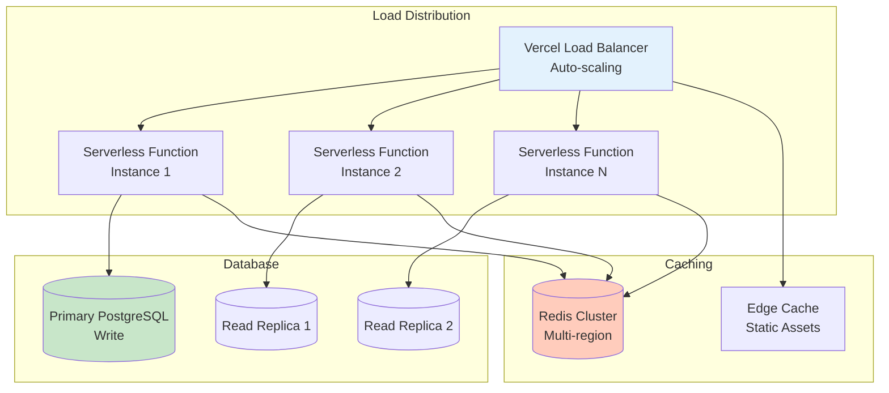

### Performance Optimization Layers

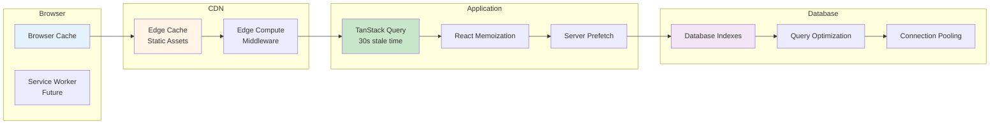

---

## Architecture Decision Records (ADRs)

### ADR-001: Next.js App Router over Pages Router

**Status:** Accepted  
**Date:** 2024-01-01

**Context:**
Need to choose between Next.js Pages Router and App Router.

**Decision:**
Use App Router with React Server Components.

**Consequences:**

- ✅ Better performance (RSC)
- ✅ Improved developer experience
- ✅ Built-in loading/error states
- ❌ Newer, less documentation
- ❌ Some libraries not fully compatible

---

### ADR-002: Supabase for Database + Auth

**Status:** Accepted  
**Date:** 2024-01-01

**Context:**
Need managed database and authentication solution.

**Decision:**
Use Supabase for PostgreSQL, Auth, and Storage.

**Consequences:**

- ✅ Managed infrastructure
- ✅ Built-in Row-Level Security
- ✅ Real-time capabilities (future)
- ✅ Great developer experience
- ❌ Vendor lock-in
- ❌ Limited customization

---

### ADR-003: Upstash Redis for Rate Limiting

**Status:** Accepted  
**Date:** 2024-01-15

**Context:**
Need distributed rate limiting for API protection.

**Decision:**
Use Upstash Redis (serverless Redis).

**Consequences:**

- ✅ Global, low-latency access
- ✅ Pay-per-request pricing
- ✅ No infrastructure management
- ✅ Compatible with serverless
- ❌ Additional cost per request

---

### ADR-004: TanStack Query over Redux

**Status:** Accepted  
**Date:** 2024-01-01

**Context:**
Need client-side state management for server data.

**Decision:**
Use TanStack Query for server state, React Context for local UI state.

**Consequences:**

- ✅ Automatic caching and revalidation
- ✅ Optimistic updates
- ✅ Less boilerplate
- ✅ Built-in loading/error states
- ❌ Not suitable for complex local state

---

## System Boundaries

### What This System Does

✅ **Restaurant Reservation Management**

- Guest booking creation and management
- Real-time availability tracking
- Booking confirmation with tokens

✅ **Operations Dashboard**

- Daily booking monitoring
- Customer profile aggregation
- Walk-in management
- Data export

✅ **Team Management**

- Role-based access control
- Team invitations
- Membership management

✅ **Loyalty Program**

- Automatic point accrual
- Tier progression
- Point event tracking

✅ **Security & Compliance**

- Rate limiting
- Audit trails
- Authentication & authorization

---

### What This System Does NOT Do

❌ **Payment Processing**

- No credit card handling
- No payment gateway integration
- No billing/invoicing

❌ **Table Management**

- No floor plan visualization
- No table assignment logic
- No seating charts

❌ **Menu Management**

- No menu items
- No pricing
- No ordering

❌ **Inventory Management**

- No stock tracking
- No ingredient management

❌ **POS Integration**

- No point-of-sale integration
- No order management

❌ **Marketing Automation**

- Basic lead capture only
- No email campaigns
- No SMS marketing

---

## Future Architecture Considerations

### Planned Enhancements

1. **Real-Time Updates**
   - WebSocket integration via Supabase Realtime
   - Live dashboard updates
   - Push notifications

2. **Mobile Applications**
   - React Native mobile apps
   - Shared TypeScript types
   - Native push notifications

3. **Advanced Analytics**
   - Custom analytics dashboard
   - Predictive availability
   - Customer behavior insights

4. **Third-Party Integrations**
   - Google Maps integration
   - Calendar sync (Google, Apple)
   - POS system connectors

5. **Multi-Tenancy Optimization**
   - Restaurant-specific subdomains
   - White-label options
   - Custom branding

---

## Conclusion

The SajiloReserveX architecture is designed for:

- **Scalability:** Serverless functions auto-scale
- **Performance:** Edge caching, RSC, optimized queries
- **Security:** Multi-layered defense, RLS, rate limiting
- **Maintainability:** Type-safe, modular, well-tested
- **Developer Experience:** Modern tooling, clear patterns

**Key Strengths:**

- ✅ Production-ready infrastructure
- ✅ Type-safe end-to-end
- ✅ Comprehensive security
- ✅ Excellent performance metrics
- ✅ Clear separation of concerns

**Areas for Growth:**

- Real-time features
- Mobile applications
- Advanced analytics
- Third-party integrations

---

**Document Version:** 1.0  
**Last Updated:** 2025-01-15  
**Maintained By:** Engineering Team  
**Review Cycle:** Quarterly
