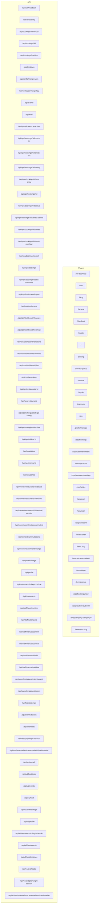

```mermaid
flowchart TD
    subgraph Pages
        my_bookings["/my-bookings"]
        ops["/ops"]
        blog["/blog"]
        browse["/browse"]
        checkout["/checkout"]
        create["/create"]
        root["/"]
        pricing["/pricing"]
        privacy_policy["/privacy-policy"]
        reserve["/reserve"]
        signin["/signin"]
        thank_you["/thank-you"]
        tos["/tos"]
        profile_manage["/profile/manage"]
        ops_bookings["/ops/bookings"]
        ops_customer_details["/ops/customer-details"]
        ops_rejections["/ops/rejections"]
        ops_restaurant_settings["/ops/restaurant-settings"]
        ops_tables["/ops/tables"]
        ops_team["/ops/team"]
        ops_login["/ops/login"]
        blog__articleId["/blog/:articleId"]
        invite__token["/invite/:token"]
        item__slug["/item/:slug"]
        reserve__reservationId["/reserve/:reservationId"]
        terms_togo["/terms/togo"]
        terms_venue["/terms/venue"]
        ops_bookings_new["/ops/bookings/new"]
        blog_author__authorId["/blog/author/:authorId"]
        blog_category__categoryId["/blog/category/:categoryId"]
        reserve_r__slug["/reserve/r/:slug"]
    end

    subgraph API
        api_auth_callback["/api/auth/callback"]
        api_availability["/api/availability"]
        api_bookings__id_history["/api/bookings/:id/history"]
        api_bookings__id["/api/bookings/:id"]
        api_bookings_confirm["/api/bookings/confirm"]
        api_bookings["/api/bookings"]
        api_config_merge_rules["/api/config/merge-rules"]
        api_config_service_policy["/api/config/service-policy"]
        api_events["/api/events"]
        api_lead["/api/lead"]
        api_ops_allowed_capacities["/api/ops/allowed-capacities"]
        api_ops_bookings__id_check_in["/api/ops/bookings/:id/check-in"]
        api_ops_bookings__id_check_out["/api/ops/bookings/:id/check-out"]
        api_ops_bookings__id_history["/api/ops/bookings/:id/history"]
        api_ops_bookings__id_no_show["/api/ops/bookings/:id/no-show"]
        api_ops_bookings__id["/api/ops/bookings/:id"]
        api_ops_bookings__id_status["/api/ops/bookings/:id/status"]
        api_ops_bookings__id_tables__tableId["/api/ops/bookings/:id/tables/:tableId"]
        api_ops_bookings__id_tables["/api/ops/bookings/:id/tables"]
        api_ops_bookings__id_undo_no_show["/api/ops/bookings/:id/undo-no-show"]
        api_ops_bookings_export["/api/ops/bookings/export"]
        api_ops_bookings["/api/ops/bookings"]
        api_ops_bookings_status_summary["/api/ops/bookings/status-summary"]
        api_ops_customers_export["/api/ops/customers/export"]
        api_ops_customers["/api/ops/customers"]
        api_ops_dashboard_changes["/api/ops/dashboard/changes"]
        api_ops_dashboard_heatmap["/api/ops/dashboard/heatmap"]
        api_ops_dashboard_rejections["/api/ops/dashboard/rejections"]
        api_ops_dashboard_summary["/api/ops/dashboard/summary"]
        api_ops_dashboard_vips["/api/ops/dashboard/vips"]
        api_ops_occasions["/api/ops/occasions"]
        api_ops_restaurants__id["/api/ops/restaurants/:id"]
        api_ops_restaurants["/api/ops/restaurants"]
        api_ops_settings_strategic_config["/api/ops/settings/strategic-config"]
        api_ops_strategies_simulate["/api/ops/strategies/simulate"]
        api_ops_tables__id["/api/ops/tables/:id"]
        api_ops_tables["/api/ops/tables"]
        api_ops_zones__id["/api/ops/zones/:id"]
        api_ops_zones["/api/ops/zones"]
        api_owner_restaurants__id_details["/api/owner/restaurants/:id/details"]
        api_owner_restaurants__id_hours["/api/owner/restaurants/:id/hours"]
        api_owner_restaurants__id_service_periods["/api/owner/restaurants/:id/service-periods"]
        api_owner_team_invitations__inviteId["/api/owner/team/invitations/:inviteId"]
        api_owner_team_invitations["/api/owner/team/invitations"]
        api_owner_team_memberships["/api/owner/team/memberships"]
        api_profile_image["/api/profile/image"]
        api_profile["/api/profile"]
        api_restaurants__slug_schedule["/api/restaurants/:slug/schedule"]
        api_restaurants["/api/restaurants"]
        api_staff_auto_confirm["/api/staff/auto/confirm"]
        api_staff_auto_quote["/api/staff/auto/quote"]
        api_staff_manual_confirm["/api/staff/manual/confirm"]
        api_staff_manual_context["/api/staff/manual/context"]
        api_staff_manual_hold["/api/staff/manual/hold"]
        api_staff_manual_validate["/api/staff/manual/validate"]
        api_team_invitations__token_accept["/api/team/invitations/:token/accept"]
        api_team_invitations__token["/api/team/invitations/:token"]
        api_test_bookings["/api/test/bookings"]
        api_test_invitations["/api/test/invitations"]
        api_test_leads["/api/test/leads"]
        api_test_playwright_session["/api/test/playwright-session"]
        api_test_reservations__reservationId_confirmation["/api/test/reservations/:reservationId/confirmation"]
        api_test_email["/api/test-email"]
        api_v1_bookings["/api/v1/bookings"]
        api_v1_events["/api/v1/events"]
        api_v1_lead["/api/v1/lead"]
        api_v1_profile_image["/api/v1/profile/image"]
        api_v1_profile["/api/v1/profile"]
        api_v1_restaurants__slug_schedule["/api/v1/restaurants/:slug/schedule"]
        api_v1_restaurants["/api/v1/restaurants"]
        api_v1_test_bookings["/api/v1/test/bookings"]
        api_v1_test_leads["/api/v1/test/leads"]
        api_v1_test_playwright_session["/api/v1/test/playwright-session"]
        api_v1_test_reservations__reservationId_confirmation["/api/v1/test/reservations/:reservationId/confirmation"]
    end
```
