# 2. Information Architecture & Navigation

**See**: `02-information-architecture.json` for machine-readable sitemap

## Visual Sitemap (Mermaid)

```mermaid
graph TD
    A[Home /] --> B[Reserve /reserve]
    A --> C[Blog /blog]
    A --> D[Sign In /signin]
    A --> E[Booking Flow /reserve/r/slug]

    C --> C1[Article /blog/articleId]
    C --> C2[Author /blog/author/authorId]
    C --> C3[Category /blog/category/categoryId]

    E --> E1[Step 1: Date/Time]
    E --> E2[Step 2: Details]
    E --> E3[Step 3: Review]
    E --> E4[Step 4: Confirmation]
    E --> F[Confirmation /reserve/reservationId]

    D --> G[Dashboard /dashboard - Protected]
    D --> H[Profile /profile/manage - Protected]

    A --> I[Legal Pages]
    I --> I1[Privacy /privacy-policy]
    I --> I2[Terms /tos]
    I --> I3[Venue Terms /terms/venue]
    I --> I4[ToGo Terms /terms/togo]

    A --> J[Utility Pages]
    J --> J1[Thank You /thank-you]
    J --> J2[404 /404]
    J --> J3[500 /500]
```



## Content Map Summary

| Node              | Path                  | Auth      | Priority | TTL  | Schema Type             |
| ----------------- | --------------------- | --------- | -------- | ---- | ----------------------- |
| **Home**          | `/`                   | Public    | Critical | 30d  | WebSite                 |
| **Reserve**       | `/reserve`            | Public    | High     | 60d  | Service                 |
| **Sign In**       | `/signin`             | Public    | Critical | 180d | WebPage                 |
| **Booking Flow**  | `/reserve/r/[slug]`   | Public    | Critical | 7d   | Service                 |
| **Confirmation**  | `/reserve/[id]`       | Public    | High     | 365d | ReservationConfirmation |
| **Dashboard**     | `/dashboard`          | Protected | Critical | 1d   | CollectionPage          |
| **Profile**       | `/profile/manage`     | Protected | Medium   | 30d  | ProfilePage             |
| **Blog Index**    | `/blog`               | Public    | Medium   | 7d   | Blog                    |
| **Blog Article**  | `/blog/[id]`          | Public    | Medium   | 365d | BlogPosting             |
| **Blog Author**   | `/blog/author/[id]`   | Public    | Low      | 30d  | ProfilePage             |
| **Blog Category** | `/blog/category/[id]` | Public    | Low      | 30d  | CollectionPage          |
| **Privacy**       | `/privacy-policy`     | Public    | Medium   | 180d | WebPage                 |
| **Terms**         | `/tos`                | Public    | Medium   | 180d | WebPage                 |
| **Venue Terms**   | `/terms/venue`        | Public    | Low      | 180d | WebPage                 |
| **ToGo Terms**    | `/terms/togo`         | Public    | Low      | 180d | WebPage                 |
| **Thank You**     | `/thank-you`          | Public    | Low      | 90d  | WebPage                 |
| **404**           | `/404`                | Public    | Low      | 365d | WebPage                 |
| **500**           | `/500`                | Public    | Low      | 365d | WebPage                 |

## Navigation Model

### Primary Navigation (Header)

**Desktop (1024px+)**:

```
[Logo] Home | Reserve | Blog          [Dashboard] [Profile ▾] [Sign Out]
                                       (authenticated only)

[Logo] Home | Pricing | Blog          [Sign In]
                                      (unauthenticated)
```

**Mobile (<1024px)**:

```
[Logo]                                [☰ Menu]

[☰ Menu] opens drawer:
├─ Home
├─ Reserve
├─ Blog
├─ Dashboard (auth)
├─ Profile (auth)
└─ Sign In/Out
```

**Implementation Notes**:

- Logo links to `/` with `aria-label="SajiloReserveX home"`
- Active link styled with `border-bottom: 2px solid hsl(var(--primary))`
- Burger icon only visible <1024px with `aria-label="Open main menu"`
- Profile dropdown (desktop) includes: "Profile", "Dashboard", "Sign Out"

### Footer Navigation

**Structure** (3 columns on desktop, stacked on mobile):

```
┌─────────────┬─────────────┬─────────────┐
│ Product     │ Legal       │ Support     │
├─────────────┼─────────────┼─────────────┤
│ Home        │ Privacy     │ Contact     │
│ Reserve     │ Terms       │ Status      │
│ Blog        │ Venue Terms │             │
└─────────────┴─────────────┴─────────────┘

© 2024 SajiloReserveX. All rights reserved.
```

**Implementation Notes**:

- `<footer>` with `aria-label="Site footer"`
- Links styled as `text-muted-foreground` with hover underline
- External links (Status page) have `rel="noopener noreferrer"`
- Copyright includes `<small>` semantic element

### Utility Navigation

**Location**: Header right  
**Items** (context-dependent):

| User State      | Visible Items                                           |
| --------------- | ------------------------------------------------------- |
| Unauthenticated | "Sign In" button (primary style)                        |
| Authenticated   | "Dashboard" link, "Profile" dropdown, "Sign Out" button |

**Profile Dropdown Contents** (Desktop):

- Profile Settings
- My Bookings (Dashboard)
- Divider
- Sign Out

### Mobile-Specific Patterns

**Burger Menu**:

- Icon: Hamburger (☰) → Close (✕) animation
- Drawer: Slide in from right (300ms ease-out)
- Overlay: Semi-transparent backdrop (`bg-black/50`)
- Focus trap: Keyboard navigation contained within drawer
- Close triggers: (a) Close button, (b) Overlay click, (c) Escape key, (d) Navigation to new page

**Touch Targets**:

- All nav links ≥44px × 44px
- Generous padding on mobile: `px-6 py-3`

### Breadcrumbs (Optional Enhancement)

**Display**: On depth-2+ pages (e.g., `/blog/[articleId]`)

```
Home > Blog > [Article Title]
```

**Implementation**:

- `<nav aria-label="Breadcrumb">`
- Current page: `aria-current="page"`, not linked
- Schema.org BreadcrumbList markup

## URL Patterns & Naming Conventions

| Pattern                  | Example                       | Purpose                               |
| ------------------------ | ----------------------------- | ------------------------------------- |
| `/`                      | Home                          | Root landing                          |
| `/{page}`                | `/reserve`                    | Top-level pages                       |
| `/{resource}/[id]`       | `/blog/best-restaurants-2024` | Resource detail                       |
| `/{resource}/{sub}/[id]` | `/blog/author/john-doe`       | Sub-resource                          |
| `/reserve/r/[slug]`      | `/reserve/r/the-ivy`          | Booking flow (restaurant slug)        |
| `/reserve/[id]`          | `/reserve/abc123`             | Booking confirmation (reservation ID) |
| `/{auth}/[page]`         | `/profile/manage`             | Protected pages (implied grouping)    |

**Conventions**:

- Lowercase, hyphenated slugs (`best-restaurants` not `BestRestaurants`)
- No trailing slashes (Next.js handles automatically)
- Dynamic segments: `[slug]`, `[id]`, `[categoryId]` (descriptive names)
- Hierarchical where logical (e.g., `/blog/category/[id]` not `/category/[id]`)

## Active Link Logic

**Implementation** (React):

```tsx
// Using Next.js Link with active state
import { usePathname } from 'next/navigation';
import Link from 'next/link';

function NavLink({ href, children }) {
  const pathname = usePathname();
  const isActive = pathname === href || pathname.startsWith(`${href}/`);

  return (
    <Link
      href={href}
      className={isActive ? 'nav-link-active' : 'nav-link'}
      aria-current={isActive ? 'page' : undefined}
    >
      {children}
    </Link>
  );
}
```

**Styling**:

```css
.nav-link {
  @apply text-foreground hover:text-primary transition-colors;
}

.nav-link-active {
  @apply text-primary font-semibold border-b-2 border-primary;
}
```

## 404/500 Handling

### 404 Not Found

**Triggers**:

- Non-existent route (e.g., `/nonexistent`)
- Dynamic route with invalid ID (e.g., `/blog/invalid-slug`)

**Content**:

- **H1**: "404: Page not found"
- **Body**: "The page you're looking for doesn't exist or has been moved."
- **CTA**: Primary button "Return Home", Secondary "Search" (if search implemented)
- **Suggestions**: List of popular pages (Home, Pricing, Blog)

**Implementation**: `/app/not-found.tsx`

### 500 Server Error

**Triggers**:

- Unhandled server exception
- Database connection failure
- External API timeout

**Content**:

- **H1**: "Something went wrong"
- **Body**: "We're working to fix this issue. Please try again in a few moments."
- **CTA**: "Reload Page" button, "Check Status" link
- **Error ID**: Display error tracking ID for support reference

**Implementation**: `/app/error.tsx` (Next.js Error Boundary)

---

**Next**: See `03-content-*.md` files for detailed page content with SEO metadata.
