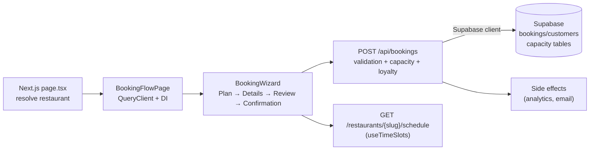
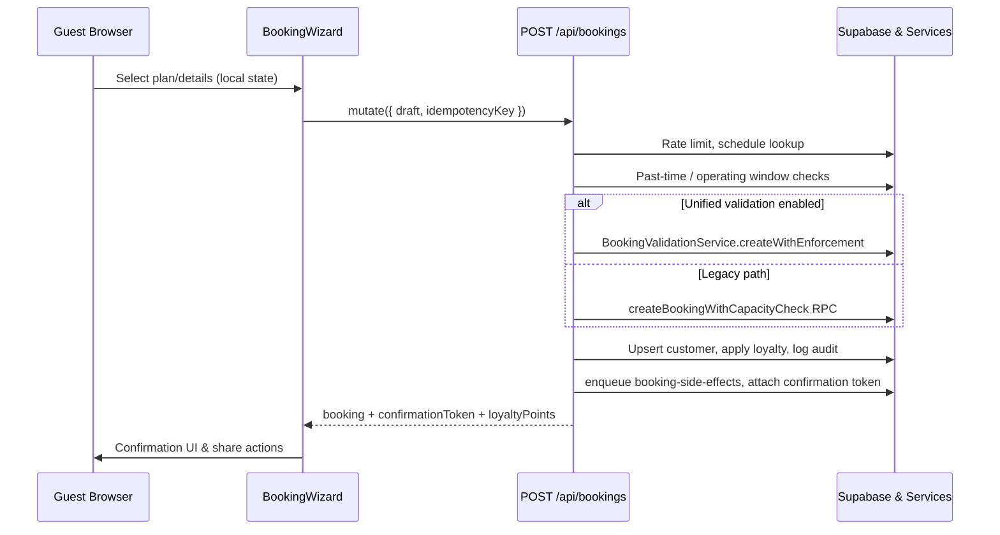
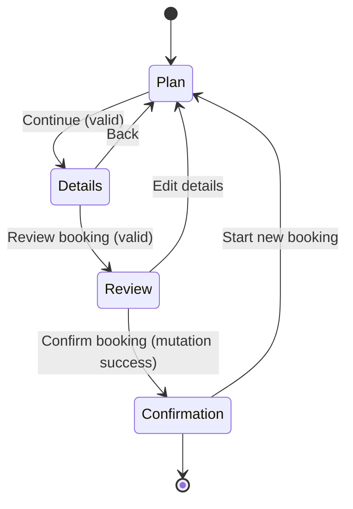
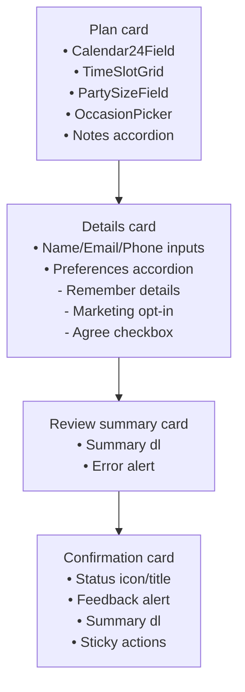
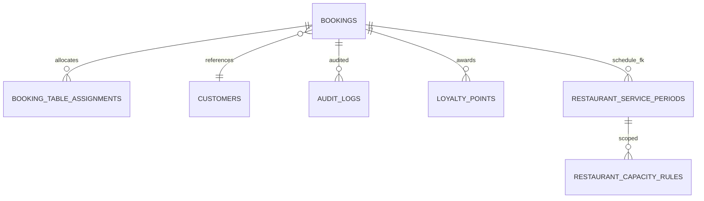

# `/reserve/r/[slug]` Booking Flow Analysis

## 1. Architecture Overview

- **Front-end composition.** The route `src/app/reserve/r/[slug]/page.tsx` resolves the restaurant, prepares initial details (ID, slug, timezone, address), and renders the client booking flow wrapper.【F:src/app/reserve/r/[slug]/page.tsx†L1-L64】 `BookingFlowPage` layers a scoped React Query client, wizard dependency injection (analytics + navigation), and the `BookingWizard` composed of the Plan, Details, Review, and Confirmation steps with sticky layout/footer providers.【F:components/reserve/booking-flow/index.tsx†L1-L68】【F:reserve/features/reservations/wizard/ui/BookingWizard.tsx†L3-L200】
- **Context providers & hooks.** Within the wizard, Supabase session/profile hooks lock contact fields for authenticated guests, analytics/haptics emitters run through the DI context, and online status gating toggles sticky actions and the offline banner.【F:reserve/features/reservations/wizard/ui/BookingWizard.tsx†L55-L205】
- **Back-end layers.** `POST /api/bookings` performs Zod validation, rate limiting (Upstash Redis or in-memory fallback), schedule lookup, operating-window enforcement, past-time blocking, customer upsert, optional unified booking validation, capacity transaction fallback, loyalty calculation, audit logging, observability, confirmation token attachment, and background job enqueueing for analytics and email dispatch.【F:src/app/api/bookings/route.ts†L69-L744】【F:server/security/rate-limit.ts†L1-L129】【F:server/restaurants/schedule.ts†L10-L173】【F:server/bookings/timeValidation.ts†L1-L65】【F:server/bookings/pastTimeValidation.ts†L1-L119】【F:server/customers.ts†L1-L158】【F:server/capacity/transaction.ts†L299-L381】【F:server/booking/serviceFactory.ts†L1-L124】【F:server/loyalty.ts†L1-L149】【F:server/jobs/booking-side-effects.ts†L1-L123】【F:server/observability.ts†L1-L22】
- **Supporting services & feature flags.** The schedule service composes occasion coverage, default durations, intervals, and availability labels. Rate limiting relies on Upstash Redis with dev fallbacks. Observability events write to Supabase. Feature switches such as `bookingValidationUnified`, `bookingPastTimeBlocking`, and Redis credentials live in `env.featureFlags`/`env.cache` to alter validation and telemetry flow.【F:server/restaurants/schedule.ts†L10-L203】【F:server/security/rate-limit.ts†L1-L129】【F:lib/env.ts†L1-L129】【F:lib/env.ts†L131-L213】
- **Stack & integrations.** The flow uses Next.js App Router (server components + client wizard), TanStack Query for caching, Shadcn UI primitives, Supabase for data/auth, Upstash Redis for throttling, and booking side effects trigger analytics plus transactional emails via Resend/Nodemailer wrappers in `server/emails/bookings` invoked from the job handler.【F:components/reserve/booking-flow/index.tsx†L1-L68】【F:reserve/features/reservations/wizard/ui/steps/PlanStep.tsx†L1-L58】【F:server/jobs/booking-side-effects.ts†L1-L93】
- **Supabase schema touchpoints.** Core tables include `public.bookings` with confirmation tokens, party checks, lifecycle constraints, and indexes on restaurant/date/status, references, idempotency, and client request IDs.【F:supabase/migrations/20251019102432_consolidated_schema.sql†L1894-L1955】【F:supabase/migrations/20251019102432_consolidated_schema.sql†L2651-L2811】 `public.customers` maintains normalized contact keys and marketing opt-in defaults, while `booking_table_assignments`, `restaurant_service_periods`, `restaurant_capacity_rules`, `loyalty_points`, `audit_logs`, and `capacity_metrics_hourly` support allocation, availability, loyalty, and auditing flows with RLS policies on staff/service roles.【F:supabase/migrations/20251019102432_consolidated_schema.sql†L1985-L2060】【F:supabase/migrations/20251019102432_consolidated_schema.sql†L1839-L1881】【F:supabase/migrations/20251019102432_consolidated_schema.sql†L2226-L2263】【F:supabase/migrations/20251019102432_consolidated_schema.sql†L2450-L2751】【F:supabase/migrations/20251019102432_consolidated_schema.sql†L3297-L3655】

## 2. Booking Flow Logic

- **Client payload shaping.** `buildReservationDraft` enforces normalized time, service inference, party minimums, optional notes, marketing defaults, and contact trimming before mutations, while `reservationToApiBooking` adapts API responses to wizard state.【F:reserve/features/reservations/wizard/model/transformers.ts†L1-L71】【F:reserve/features/reservations/wizard/model/transformers.ts†L73-L108】
- **Mutation plumbing.** `useCreateReservation` posts or puts bookings with idempotency headers, resets keys on completion, emits analytics events, and invalidates reservation queries on success.【F:reserve/features/reservations/wizard/api/useCreateReservation.ts†L1-L67】
- **Server validation pipeline.** `bookingSchema` clamps payload types, the handler consumes a per-restaurant+IP rate limit, derives idempotency keys, fetches schedules, validates operating windows/past-time grace with feature-flag guards, upserts customers, and optionally runs a unified validation service before falling back to the capacity RPC (which itself retries with a legacy path when the RPC is missing).【F:src/app/api/bookings/route.ts†L69-L381】【F:server/capacity/transaction.ts†L299-L381】 `createBookingValidationService` pulls service periods/capacity rules to double-check cover counts when unified validation is enabled.【F:server/booking/serviceFactory.ts†L1-L166】
- **Business rules.** Booking duration defaults and interval normalization come from plan form logic (`usePlanStepForm`) and reservation config defaults, adjusting selections to slot intervals and closing buffers.【F:reserve/features/reservations/wizard/hooks/usePlanStepForm.ts†L1-L380】【F:reserve/shared/config/reservations.ts†L1-L126】 Party sizes clamp between 1 and 12, contact schemas require email/phone for customer mode, and marketing opt-in defaults true but can be toggled.【F:reserve/features/reservations/wizard/model/schemas.ts†L9-L62】【F:reserve/features/reservations/wizard/hooks/useDetailsStepForm.ts†L1-L123】 The wizard locks authenticated contacts, infers services from slots, and stores remember-details preferences in localStorage.【F:reserve/features/reservations/wizard/ui/BookingWizard.tsx†L71-L123】【F:reserve/features/reservations/wizard/hooks/usePlanStepForm.ts†L250-L331】【F:reserve/features/reservations/wizard/hooks/useRememberedContacts.ts†L1-L60】
- **Error handling.** Client forms surface Zod validation errors inline and focus offending fields. Submission catches past-time errors (mapping to customer-friendly alerts) vs generic booking failures, resetting to Plan or origin step as needed.【F:reserve/features/reservations/wizard/hooks/usePlanStepForm.ts†L312-L380】【F:reserve/features/reservations/wizard/hooks/useReservationWizard.ts†L63-L206】 Server responses distinguish Zod errors (400), rate limits (429 with retry headers), booking validation (mapped responses), and unexpected errors with observability logging and anonymized identifiers.【F:src/app/api/bookings/route.ts†L69-L744】【F:server/security/rate-limit.ts†L1-L129】 Capacity RPC fallbacks log missing procedures and call legacy insert logic to avoid hard failures.【F:server/capacity/transaction.ts†L299-L381】
- **State management.** The reducer manages steps, loading/submitting flags, errors, editing states, confirmation payloads, and draft resets (including remembering contact fields). Sticky action state is recalculated on step changes, and haptic cues fire for transitions.【F:reserve/features/reservations/wizard/model/reducer.ts†L1-L203】【F:reserve/features/reservations/wizard/model/store.ts†L1-L74】【F:reserve/features/reservations/wizard/hooks/useReservationWizard.ts†L1-L210】

### Key Server Snippet

```ts
const parsed = bookingSchema.safeParse({
  ...body,
  party: Number(body.party ?? 0),
});
if (!parsed.success) {
  return handleZodError(parsed.error);
}
```

【F:src/app/api/bookings/route.ts†L94-L108】

## 3. UX/UI Flow & Rules

- **Plan step.** The card introduces plan copy, surfaces destructive alerts for invalid selections, and renders the form with date picker, time grid, party selector, occasion picker, and notes accordion. Availability banners warn when a date is closed or fully booked, and schedule prefetching disables unavailable times.【F:reserve/features/reservations/wizard/ui/steps/PlanStep.tsx†L1-L58】【F:reserve/features/reservations/wizard/ui/steps/plan-step/PlanStepForm.tsx†L1-L200】 Skeletons mirror layout during loading.【F:reserve/features/reservations/wizard/ui/WizardSkeletons.tsx†L1-L41】
- **Details step.** Contact inputs auto-fill/lock for authenticated users, with marketing + remember-details toggles inside an accordion and inline alerts for required agreements. Labels/toggles use focus-visible styles and descriptive helper text.【F:reserve/features/reservations/wizard/ui/steps/DetailsStep.tsx†L1-L200】 Validation feedback uses `FormMessage` + destructive alerts for agreement failures.【F:reserve/features/reservations/wizard/ui/steps/DetailsStep.tsx†L200-L280】
- **Review step.** Summary cards list formatted schedule, venue, contact, marketing, and optional notes with an `aria-live` description for screen readers and destructive alert for submission errors.【F:reserve/features/reservations/wizard/ui/steps/ReviewStep.tsx†L1-L55】
- **Confirmation step.** Status icons change between pending/confirmed/updated, alerts display feedback variants with dismiss buttons, and a summary card shows reference, guest, date/time, and party info. Buttons connect to share handlers for calendar/wallet export.【F:reserve/features/reservations/wizard/ui/steps/ConfirmationStep.tsx†L1-L78】【F:reserve/features/reservations/wizard/hooks/useConfirmationStep.ts†L1-L204】
- **Layout & chrome.** `WizardLayout` applies sticky footer padding, `WizardFooter`/`WizardStickyConfirmation` provide progress, responsive button groups, and safe-area padding, while `WizardOfflineBanner` focuses on offline detection with `aria-live` support.【F:reserve/features/reservations/wizard/ui/WizardLayout.tsx†L1-L40】【F:reserve/features/reservations/wizard/ui/WizardFooter.tsx†L1-L110】【F:reserve/features/reservations/wizard/ui/WizardStickyConfirmation.tsx†L1-L95】【F:reserve/features/reservations/wizard/ui/WizardOfflineBanner.tsx†L1-L33】
- **Accessibility & responsiveness.** Progress components expose SR labels, alerts use appropriate roles, sticky bars respect safe areas, and Tailwind breakpoints (`sm`, `md`, `lg`) adjust grid layouts and stacking throughout Plan/Details cards and sticky footers.【F:reserve/features/reservations/wizard/ui/WizardProgress.tsx†L1-L69】【F:reserve/features/reservations/wizard/ui/steps/plan-step/PlanStepForm.tsx†L63-L180】【F:reserve/features/reservations/wizard/ui/steps/DetailsStep.tsx†L45-L190】

## 4. UX/UI Rules & Expectations

- **Field enablement.** Time grid disables when schedules flag `currentUnavailabilityReason`, while `selectTime` early-returns without available slots; contact inputs disable via `contactLocks` when authenticated.【F:reserve/features/reservations/wizard/hooks/usePlanStepForm.ts†L142-L216】【F:reserve/features/reservations/wizard/ui/BookingWizard.tsx†L71-L123】 Sticky actions disable when offline or loading, and offline banners appear once hydration detects connectivity loss.【F:reserve/features/reservations/wizard/ui/BookingWizard.tsx†L124-L205】
- **Conditional UI.** Notes accordion summary updates with selections, alerts render only when copy is present, duplicate booking plan alerts appear when server rejects past bookings, and sticky confirmation replaces the footer on step four.【F:reserve/features/reservations/wizard/ui/steps/plan-step/PlanStepForm.tsx†L80-L156】【F:reserve/features/reservations/wizard/hooks/useReservationWizard.ts†L63-L206】
- **Live updates.** `useTimeSlots` refetches schedules per slug/date and tracks active slot availability, while Plan form prefetches calendar months for quick switching. React Query invalidation after booking refreshes reservation lists, and offline detection toggles share buttons.【F:reserve/features/reservations/wizard/services/useTimeSlots.ts†L1-L70】【F:reserve/features/reservations/wizard/hooks/usePlanStepForm.ts†L37-L140】【F:reserve/features/reservations/wizard/api/useCreateReservation.ts†L40-L67】
- **Draft persistence & navigation.** `useRememberedContacts` hydrates and persists contacts when opted-in, resets honor rememberDetails, and reducer `START_EDIT` hydrates existing bookings. Back navigation on Details step routes to Plan via `handleBack`. No explicit session timeout is enforced, representing a potential resilience gap for long-lived drafts.【F:reserve/features/reservations/wizard/hooks/useRememberedContacts.ts†L1-L60】【F:reserve/features/reservations/wizard/model/reducer.ts†L134-L190】【F:reserve/features/reservations/wizard/hooks/useDetailsStepForm.ts†L69-L123】
- **Safeguards.** Aside from rate limiting and duplicate detection server-side, there are no modal confirmations for destructive actions (e.g., leaving wizard), so unsaved changes rely on stored state rather than explicit dialogs.【F:src/app/api/bookings/route.ts†L214-L744】【F:reserve/features/reservations/wizard/model/reducer.ts†L150-L203】

## 5. Data Flow

- **Restaurant schedule API.** `fetchReservationSchedule` issues `GET /restaurants/{slug}/schedule?date=YYYY-MM-DD`, yielding a `ReservationSchedule` with interval minutes, booking options, slots, and occasion catalog used by `useTimeSlots` and Plan form availability labels.【F:reserve/features/reservations/wizard/services/schedule.ts†L1-L24】【F:reserve/features/reservations/wizard/services/timeSlots.ts†L1-L55】
- **Booking creation API.** Client payload includes restaurant ID/date/time/party/bookingType/seating/notes/contact/marketing, optionally `bookingId` for edits; response returns the committed booking list, confirmation token, loyalty award, and duplicate flag before adapters normalize to wizard state.【F:reserve/features/reservations/wizard/api/useCreateReservation.ts†L13-L67】【F:reserve/features/reservations/wizard/model/transformers.ts†L73-L108】【F:src/app/api/bookings/route.ts†L619-L716】
- **Transformation chain.** Wizard state → `buildReservationDraft` → React Query mutation → REST API → server validation/capacity → Supabase insert/update → response adapted by `reservationAdapter`/`reservationToApiBooking` → reducer confirmation payload.【F:reserve/features/reservations/wizard/model/transformers.ts†L1-L108】【F:reserve/entities/reservation/adapter.ts†L1-L110】【F:reserve/features/reservations/wizard/hooks/useReservationWizard.ts†L115-L200】
- **Validation layers.** Client Zod schemas, server `bookingSchema`, optional booking validation service (capacity + operating windows), Supabase constraints (checks, unique indexes, RLS) combine for multi-tier enforcement.【F:reserve/features/reservations/wizard/model/schemas.ts†L9-L62】【F:src/app/api/bookings/route.ts†L69-L381】【F:server/booking/serviceFactory.ts†L1-L166】【F:supabase/migrations/20251019102432_consolidated_schema.sql†L1894-L1955】
- **Caching & storage.** TanStack Query caches schedules per slug/date key and auto-prefetches month ranges; reservation mutations invalidate `reservationKeys`. Contact details persist in `localStorage` via `useRememberedContacts`. No server push/real-time refresh is present beyond manual refetch triggers.【F:reserve/features/reservations/wizard/hooks/usePlanStepForm.ts†L37-L173】【F:reserve/features/reservations/wizard/api/useCreateReservation.ts†L40-L67】【F:reserve/features/reservations/wizard/hooks/useRememberedContacts.ts†L1-L60】

## 6. Key Operations

- **Availability computation.** `useTimeSlots` fetches schedules, maps raw slots to descriptors with labels/availability flags, and infers booking options for selected times. `usePlanStepForm` normalizes selections to slot intervals, enforces closing buffers, and surfaces availability warnings.【F:reserve/features/reservations/wizard/services/useTimeSlots.ts†L1-L70】【F:reserve/features/reservations/wizard/hooks/usePlanStepForm.ts†L142-L331】
- **Capacity enforcement.** `createBookingWithCapacityCheck` wraps the Supabase RPC, logs telemetry, retries with legacy inserts if the RPC is missing, and records duplicate detection; booking validation service cross-checks capacity when feature-flagged.【F:server/capacity/transaction.ts†L299-L381】【F:server/booking/serviceFactory.ts†L1-L166】 Table assignments persist in `booking_table_assignments` for downstream ops flows.【F:supabase/migrations/20251019102432_consolidated_schema.sql†L1839-L1881】【F:supabase/migrations/20251019102432_consolidated_schema.sql†L2450-L2751】
- **Payments.** The flow does not collect or process payments—no payment fields exist in the client payload or server handler, so confirmation is purely booking-based.【F:reserve/features/reservations/wizard/api/useCreateReservation.ts†L13-L67】【F:src/app/api/bookings/route.ts†L69-L744】
- **Confirmation & notifications.** Post-commit hooks award loyalty points, log audit events, enqueue analytics/email side effects, and generate confirmation tokens stored on the booking for guest access.【F:src/app/api/bookings/route.ts†L500-L716】【F:server/loyalty.ts†L1-L149】【F:server/jobs/booking-side-effects.ts†L1-L123】【F:server/bookings/confirmation-token.ts†L1-L94】
- **Calendar & wallet share.** Confirmation step handlers call `downloadCalendarEvent` for ICS export and `shareReservationDetails` for Web Share/clipboard fallbacks, each returning feedback variants surfaced via alerts.【F:reserve/features/reservations/wizard/hooks/useConfirmationStep.ts†L80-L204】【F:lib/reservations/share.ts†L1-L96】

## 7. Edge Cases & Error Handling

- **Concurrency & idempotency.** Client mutations attach `Idempotency-Key` headers, server normalizes keys and uses Supabase upserts to avoid duplicates; capacity RPC duplicates return prior bookings, and unified validation surfaces duplicates with explicit responses.【F:reserve/features/reservations/wizard/api/useCreateReservation.ts†L23-L54】【F:src/app/api/bookings/route.ts†L308-L396】【F:server/capacity/transaction.ts†L299-L381】
- **Network/offline resilience.** Offline detection disables sticky actions, focuses the banner, and analytics emit offline events; React Query retries once by default, and errors propagate to wizard alerts with retry guidance.【F:reserve/features/reservations/wizard/ui/BookingWizard.tsx†L124-L205】【F:components/reserve/booking-flow/index.tsx†L12-L24】
- **Partial progress.** Reducer stores selections per step, `resetForm` respects remember-details, and plan alerts bring users back when past-time submissions fail; `startEdit` loads existing bookings for modifications.【F:reserve/features/reservations/wizard/model/reducer.ts†L134-L190】【F:reserve/features/reservations/wizard/hooks/useReservationWizard.ts†L115-L206】
- **Timeouts & gaps.** No client/server idle timeout or warning modal exists; long sessions rely on fresh schedule refetches and local state, a noted area for potential improvement.
- **Validation feedback.** Client shows inline errors, server returns structured errors with HTTP codes, and observability events capture failure context. Capacity fallbacks ensure RPC outages still commit bookings, preventing hard failures but relying on legacy enforcement.【F:reserve/features/reservations/wizard/hooks/usePlanStepForm.ts†L312-L380】【F:src/app/api/bookings/route.ts†L214-L744】【F:server/capacity/transaction.ts†L299-L381】
- **Recovery & logging.** `mapErrorToMessage` ensures friendly messaging, errors emit analytics, observability events anonymize identifiers, and loyalty/application failures fallback gracefully while logging console errors for ops review.【F:reserve/features/reservations/wizard/hooks/useReservationWizard.ts†L115-L206】【F:src/app/api/bookings/route.ts†L626-L716】【F:server/observability.ts†L1-L22】

## 8. Visual Deliverables

### Architecture Diagram



【F:src/app/reserve/r/[slug]/page.tsx†L5-L64】【F:components/reserve/booking-flow/index.tsx†L1-L68】【F:reserve/features/reservations/wizard/ui/BookingWizard.tsx†L55-L205】【F:src/app/api/bookings/route.ts†L69-L744】【F:reserve/features/reservations/wizard/services/useTimeSlots.ts†L1-L70】

### Booking Sequence



【F:reserve/features/reservations/wizard/hooks/useReservationWizard.ts†L115-L206】【F:reserve/features/reservations/wizard/api/useCreateReservation.ts†L13-L67】【F:src/app/api/bookings/route.ts†L94-L716】【F:server/capacity/transaction.ts†L299-L381】【F:server/jobs/booking-side-effects.ts†L1-L123】

### Wizard State Machine



【F:reserve/features/reservations/wizard/model/reducer.ts†L1-L203】【F:reserve/features/reservations/wizard/hooks/useDetailsStepForm.ts†L69-L123】【F:reserve/features/reservations/wizard/hooks/useReviewStep.ts†L1-L74】【F:reserve/features/reservations/wizard/hooks/useConfirmationStep.ts†L150-L204】

### Step Wireframes (textual)



【F:reserve/features/reservations/wizard/ui/steps/plan-step/PlanStepForm.tsx†L63-L180】【F:reserve/features/reservations/wizard/ui/steps/DetailsStep.tsx†L45-L200】【F:reserve/features/reservations/wizard/ui/steps/ReviewStep.tsx†L1-L55】【F:reserve/features/reservations/wizard/ui/steps/ConfirmationStep.tsx†L1-L78】

### ERD Focus



【F:supabase/migrations/20251019102432_consolidated_schema.sql†L1894-L1955】【F:supabase/migrations/20251019102432_consolidated_schema.sql†L1839-L1881】【F:supabase/migrations/20251019102432_consolidated_schema.sql†L1985-L2060】【F:supabase/migrations/20251019102432_consolidated_schema.sql†L2226-L2263】【F:supabase/migrations/20251019102432_consolidated_schema.sql†L3238-L3263】

## Critical Observations & Risks

- Unified booking validation is feature-flagged; environments without the flag rely solely on the capacity RPC, so ensuring the RPC exists (or monitoring the fallback path) is essential.【F:src/app/api/bookings/route.ts†L474-L559】【F:server/capacity/transaction.ts†L299-L381】
- No session timeout or “are you sure” guard may expose guests to stale drafts if they leave tabs idle; consider session expiry prompts aligned with schedule validity windows.
- Offline mode disables confirmation actions but does not queue retries—guests must manually retry once reconnected, which may merit explicit guidance or auto retry hooks.【F:reserve/features/reservations/wizard/ui/BookingWizard.tsx†L124-L205】
