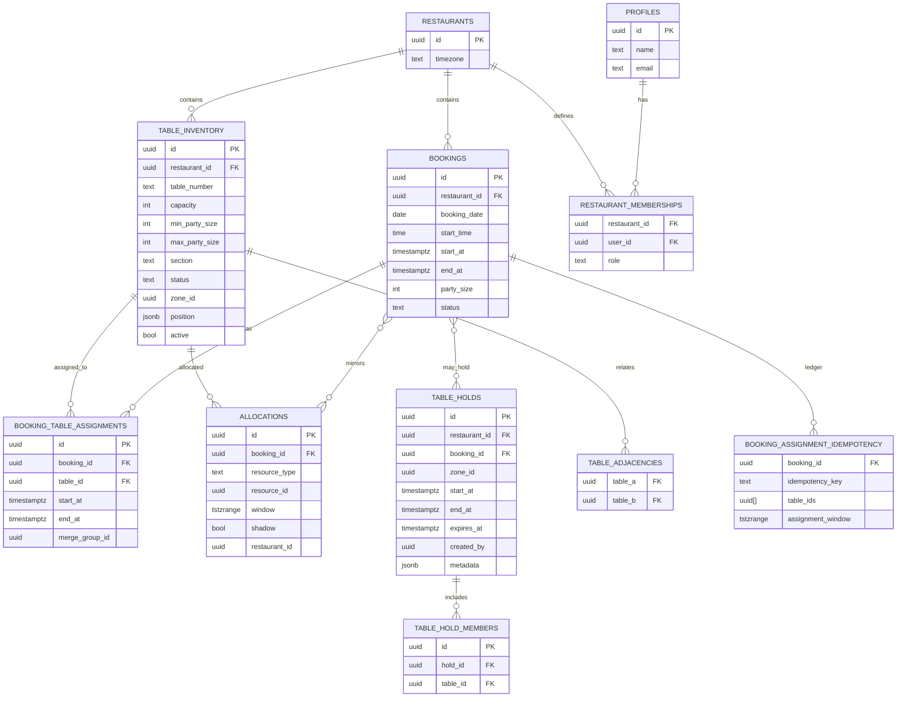

# Data Model — Table Assignment Entities (ER)

```mermaid
erDiagram
  BOOKINGS ||--o{ BOOKING_TABLE_ASSIGNMENTS : has
  BOOKINGS }o--o{ ALLOCATIONS : mirrors
  BOOKINGS }o--o{ TABLE_HOLDS : may_hold
  TABLE_HOLDS ||--o{ TABLE_HOLD_MEMBERS : includes
  TABLE_INVENTORY ||--o{ TABLE_ADJACENCIES : relates
  TABLE_INVENTORY ||--o{ BOOKING_TABLE_ASSIGNMENTS : assigned_to
  TABLE_INVENTORY ||--o{ ALLOCATIONS : allocated
  RESTAURANTS ||--o{ BOOKINGS : contains
  RESTAURANTS ||--o{ TABLE_INVENTORY : contains
  PROFILES ||--o{ RESTAURANT_MEMBERSHIPS : has
  RESTAURANTS ||--o{ RESTAURANT_MEMBERSHIPS : defines
  BOOKINGS ||--o{ BOOKING_ASSIGNMENT_IDEMPOTENCY : ledger

  BOOKINGS {
    uuid id PK
    uuid restaurant_id FK
    date booking_date
    time start_time
    timestamptz start_at
    timestamptz end_at
    int party_size
    text status
  }

  TABLE_INVENTORY {
    uuid id PK
    uuid restaurant_id FK
    text table_number
    int capacity
    int min_party_size
    int max_party_size
    text section
    text status
    uuid zone_id
    jsonb position
    bool active
  }

  TABLE_ADJACENCIES {
    uuid table_a FK
    uuid table_b FK
  }

  BOOKING_TABLE_ASSIGNMENTS {
    uuid id PK
    uuid booking_id FK
    uuid table_id FK
    timestamptz start_at
    timestamptz end_at
    uuid merge_group_id
  }

  ALLOCATIONS {
    uuid id PK
    uuid booking_id FK
    text resource_type
    uuid resource_id
    tstzrange window
    bool shadow
    uuid restaurant_id
  }

  BOOKING_ASSIGNMENT_IDEMPOTENCY {
    uuid booking_id FK
    text idempotency_key
    uuid[] table_ids
    tstzrange assignment_window
  }

  TABLE_HOLDS {
    uuid id PK
    uuid restaurant_id FK
    uuid booking_id FK
    uuid zone_id
    timestamptz start_at
    timestamptz end_at
    timestamptz expires_at
    uuid created_by
    jsonb metadata
  }

  TABLE_HOLD_MEMBERS {
    uuid id PK
    uuid hold_id FK
    uuid table_id FK
  }

  RESTAURANTS {
    uuid id PK
    text timezone
  }

  RESTAURANT_MEMBERSHIPS {
    uuid restaurant_id FK
    uuid user_id FK
    text role
  }

  PROFILES {
    uuid id PK
    text name
    text email
  }
```
