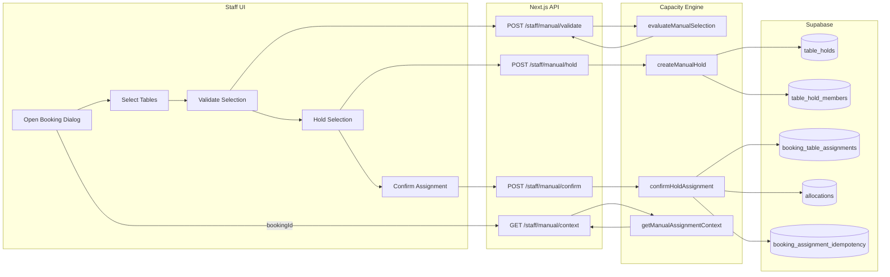
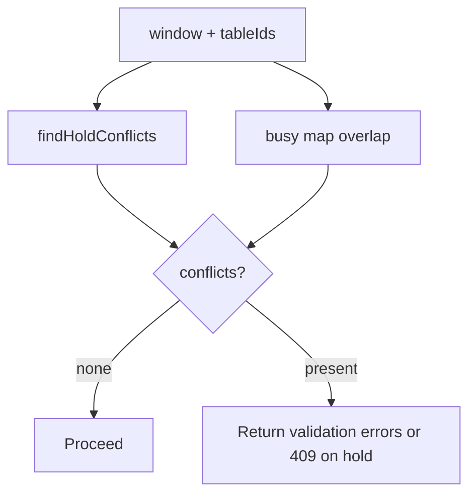
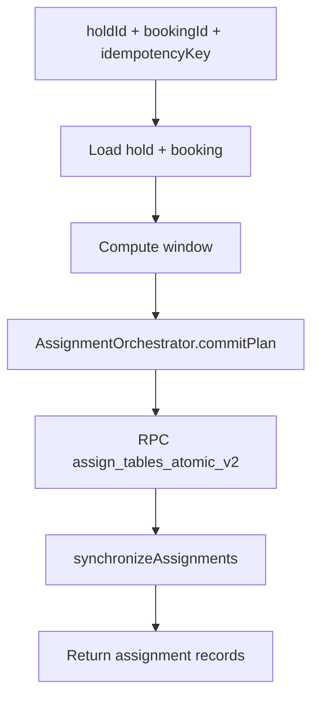
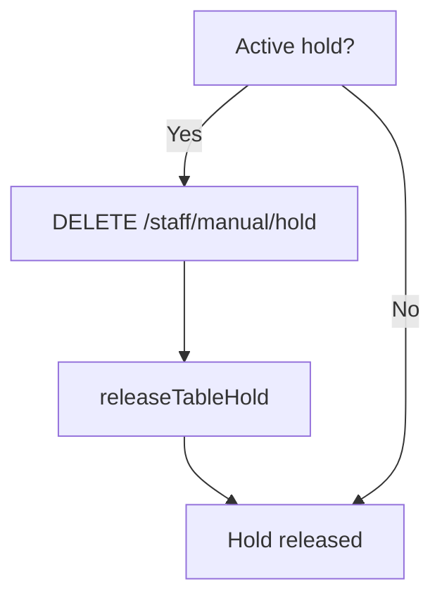

# Flowcharts — Manual Table Assignment

Use these Mermaid charts to render visual diagrams.

## 1) High-Level Overview



## 2) Sub-Process: Table Availability Verification

```mermaid
flowchart TD
  I[Input: bookingId, tableIds] --> L1[Load booking + policy]
  L1 --> W[Compute booking window]
  W --> T[Load selected tables]
  T --> A1[Load adjacency for tableIds]
  A1 --> C1[Load context bookings for date]
  C1 --> H[Load active holds]
  H --> BM[Build busy map (bookings+holds)]
  BM --> CF[Extract conflicts for tableIds]
  CF --> OUT[Return conflicts + summary]
```

## 3) Sub-Process: Customer/Reservation Validation

```mermaid
flowchart TD
  S[Selected Tables] --> CAP[Capacity check (sum >= party)]
  S --> Z[Zone uniformity check]
  S --> ADJ[Adjacency check (if required)]
  S --> HC[Hold conflicts]
  S --> BC[Booking conflicts]
  CAP --> CHK[Build checks list]
  Z --> CHK
  ADJ --> CHK
  HC --> CHK
  BC --> CHK
  CHK --> OK{Any error?}
  OK -- Yes --> RES[ok=false, checks]
  OK -- No --> RES2[ok=true, checks]
```

## 4) Sub-Process: Conflict Detection & Resolution



## 5) Sub-Process: Assignment Confirmation



## 6) Sub-Process: Rollback/Cancellation



## 7) Swimlanes (Actors)

```mermaid
flowchart LR
  subgraph UI[UI]
    U1[Select Tables]
    U2[Validate]
    U3[Hold]
    U4[Confirm]
  end
  subgraph API[API]
    A1[/validate]
    A2[/hold]
    A3[/confirm]
  end
  subgraph Engine[Engine]
    E1[evaluateManualSelection]
    E2[createManualHold]
    E3[confirmHoldAssignment]
  end
  subgraph DB[DB]
    D1[(table_holds)]
    D2[(table_hold_members)]
    D3[(booking_table_assignments)]
  end
  U1 --> U2 --> A1 --> E1 --> A1
  U2 --> U3 --> A2 --> E2 --> D1 & D2
  U3 --> U4 --> A3 --> E3 --> D3
```
