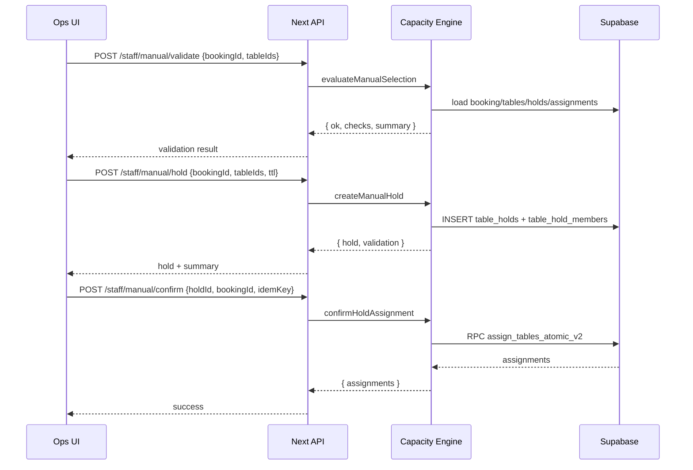
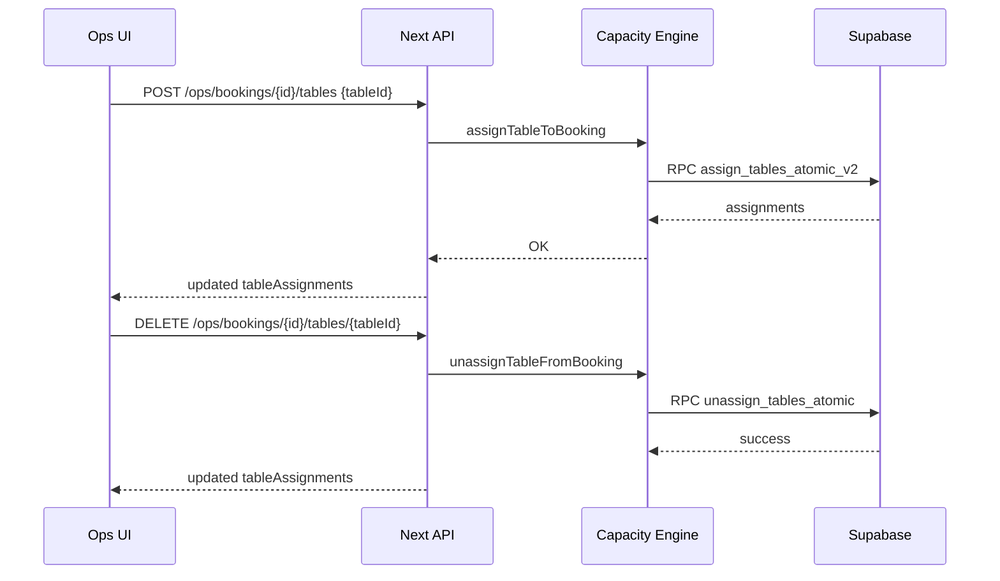

# Sequence Diagrams — Manual Table Assignment

## Manual Hold + Confirm

```mermaid
sequenceDiagram
  participant UI as Ops UI
  participant API as Next API
  participant ENG as Capacity Engine
  participant DB as Supabase

  UI->>API: POST /staff/manual/validate {bookingId, tableIds}
  API->>ENG: evaluateManualSelection
  ENG->>DB: load booking/tables/holds/assignments
  ENG-->>API: { ok, checks, summary }
  API-->>UI: validation result

  UI->>API: POST /staff/manual/hold {bookingId, tableIds, ttl}
  API->>ENG: createManualHold
  ENG->>DB: INSERT table_holds + table_hold_members
  ENG-->>API: { hold, validation }
  API-->>UI: hold + summary

  UI->>API: POST /staff/manual/confirm {holdId, bookingId, idemKey}
  API->>ENG: confirmHoldAssignment
  ENG->>DB: RPC assign_tables_atomic_v2
  DB-->>ENG: assignments
  ENG-->>API: { assignments }
  API-->>UI: success
```

## Direct Assign / Unassign (Single Table)

```mermaid
sequenceDiagram
  participant UI as Ops UI
  participant API as Next API
  participant ENG as Capacity Engine
  participant DB as Supabase

  UI->>API: POST /ops/bookings/{id}/tables {tableId}
  API->>ENG: assignTableToBooking
  ENG->>DB: RPC assign_tables_atomic_v2
  DB-->>ENG: assignments
  ENG-->>API: OK
  API-->>UI: updated tableAssignments

  UI->>API: DELETE /ops/bookings/{id}/tables/{tableId}
  API->>ENG: unassignTableFromBooking
  ENG->>DB: RPC unassign_tables_atomic
  DB-->>ENG: success
  API-->>UI: updated tableAssignments
```
