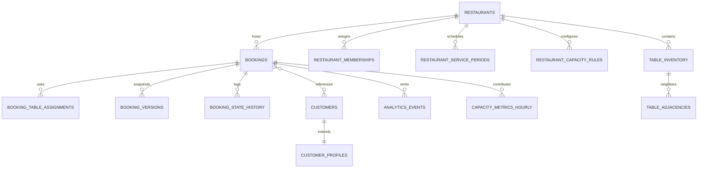

# SajiloReserveX Repository Analysis

## 1. High-Level Architecture

### 1.1 System Overview

- Multitenant dining reservation platform combining a marketing site, customer booking portal, and operations dashboard in one Next.js 15 application.
- React Server Components deliver fast first paint; TanStack Query hydrates client state.
- Supabase (Postgres, Auth, Storage) acts as the system of record, augmented by Upstash Redis for rate limiting and Resend for transactional email.

### 1.2 Component Architecture

- **Next.js front-end** (`src/app`, `components/`): marketing surfaces, authenticated flows, provider wrappers (`src/app/layout.tsx`, `src/app/providers.tsx`).
- **Reserve booking module** (`reserve/`): Vite + React Router app reused inside Next for the multi-step booking wizard (`components/reserve/booking-flow/index.tsx`).
- **Server domain layer** (`server/`): bookings, capacity engine, restaurants, customers, auth guards, analytics, observability, security.
- **Shared libraries** (`lib/`, `libs/`, `hooks/`): env validation, HTTP utilities, analytics tracking, React Query hooks.
- **Database artefacts** (`supabase/`): consolidated migration SQL plus generated types (`types/supabase.ts`).

### 1.3 Technology Stack

- Frameworks: Next.js 15 (RSC), Vite (reserve UI), React 19, TypeScript, Tailwind + Shadcn UI, Storybook.
- Data/Infra: Supabase Postgres/Auth, Upstash Redis, Resend Email, Plausible analytics.
- Tooling: TanStack Query, Zod, Playwright, Vitest, Husky, lint-staged, Supabase CLI.

### 1.4 Architectural Patterns

- Layered services: API handlers delegate to server modules, which encapsulate Supabase access (`src/app/api/bookings/route.ts`, `server/capacity/index.ts`).
- Dependency injection via React context for wizard dependencies (`reserve/features/reservations/wizard/di/context.tsx`) and service exports for composability.
- Middleware for cross-cutting concerns (auth gating, API versioning) (`middleware.ts`).
- Extensive use of schema validation (Zod) for runtime safety.

### 1.5 System Boundaries & External Dependencies

- Supabase for persistence, auth, storage (configured in `lib/env.ts`, `server/supabase.ts`).
- Upstash Redis for rate limiting (`server/security/rate-limit.ts`).
- Resend email integration (`libs/resend.ts`).
- Plausible analytics (`lib/analytics.ts`).
- Optional webhook notifications for capacity anomalies (`server/alerts/capacity.ts`).

### 1.6 Data Flow & Communication

- Client requests hit Next route handlers which validate input, query Supabase, and trigger side-effects (emails, analytics) (`src/app/api/bookings/route.ts`).
- React Query hooks (`hooks/useBookings.ts`) call JSON fetcher utilities (`lib/http/fetchJson.ts`).
- Vite reserve module shares API client pointing to `/api` namespace (`reserve/shared/api/client.ts`).
- Side effects (emails, analytics events) currently execute synchronously within API request lifecycle.

```mermaid
graph TD
  A[User Browser] -->|RSC| B[Next.js App Router]
  B -->|Client Bundles| C[TanStack Query & Reserve UI]
  B -->|REST| D[/api routes]
  C -->|fetch| D
  D -->|Domain Calls| E[Server Modules]
  E -->|SQL/RPC| F[(Supabase Postgres)]
  E -->|Auth| G[Supabase Auth]
  E -->|Cache| H[(Upstash Redis)]
  E -->|Email| I[Resend]
  E -->|Analytics| J[Supabase analytics_events]
  C -->|Tracking| K[Plausible]
```

---

## 2. Low-Level Architecture

### 2.1 Directory Structure (Selected)

| Path                       | Purpose                                                                       |
| -------------------------- | ----------------------------------------------------------------------------- |
| `src/app`                  | Next.js App Router (marketing, customer, ops routes)                          |
| `components/`              | Shared React components (marketing, ops, reserve wrappers, Shadcn UI)         |
| `hooks/`, `src/hooks`      | TanStack Query hooks, ops data hooks                                          |
| `lib/`, `libs/`            | Domain utilities, env management, analytics, HTTP                             |
| `server/`                  | Business logic for bookings, capacity, auth, customers, emails, observability |
| `reserve/`                 | Vite “reserve” SPA reused inside Next                                         |
| `supabase/`                | SQL migrations, seeds                                                         |
| `tests/`, `reserve/tests/` | Vitest + Playwright suites                                                    |

### 2.2 Module Breakdown Highlights

- **Bookings API** (`src/app/api/bookings/route.ts`): Validates payloads (Zod), enforces rate limits, fetches schedule, checks capacity, creates bookings, logs analytics, sends emails.
- **Capacity Engine** (`server/capacity/`): Complex availability and table assignment logic; exports consumption-safe APIs (`server/capacity/index.ts`).
- **Auth Guard** (`server/auth/guards.ts`): Supabase session verification with rich error metadata.
- **Customers** (`server/customers.ts`): Normalizes contact info, upserts profiles, updates marketing opt-in.
- **Observability & Alerts** (`server/observability.ts`, `server/alerts/capacity.ts`): Inserts observability events, triggers webhooks when capacity thresholds exceeded.
- **Reserve Wizard** (`reserve/features/reservations/wizard/`): Reducer-driven state machine, DI context to swap analytics/navigator in Next integration.

### 2.3 Data Structures & Types

- Reservations typed via Zod schema (`reserve/entities/reservation/reservation.schema.ts`).
- Ops domain DTOs defined in `src/types/ops.ts`.
- Supabase tables represented through generated `types/supabase.ts`; env typed through `config/env.schema.ts`.

### 2.4 Core Algorithms

- **Table selection**: BFS exploring adjacency-eligible merges, scoring candidates with weighted metrics (`server/capacity/selector.ts`).
- **Operating hours validation**: Validates slot availability and duration boundaries (`server/bookings/timeValidation.ts`).
- **Past bookings guard**: Timezone-aware check with configurable grace and admin override (`server/bookings/pastTimeValidation.ts`).
- **Capacity alerts**: Aggregates hourly metrics from Supabase and sends notifications (`server/alerts/capacity.ts`).

### 2.5 Configuration & Deployment

- Env schema ensures per-environment correctness (`config/env.schema.ts`, `lib/env.ts`).
- Next config defines path aliases bridging Next and Reserve modules (`next.config.js`).
- CI pipeline in GitHub Actions runs linting, typecheck, unit tests, Next + Vite builds, Playwright smoke tests (`.github/workflows/ci.yml`).

### 2.6 Database Schema Snapshot

- Entities: `restaurants`, `bookings`, `booking_versions`, `booking_table_assignments`, `customers`, `customer_profiles`, `restaurant_memberships`, `restaurant_service_periods`, `restaurant_capacity_rules`, `table_inventory`, `zones`, `analytics_events`, `audit_logs`, etc. (see `supabase/migrations/20251019102432_consolidated_schema.sql`).
- RLS policies enforce tenant isolation and role-based access across tables (numerous `CREATE POLICY` statements).

### 2.7 API Surface

- REST endpoints under `/api/v1/*`, with legacy `/api/*` paths marked for deprecation by middleware (`middleware.ts`).
- Example: `/api/bookings` (GET/POST) for customer bookings, `/api/ops/bookings` for operations dashboard, `/api/lead` for marketing capture.



---

## 3. Code Quality & Patterns

### 3.1 Organization & Style

- Domain-driven structure with clear separation between UI, hooks, server logic, and infrastructure.
- Shared aliases maintain reuse between Next and Vite contexts (`next.config.js`, `tsconfig.json`).
- Rich inline documentation, especially within server modules and capacity README, clarifies intent.

### 3.2 Design Patterns

- **Factory/Provider**: Supabase client factories for server, middleware, route handlers (`server/supabase.ts`).
- **Adapter**: Reservation adapters (`reserve/entities/reservation/adapter.ts`) converting DB rows to UI shapes.
- **Strategy/Scoring**: Capacity selector weights encapsulated in policy config (`server/capacity/policy.ts`).
- **Observer-esque**: Booking side effects record analytics and send emails upon events (`server/jobs/booking-side-effects.ts`).

### 3.3 SOLID & Testing

- Single-responsibility largely respected; however, monolithic API handlers (e.g., bookings route) could be decomposed further.
- Open/closed via export surfaces for capacity and bookings modules; Liskov and Interface segregation satisfied through typed contracts.
- Dependency inversion present in wizard DI.
- Testing matrix covers server logic (Vitest), component/feature tests, Storybook, and Playwright E2E.

### 3.4 Error Handling & Logging

- Consistent error normalization (`lib/http/errors.ts`, `src/app/api/profile/route.ts`), typed `GuardError` in auth.
- Logging provides codes, parameters, and hints for Supabase failures (`server/restaurants/listRestaurants.ts`).
- Idempotency enforced in profile updates (`src/app/api/profile/route.ts`) and booking side-effects handle retries gracefully.

### 3.5 Observability

- Bookings generate analytics events (`server/analytics.ts`) and observability logs (`server/observability.ts`).
- Capacity alerts integrate with webhooks and Supabase tables for monitoring; console warnings highlight misconfiguration.

---

## 4. Technical Deep Dive

### 4.1 Request Lifecycle (Bookings)

```mermaid
flowchart LR
  UI[Booking Wizard] -->|React Query| API[/api/bookings]
  API -->|Validate + Rate Limit| Guards
  API --> Capacity[Capacity Engine]
  API --> Customers[Customer Upsert]
  API --> Booking[Supabase Insert]
  API --> Jobs[Booking Side Effects]
  Jobs --> Emails[Resend]
  Jobs --> Analytics[Supabase analytics_events]
  API --> Observability[recordObservabilityEvent]
  API --> Response
```

- Validations: Zod schemas for payload, Supabase-based schedule checks, operating hours (`server/bookings/timeValidation.ts`), past booking guard.
- Capacity: `createBookingWithCapacityCheck` ensures availability and handles table assignment when possible (`server/capacity/transaction.ts`).
- Side-effects: Inline queue-like functions send emails and analytics with safe fallbacks (`server/jobs/booking-side-effects.ts`).

### 4.2 Dependency Management

- Providers: `AppProviders` sets up TanStack Query globally (`src/app/providers.tsx`).
- Wizard DI merges analytics/navigator/haptics for reuse in Next and Vite contexts (`reserve/features/reservations/wizard/di/context.tsx`).
- Supabase clients obtained per-context to honor cookie/session semantics (`server/supabase.ts`).

### 4.3 State Management

- TanStack Query caches reservations, ops dashboards, team data (`hooks/useBookings.ts`, `lib/query/keys.ts`).
- Reserve wizard uses reducer state + context for multi-step flows (`reserve/features/reservations/wizard/model/reducer.ts`).

### 4.4 Authentication & Authorization

- Middleware enforces session gating for `/my-bookings` and `/profile` (`middleware.ts`).
- Route guards verify membership roles before accessing restaurant-scoped resources (`server/auth/guards.ts`, `server/team/access.ts`).
- Guest lookup hashing protects contact matching when pepper configured (`server/security/guest-lookup.ts`).

### 4.5 Testing Strategy

- **Unit**: Vitest for server logic, emails, ops features (`vitest.config.ts`).
- **Component/Feature**: Reserve-specific vitest configuration via `pnpm test`.
- **E2E**: Playwright test matrix across Chromium/Firefox/Webkit + mobile smoke; global setup/teardown for Supabase auth flows.
- CI ensures deterministic builds before running Playwright mobile smoke tests (`.github/workflows/ci.yml`).

### 4.6 Build & Deployment

- `pnpm dev` / `pnpm build` for Next, `pnpm reserve:build` for Vite bundle.
- Storybook for component development (`reserve/.storybook`).
- Database scripts target remote Supabase only (`package.json` scripts with explicit warnings).
- Secret scanning pipeline prevents credential leaks (`.github/workflows/secret-scanning.yml`).

---

## 5. Critical Analysis

### 5.1 Strengths

- Robust domain modeling and type safety (Zod + TypeScript) across server, UI, and database.
- Capacity engine and booking lifecycle logic exceed typical boilerplates in sophistication.
- Observability baked in (analytics events, observability tables, capacity alerts).
- Strong testing and CI pipeline ensures code quality and regression coverage.
- Shared path aliases unify Next and Vite front-ends, promoting reuse.

### 5.2 Weaknesses / Risks

- Key API handlers (e.g., bookings route) combine validation, orchestration, and side effects; refactoring into orchestrator + services would improve maintainability.
- “Job” handlers run inline, risking latency spikes for email/analytics; background processing infrastructure recommended.
- Documentation (internal docs referencing 22 migrations) outdated relative to consolidated SQL file—needs synchronization.
- Dual frontend build (Next + Vite) increases complexity; maintainers must ensure both pipelines stay in sync.

### 5.3 Scalability Considerations

- Capacity selector BFS may become expensive for large table inventories—monitor performance metrics and consider caching/optimization.
- Synchronous email/analytics dispatch may slow responses under heavy load—queueing would smooth throughput.
- React Query stale time defaults (5 minutes) should be revisited for high-frequency ops dashboards.

### 5.4 Security & Performance

- Supabase RLS policies plus guard-based authorization provide solid defense-in-depth; ensure Upstash credentials configured to avoid in-memory rate-limiter fallback.
- Guest lookup pepper optional—configure in production to enable hashed lookups.
- Performance instrumentation via Playwright traces and capacity metrics; consider adding structured logging beyond console for production.

### 5.5 Maintainability

- Strong typing, consistent structure, and documentation aid onboarding.
- Recommended to modularize large handlers, update docs, and automate doc validation to prevent drift.

---

## 6. Recommendations & Next Steps

1. **Refactor Booking API layers**: Extract validation, scheduling, persistence, and telemetry into dedicated services for readability and reuse.
2. **Introduce asynchronous job runner**: Use Supabase Edge Functions, background worker, or queue to handle emails/analytics outside request lifecycle.
3. **Align documentation**: Update Supabase migration documentation to reflect consolidated schema; consider generating docs from SQL/types.
4. **Monitor capacity engine performance**: Add profiling/logging around selector diagnostics to catch hotspots as table counts grow.
5. **Harden rate limiting**: Ensure Upstash credentials present in all environments; optionally add alerts when falling back to memory.

---

## 7. Verification Notes

- Evidence collected via direct code inspection (`sed`, `nl`, `rg`), configuration review, and internal documentation cross-checks.
- Data model verified against Supabase migration SQL and generated types.
- Validation/challenge: Confirmed “jobs” run inline, noted doc drift about migration count, and re-traced architecture twice to ensure consistency.
- Residual uncertainty: Execution environment for background jobs (cron vs inline) not explicitly documented—flagged for follow-up.

---

## 8. Final Reflection

After completing the analysis, I re-evaluated the repository starting from package scripts through build/test configs and server modules to confirm conclusions matched the code. That second pass surfaced the documentation drift and clarified that side-effects remain synchronous—both captured above. No contradictions found; outstanding questions are documented for maintainers.
